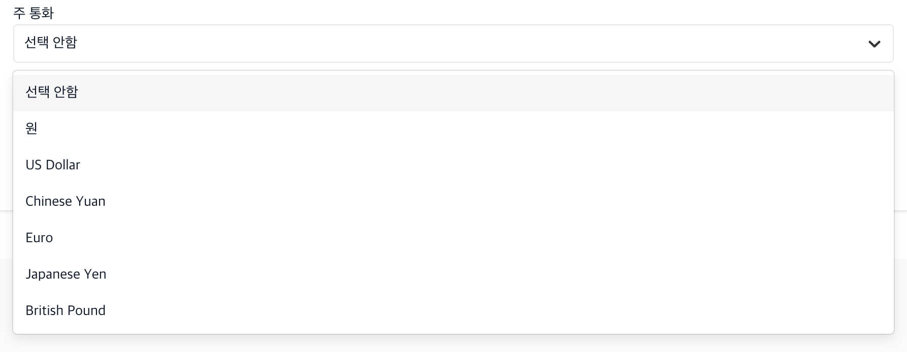
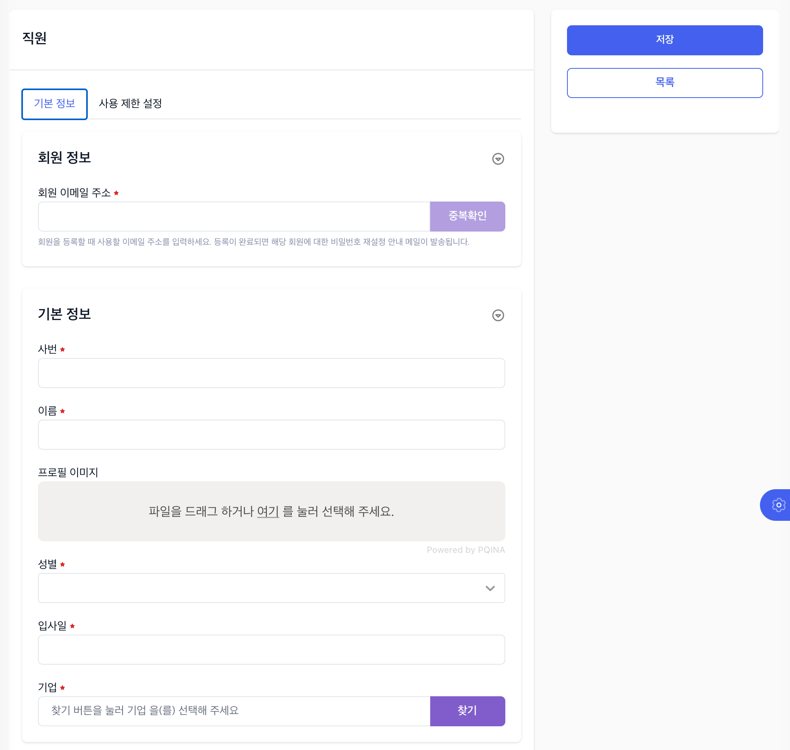
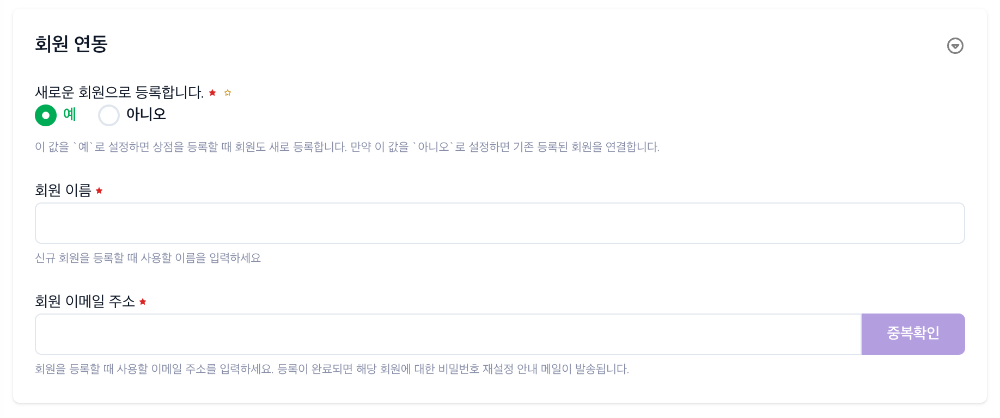
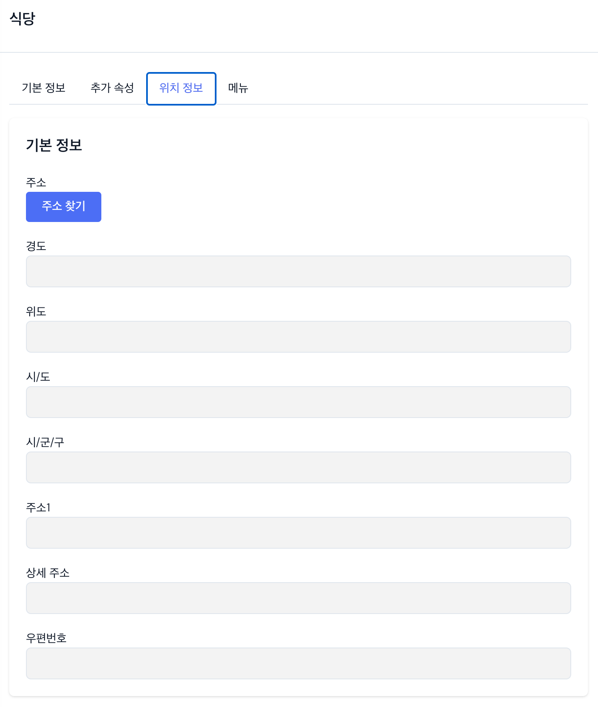

[#_mealcart]
= Mealcart 관리자도구 매뉴얼
:toc: left
:toc-title: MealCart Admin
:toclevels: 3
:stylesheet: asciidoctor.css
:hardbreaks:
:doctype: book
:icons: font
:idseparator: -
:sectanchors:
:sectids:
:sectnums:
:sectlinks:
:sectnumlevels: 6
:author: ny9302@rchemist.io
:version-label: v0.1

== 둘러보기
=== 처음 접속하기
====
.관리자도구 로그인 화면

====

=== 관리자 도구 둘러보기
관리자도구의 각 기능을 설명하기에 앞서, 관리자 도구의 전체적인 외관을 설명하고 공통 기능에 대해 알아 보겠습니다.

==== 화면의 구성
관리자도구는 크게 좌/우 패널로 나뉘어 있습니다.
좌측에는 메뉴(섹션)가 표시되고, 우측에는 선택된 메뉴에 해당하는 섹션의 내용이 표시됩니다.

==== 메뉴
메뉴는 2depth 구조를 가지고 있습니다. 모든 메뉴가 2depth 구조를 가지는 것은 아니며, 단일 모듈로 이루어진 메뉴도 있습니다.
앞으로 우리는 1 depth 메뉴를 `모듈`, 2 depth 메뉴를 `섹션` 이라고 부를 것입니다.

----
예: 기업관리 모듈의 기업관리 섹션
----
====
.관리자도구 메뉴

====

메뉴에서 현재 선택된 섹션은 파란색으로 강조됩니다.
각 모듈을 누르면 하위 섹션을 선택할 수 있도록 토글되어 나타나며, 원하는 섹션을 클릭하면 해당 섹션 페이지로 이동할 수 있습니다.

==== 섹션
대부분 모듈과 섹션은 목록과 상세보기, 그리고 데이터를 새로 입력하거나, 다른 데이터를 참조하는 모달 윈도우 등으로 구성되어 있습니다.

===== 목록
기본적으로 섹션의 첫 화면에는 해당 섹션으로 관리되는 데이터의 목록을 표시합니다.

====
.섹션 목록
image::images/list.png[width=800]
====

====== 기본 검색
목록 페이지의 상단에 제공되는 기본 검색창을 이용해 검색 할 수 있습니다. 단, 상단 기본 검색창은 기업 아이디에 대해서만 검색합니다.

====== 필드 별 필터 검색
그 외 다른 필드의 값으로 검색하려면 목록 상단의 검색창 우측에 있는 통합 검색 버튼을 눌러 고급 검색창을 활성화 합니다.
필드별 필터 검색은 여러 필드에 대해 중첩해 사용할 수 있습니다.

====
.필드값 필터

====

====== 그리드 개인설정

검색창 우측에 위치한 버튼을 클릭하면 화면에 표시되는 필드를 설정할 수 있습니다. 필요한 정보만을 화면에 표시하여 작업을 진행할 수 있습니다.

====
.원하는 필드만 선택

====

====== 정렬
목록 상단의 각 필드명 옆에 위아래 화살표 표시 아이콘을 클릭하면 해당 필드값으로 목록을 정렬할 수 있습니다.
정렬 아이콘을 한번 누르면 내림차순, 두번 누르면 오름차순, 세번 누르면 정렬이 해제됩니다.

====
.필드값 정렬

====

===== 상세 보기
목록에서 특정 엔티티를 선택하면 상세보기 화면으로 이동합니다.
상세보기 화면은 탭 > 필드 그룹 > 필드의 구조로 구성되어 있습니다.

====
.상세보기 화면 내 구성요소
image::images/detail.png[width=800]
====

[%autowidth.stretch]
[cols="1,3,^6"]
[cols="^.^,^.^,<.^"]
.상세보기 화면 내 구성요소
|====================
| No |  이름 | 설명
| 1 |  탭 | 엔티티 정보를 탭으로 구분해 표시합니다.
| 2 |  필드 그룹 | 일련의 필드를 묶어 한 그룹으로 표시합니다.
| 3 |  필드 | 필드 그룹은 여러 필드로 구성되어 있습니다. 실제 데이터를 관리합니다.
|====================

====== 탭
섹션의 상세보기 화면이 여러 탭으로 나뉘어 있는 경우 화면 상단에 탭 영역이 표시됩니다.
====
.섹션 상세보기 > 탭

====

위의 예시에서 '기본정보', '추가 속성', '위치 정보', '사용 제한 설정', '지점 관리'에 해당하는 영역이 탭 입니다.
각 탭을 눌러 탭의 하위 필드를 확인할 수 있습니다.

====== 필드 그룹
탭에서 하위 필드를 표시할 때 여러 필드를 하나의 영역으로 묶어 표시합니다.
이 영역을 필드 그룹이라고 부르며, 한 탭에 여러 필드 그룹이 표시될 수도 있습니다.

.섹션 상세보기 > 탭 > 필드 그룹
image::images/group.png[width=800]

위 그림에서 기업 정보 라는 타이틀로 묶인 박스가 필드 그룹입니다.

====== 필드 툴팁
필드명 오른쪽의 인포 아이콘에 커서를 올리면 해당 필드에 대한 자세한 설명을 볼 수 있습니다.

====
.필드 툴팁

====

TIP: 모든 필드에 필드 툴팁이 제공되는 것은 아닙니다. 특별한 설명이 필요하지 않은 필드의 경우에는 인포 아이콘이 없을 수 있습니다.

==== 새 엔티티 추가
섹션 목록의 우측 상단에 제공되는  `+ 버튼` 을 클릭해 새 엔티티를 추가할 수 있습니다.
`신규 입력` 버튼을 누르면 엔티티 추가 창이 노출되고, 노출된 창 내 입력폼에 정보를 입력해 새 엔티티를 저장합니다.

====
.새 엔티티 추가

====

TIP: 밀카트 관리자도구에서 각 섹션의 새 엔티티를 추가하는 작업은 대부분 비슷합니다. 섹션 목록의 우측 상단에 `+ 버튼`이 있다면 클릭하고 필요한 정보를 입력하면 됩니다.

===== 필수값
필드명 좌측의 붉은 * 표시는 해당 필드가 필수값이어서 반드시 값을 입력해야 한다는 뜻입니다.

====
.필수값 표시
image::images/require.png[width=800]
====

===== Validation
입력폼의 Validation Error가 발생하면 화면에 다음과 같은 문구가 표시됩니다.

====
.새 엔티티 추가 시 Validation 결과
image::images/validationerror.png[width=800]
====

맨 위에 에러 전바반적인 설명이 표시되고, 그 아래에는 어떤 필드 그룹의 어떤 필드에 어떤 에러가 있는지 상세히 설명합니다.
{blank}
위의 예시에 따르면, `기본 정보` 필드 그룹의 `이름`  필드를 반드시 입력하라는 것을 알 수 있습니다.

TIP: 엔티티를 추가하려면, 안내 문구에 따라 알맞은 필드값을 입력해야 합니다.

== 기업 관리
회사의 정보를 등록하고 부서와 직급, 직원 관리를 할 수 있는 메뉴입니다.

[#corporation]
=== 기업 관리
기업의 정보를 추가하고 확인할 수 있으며, 기업별 식대 정책에 대한 정보를 입력하고 관리합니다.
====
.기업관리 > 기업관리 섹션
image::images/corp.png[width=800]
====

==== 기업 등록하기
새 기업을 등록하기 위해 메뉴에서 `기업관리 > 기업관리` 를 눌러 기업관리 섹션으로 이동합니다.
{blank}
목록 상단의 우측에 있는 `+ 버튼` 을 클릭하여 신규 입력을 진행합니다.

====
.기업 등록 화면
image::images/corp1.png[width=800]
====

===== 기본 정보 탭
* 기본 정보
** 기업아이디: 직원 로그인 등 시스템에서 사용하는 기업의 ID입니다. 영문 소문자와 숫자만 입력할 수 있으며, 값을 입력한 후 반드시 중복 확인을 해야 반영됩니다.
** 기업명: 기업명을 입력합니다.
** 기업 설명: 관리자 도구에서 식별을 위한 설명입니다.
** 사용 여부: 이 값을 아니오로 설정하면 Front 서비스에서 이 기업 정보로 로그인할 수 없습니다.

====
.기업 등록 화면

====

* 기업 정보
** 사업자 등록번호: 사업자 등록번호를 입력합니다. 값을 입력한 후 반드시 중복 확인을 해야 반영됩니다.
** 대표자명: 대표자의 이름을 입력합니다.
** 업태/업종: 사업자 등록 상 업태 및 업종을 확인하여 입력합니다.

====
.기업 등록 화면

====

* 대표 회원 연동
** Tenant Alias: 기업 회원이 최초 등록될 때 Tenant 정보가 생성됩니다. 기업 회원이 생성하는 모든 정보에서 Tenant Alias 가 사용됩니다. 영문과 숫자만 입력 가능합니다.
** 회원 선택: `찾기` 버튼을 클릭해 등록된 회원에게 이 기업의 관리 권한을 부여합니다. 직원의 정보는 사전에 등록되어 있어야 합니다.

===== 추가 속성 탭
====
.기업 등록 화면

====

* 추가 속성
** 로고 이미지: 기업의 이미지 파일을 드래그 하거나 `여기`를 클릭해 사진을 업로드 합니다.
** 외부 연동 ID: 외부 시스템과 연동할 때 사용하는 ID 입니다. 값을 입력한 후 반드시 중복 확인을 해야 반영됩니다.
** 주 언어: 언어를 선택합니다. 선택 가능한 언어에는 한국어와 영어가 있습니다. 주 언어를 설정하면 Front 서비스에 이 기업으로 로그인할 때 해당 언어로 먼저 표시됩니다.
** 주 통화: 통화를 선택합니다. 주 통화를 설정하면 Front 서비스에서 이 기업으로 로그인할 때 해당 통화로 서비스 됩니다.
====
.사용할 통화 선택

====
** 주 시간대: 주 시간대를 설정합니다. 주 시간대를 설정하면 Front 서비스에서 이 기업으로 로그인할 때 해당 시간대를 기준으로 서비스 됩니다.
====
.주 시간대 설정

====

===== 위치 정보 탭
====
.기업 등록 화면
image::images/corp5.png[width=800]
====

`주소 찾기` 버튼을 클릭하며 기업 주소를 입력합니다.
====
.기업 등록 화면
image::images/corp6.png[width=800]
====

===== 사용 제한 설정 탭
식사 가능 요일 설정이나 이용시간 설정, 가격제한 등 다양한 세부설정을 통해 회사 식대지원 정책에 맞는 식권을 만들 수 있습니다.
====
.기업 등록 화면

====

* 식사 시간 제한
** 식사 가능 요일: 지정된 요일에만 식사를 할 수 있도록 설정할 수 있습니다. 입력하지 않으면 모든 요일에 사용 가능합니다.
** 식사 가능 시간대: 몇시부터 몇시까지 식사가 가능한지 지정합니다. 입력하지 않으면 하루 중 언제나 식사 요청을 할 수 있습니다.

====
.기업 등록 화면

====

* 반복 식사 제한
** 반복 식사 제한 여부: 이 값을 `예` 로 설정하면 지정된 시간 내 반복해 식사를 요청하는 경우를 제한할 수 있습니다.
** 최대 연속 반복 가능 횟수: `반복 식사 제한 여부` 값이 `예` 로 설정된 경우 반복할 수 있는 최대 횟수를 설정합니다. 이 값을 0으로 설정하면 반복 식사가 불가능하며, 1 이상의 숫자로 설정하면 최대 해당 숫자만큼 반복 식사 요청이 가능합니다.
** 반복 횟수 계산 시간: 반복 식사 횟수를 계산할 때, 현재 식사 요청으로부터 몇분 전까지의 기록을 반복 식사로 판단할 것인지 설정합니다. 기본값은 60분이며, 분 단위의 숫자값을 입력하되 최소 30 이상의 숫자를 입력해야 합니다.

====
.기업 등록 화면
image::images/corp9.png[width=800]
====

* 가격 제한
** 회당 가격 제한: 매 식사 당 최대 얼마까지 사용할 수 있는지 설정합니다. 값을 입력하지 않으면 메뉴의 가격에 대해 제한하지 않습니다.
** 일간 누적 가격 제한: 하루 최대 얼마까지 사용할 수 있는지 설정합니다. 값을 입력하지 않으면 하루 동안 사용되는 금액에 대해 제한하지 않습니다.
** 월간 누적 가격 제한: 매달 최대 얼마까지 사용할 수 있는지 설정합니다. 값을 입력하지 않으면 매달 사용되는 금액에 대해 제한하지 않습니다.

NOTE: 금액은 `기업 > 추가 속성 > 주 통화` 에서 설정한 통화로 입력합니다.

필수 입력 사항을 모두 기입 후 `저장` 버튼을 클릭해 기업을 등록합니다.

[#department]
=== 부서 관리
이 섹션에서는 기업 내 부서를 등록하고 관리합니다.

====
.기업관리 > 부서관리 섹션
image::images/department.png[width=800]
====

==== 부서 등록하기
새 부서를 등록하기 위해 메뉴에서 `기업관리 > 부서관리` 를 눌러 부서관리 섹션으로 이동합니다.
{blank}
목록 상단의 우측에 있는 `+ 버튼` 을 클릭하여 신규 입력을 진행합니다.

====
.부서 등록 화면
image::images/department1.png[width=800]
====

* 기본정보
** 이름: 부서의 이름을 입력합니다.
** 설명: 부서의 설명을 입력합니다.
** 외부 연동 ID: 외부 시스템과 연동할 때 사용하는 ID 입니다. 값을 입력한 후 반드시 중복확인을 해야 반영됩니다.
** 기업: `찾기` 버튼을 눌러 기업을 선택합니다. 기업의 정보는 사전에 등록되어 있어야 합니다.
====
.기업 찾기

====

필수 입력 사항을 모두 기입 후 `저장` 버튼을 클릭해 부서를 등록합니다.

[#position]
=== 직급 관리
기업의 직급을 등록하고 관리합니다.

====
.기업 관리 > 직급 관리 섹션
image::images/position.png[width=800]
====

==== 직급 등록하기
새 직급을 등록하기 위해 메뉴에서 `기업관리 > 직급관리` 를 눌러 부서관리 섹션으로 이동합니다.
{blank}
목록 상단의 우측에 있는 `+ 버튼` 을 클릭하여 신규 입력을 진행합니다.

====
.직급 등록 화면

====

* 기본 정보
** 직급명: 직급의 이름을 입력합니다.
** 설명: 직급에 대한 설명을 입력합니다.
** 우선순위: 직급을 트리 형태로 표현할 때 필요한 우선순위 입니다. 숫자값이 낮을 수록 우선적으로 표시됩니다. 값이 동일한 직급들은 이름 순서로 정렬됩니다.
** 외부 연동 ID: 외부 시스템과 연동할 때 사용하는 ID 입니다. 값을 입력한 후 반드시 중복 확인을 해야 반영됩니다.
** 상위 부서: 직급을 트리 형식으로 표시할 때 사용하는 상위 직급 정보 입니다.

[#staff]
=== 직원 관리
기업의 직원을 등록하고 관리합니다.

====
.기업관리 > 직원관리 섹션

====

==== 직원 등록하기
새 직급을 등록하기 위해 메뉴에서 `기업관리 > 직원관리` 를 눌러 직원관리 섹션으로 이동합니다.
{blank}
목록 상단의 우측에 있는 `+ 버튼` 을 클릭하여 신규 입력을 진행합니다

====
.직원 등록 화면

====

* 회원 정보
** 회원 이메일 주소: 회원을 등록할 때 사용할 이메일 주소를 입력합니다. 등록이 완료되면 해당 회원에 대한 비밀번호 재설정 안내 메일이 발송됩니다.

* 기본 정보
** 사번: 직원의 사번을 입력합니다.
** 이름: 직원의 이름을 입력합니다.
** 프로필 이미지: 직원의 프로필 사진이 있다면 파일을 드래그 하거나 `여기` 를 클릭해 파일을 첨부합니다.
** 성별: 직원의 성별을 입력합니다.
** 입사일: 직원의 입사일을 입력합니다.
** 기업: 직원이 소속된 기업을 선택합니다. `찾기` 버튼을 클릭하여 해당 기업을 지정할 수 있습니다.

====
.직원 등록 화면

====

* 부서 및 직급
** 직급: 직원의 직급을 `찾기` 버튼을 클릭해 선택합니다.
** 부서 변경일: 직원의 부서가 변경된 경우, 변경된 날짜를 입력합니다.
** 부서: 직원이 소속된 부서를 선택합니다. `찾기` 버튼을 클릭하여 해당 부서를 지정할 수 있습니다.
** 직책: 직원의 직책을 입력합니다.

* 상태
** 계약 구분: 직원의 계약 상태를 입력합니다. 계약 상태는 계약직, 정규직, 인턴, 기타 중에서 선택할 수있습니다.
** 현재 상태: 직원의 현재 상태를 입력합니다. 상태는 재직중, 병가, 출산 휴가 등 다양한 상태를 나타낼 수 있습니다.
====
.직원 현재 상태 선택
image::images/staff3.png[width=800]
====

== 식당 관리
식당관리 모듈은 식당을 등록하고 등록된 식당들의 상세 정보를 확인하고 관리하는 페이지 입니다.
리스트그리드 형태로 식당 목록을 시각적으로 제공하며, 검색, 추가, 수정 등 다양한 기능을 제공합니다.
====
.식당 관리
image::images/store.png[width=800]
====

=== 식당 등록하기
새 식당을 등록하기 위해 메뉴에서 `식당관리` 를 눌러 이동합니다.
{blank}
목록 상단의 우측에 있는 `+ 버튼` 을 클릭하여 신규 입력을 진행합니다.

==== 기본정보 탭
====
.식당 등록 화면

====

* 기본 정보
** 이름: 식당의 이름을 입력합니다.
** 설명: 식당의 설명을 입력합니다.
** 사용 여부: 사용 여부를 선택합니다. 이 값을 '아니오'로 설정하면 Front 서비스에서 이 기업 정보로 로그인할 수 없습니다.
** 상위 상점: 상위 상점을 선택합니다. 상점이 상위 상점의 하위 지점 정보인 경우 상위 상점을 선택합니다.
{blank}

====
.식당 등록 화면
image::images/store2.png[width=800]
====

* 상점 정보
** 사업자 등록번호: 상점의 사업자등록번호를 입력합니다. 숫자만 입력 가능하며, 값을 입력한 후 반드시 중복 확인을 해야 반영됩니다.
** 대표자 명: 대표자 이름을 입력합니다.
** 업태/업종: 사업자 등록 상 업태/업종을 입력합니다.
{blank}

====
.식당 등록 화면

====

* 회원 연동
** 새로운 회원 등록: 이 값을 '예' 로 설정하면 상점을 등록할 때 회원도 새로 등록합니다. 새로 등록할 회원의 이름과 이메일 주소를 입력해 회원을 등록합니다.
** 값을 '아니오' 로 설정 시 기존 등록된 회원을 찾아 선택합니다.

==== 추가속성 탭

====
.식당 등록 화면

====

* 추가 속성
** 로고 이미지: 상점의 로고 이미지가 있다면 파일을 드래그 하거나 `여기` 를 클릭해 파일을 첨부합니다.
** 외부 연동 ID: 외부 시스템과 연동할 때 사용하는 ID입니다. 값을 입력한 후 반드시 중복 확인을 해야 반영됩니다.
** 주 통화: 주 통화를 설정합니다. 주 통화를 설정하면 메뉴의 가격을 표시할 때 기본으로 해당 통화가 사용됩니다. 메뉴 별로 통화를 별도로 설정할 수 도 있습니다.
** 주 시간대: 주 시간대를 설정하면 Front 서비스에서 식사 시간이 해당 시간대로 표시됩니다.

==== 위치정보 탭
식당의 주소를 입력합니다.

====
.식당 등록 화면

====

==== 메뉴 탭

====
.식당 등록 화면
image::images/store7.png[width=800]
====

* 기본 정보
** 메뉴 사용 여부: 이 값을 '예' 로 설정하면 메뉴 정보를 개별적으로 생성해야 합니다. 메뉴 정보는 식당 상세보기 에서 설정할 수 있습니다., 값을 '아니오'로 설정하면 모든 식사 요청에 대해 단일 메뉴를 제공하게 됩니다.
** 기본 메뉴명: 메뉴 사용 여부가 `아니오` 일 때, 식권에 표시될 상품명 입니다.
** 기본 메뉴 가격: 메뉴 사용여부가 `아니오` 일 때, 식권에 표시될 메뉴의 기본 가격입니다. 식권 가격은 기업과의 계약 별로 재설정 할 수 있습니다.

=== 식당 상세보기
등록한 식당 목록에서 특정 식당을 선택하면 해당 식당의 상세 정보를 확인하고 수정할 수 있습니다.

==== 메뉴 관리
기본적으로 식당을 등록할 때 입력한 정보를 수정할 수 있습니다. 또한, 메뉴 사용 여부를 '예' 로 설정한 경우, 이곳에서 메뉴를 추가할 수 있습니다.

====
.특정 식당 선택 > 식당 메뉴 등록화면

====
{blank}

메뉴 필드에서 `등록` 버튼을 클릭해 메뉴를 등록합니다.

====
.메뉴 추가등록 화면

====

메뉴명과 판매가 등 필요한 정보를 입력합니다. 할인가는 상품의 판매가를 재정의 할 수 있으며, 입력하지 않으면 상품에 등록된 판매가를 그대로 사용합니다.

== 계약 관리
기업과 상점 간의 계약을 관리할 수 있습니다. 계약을 통해 식사 가능한 메뉴를 설정하고, 계약 조건을 조정할 수 있습니다.

====
.계약 관리

====

=== 계약 등록하기
기업과 상점과의 계약을 등록하기 위해 메뉴에서 `계약 관리` 를 눌러 이동합니다.
{blank}
목록 상단의 우측에 있는 `+ 버튼` 을 클릭하여 신규 입력을 진행합니다.

====
.계약 등록 화면

====

* 계약 대상
계약을 설정할 기업과 상점을 지정합니다.
** 기업: 기등록한 기업을 `찾기` 버튼을 클릭해 선택합니다.
** 상점: 기등록한 상점을 `찾기` 버튼을 클릭해 선택합니다.

* 계약 내용
** 사용 여부: 사용 여부를 선택합니다. 이 값을 '아니오' 로 설정하면 계약 기간 중이라도 이 계약을 통해 식사할 수 없습니다.
** 하위 기업 연동 여부: 하위 기업들에 동일한 계약을 적용할지 여부를 선택합니다. 이 값을 `예` 로 설정하면 계약한 기업의 하위 기업에도 동일한 계약이 적용됩니다.
** 대상 직원 유형: 이 계약을 통해 식사할 수 있는 직원의 유형을 선택합니다. 동일한 기업과 상점 간에는 같은 유형의 직원을 대상으로 서로 다른 계약을 두 개 이상 등록할 수 없습니다. 아무 것도 설정하지 않으면 모든 유형의 직원에 대해 계약이 허용됩니다.
** 계약 시작일: 이 계약을 통해 식사가 가능한 시작일을 설정합니다. 시작일을 설정하지 않으면 현재 시점부터 적용됩니다.
** 계약 종료일: 이 계약을 통해 식사가 가능한 마지막 날을 설정합니다. 종료일을 설정하지 않으면 시작일 이후부터 계속 적용됩니다.
** 계약일: 계약일자를 설정합니다.

=== 계약 상세보기
등록한 계약 목록에서 특정 계약을 선택하면 해당 계약의 상세 정보를 확인하고 수정할 수 있습니다.

====
.계약 관리 > 계약 상세보기 화면

====

선택한 계약의 상세보기 화면에서는 계약을 통해 식사할 수 있는 메뉴를 설정할 수 있습니다. 단, 단일 메뉴를 제공하는 식당과의 계약인 경우 메뉴를 별도로 설정할 수 없습니다. 이 정보를 변경하고 난 후 반드시 저장 버튼을 눌러야 반영됩니다.

====
.계약 상세보기 화면

====

식사 가능한 메뉴를 설정하기 위해 `불러오기` 버튼을 클릭합니다.

====
.메뉴 불러오기 클릭 후 출력된 모달창

====

계약한 식당의 메뉴를 선택하려면 찾기 버튼을 클릭합니다. 메뉴의 가격은 기업과 식당 간의 계약에 따라 재설정할 수 있습니다.

====
.메뉴 찾기 모달 창

====

메뉴를 선택한 후 `저장` 버튼을 클릭합니다. 계약 상세보기 화면에서 추가된 메뉴를 확인한 후, 상단에 저장 버튼을 한번 더 클릭하여 변경 사항을 반영합니다.

== 식사 내역
임직원의 식사 내역을 상세히 확인할 수 있습니다. 이 기능을 통해 메뉴 가격, 상점 이름, 직원 이름, 식사한 날짜 및 시간을 포함한 전반적인 내역을 조회할 수 있습니다.

====
.식사 내역

====

== 사용자 관리
시스템 내에 모든 사용자 계정을 관리합니다.

=== 관리자
어드민 관리자 계정을 관리합니다. 어드민 관리자는 시스템의 전반적인 운영과 관리를 담당하는 사용자들입니다. 새로운 관리자를 추가하고, 기존 관리자의 권한을 수정하거나 삭제할 수 있습니다.

====
.사용자 관리 > 관리자

====

==== 관리자 등록하기
새 관리자를 등록하기 위해 메뉴에서 `사용자 관리 > 관리자` 를 눌러 관리자 섹션으로 이동합니다.
{blank}
목록 상단의 우측에 있는 `+ 버튼` 을 클릭하여 신규 입력을 진행합니다.

====
.관리자 등록 화면
image::images/admin1.png[width=800]
====

관리자의 정보를 입력 후 사용여부를 체크해 저장 합니다.

작성중..

=== 회원 관리

