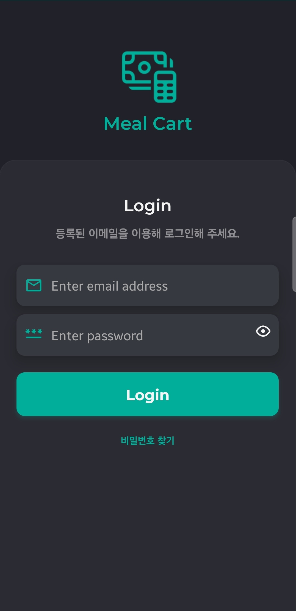
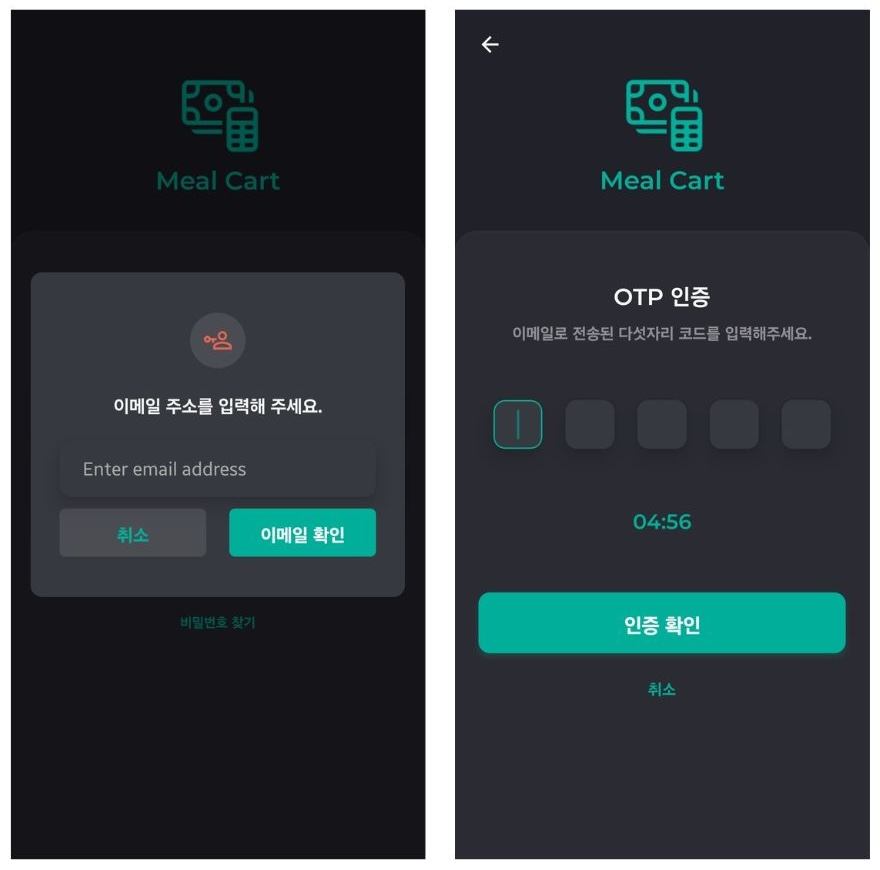
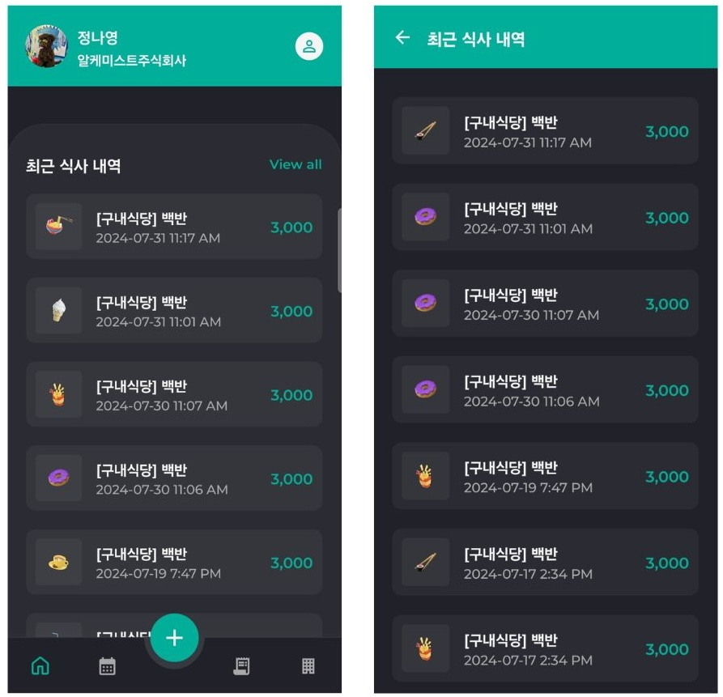
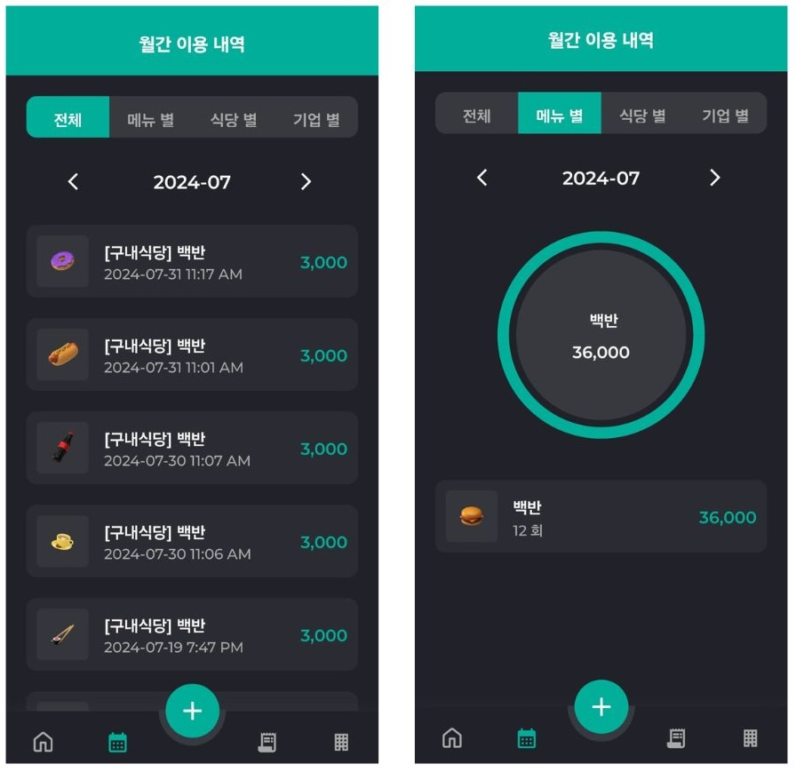
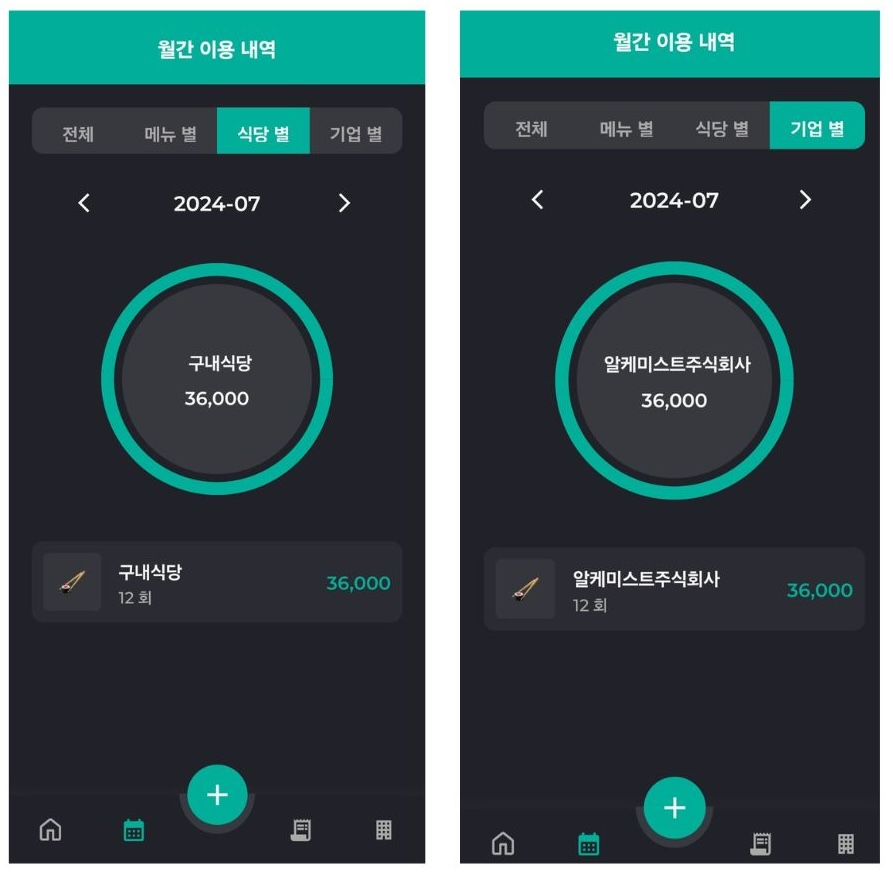
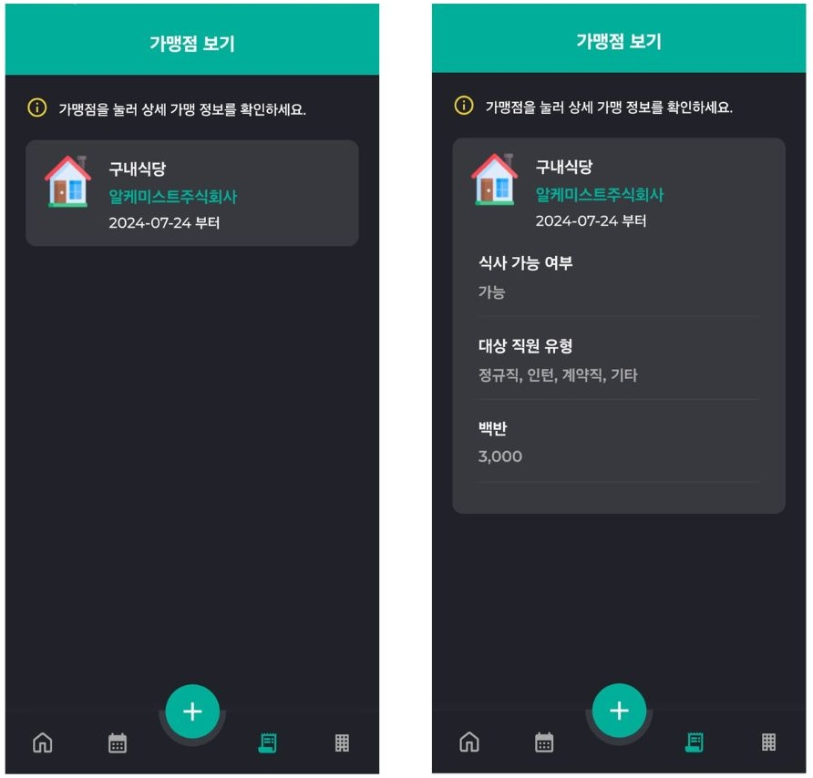
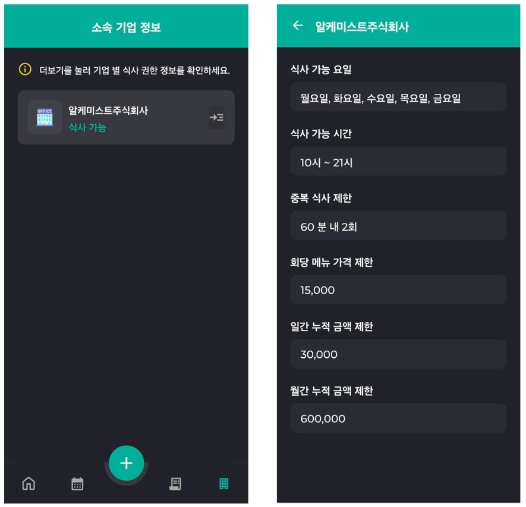
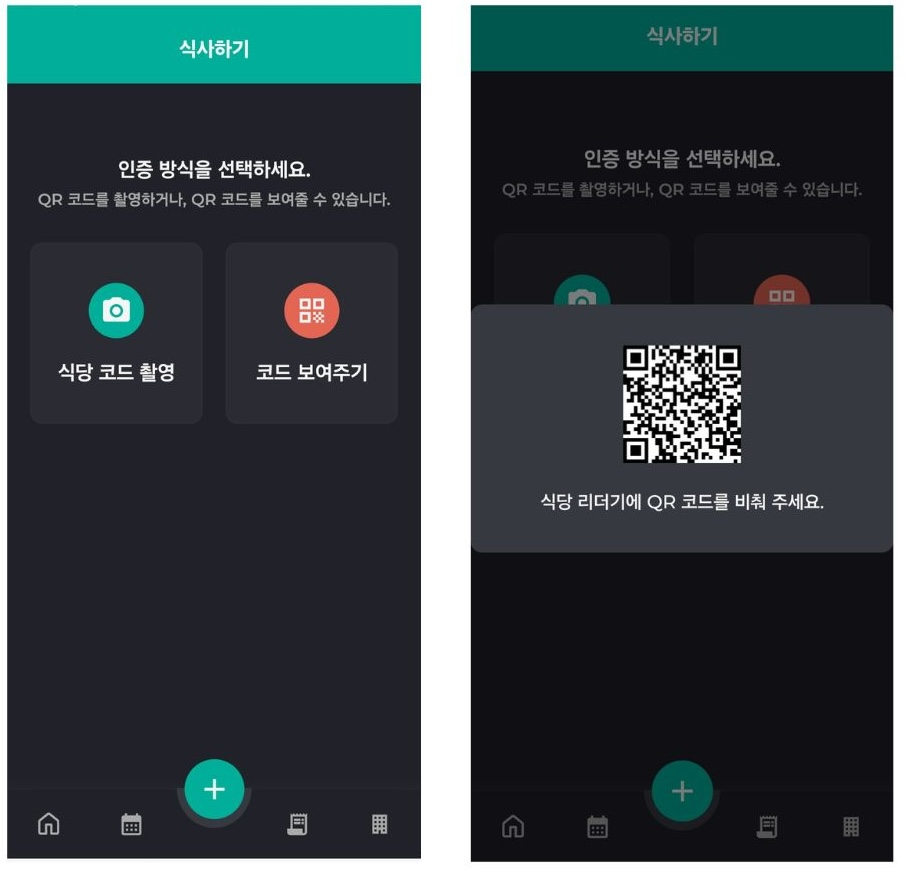
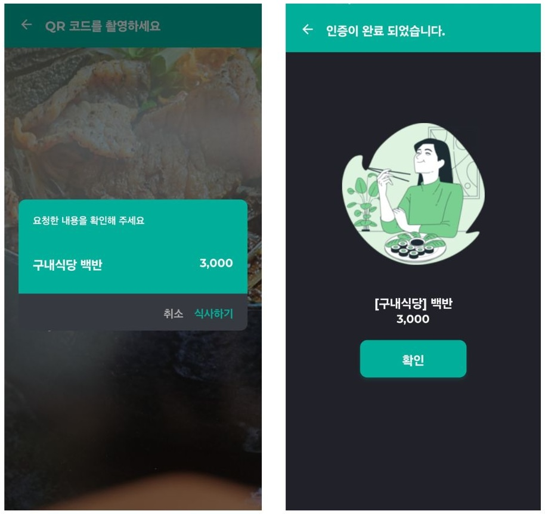
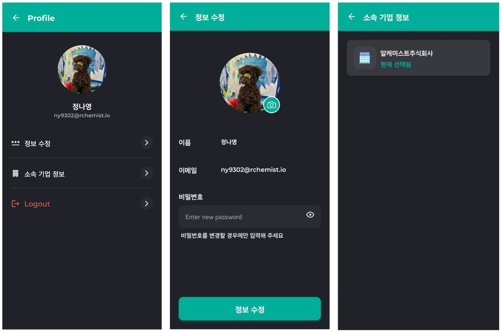

[#_mealcart]
= Mealcart App 매뉴얼
:toc: left
:toc-title: MealCart App
:toclevels: 3
:stylesheet: asciidoctor.css
:hardbreaks:
:doctype: book
:icons: font
:idseparator: -
:sectanchors:
:sectids:
:sectnums:
:sectlinks:
:sectnumlevels: 6
:author: ny9302@rchemist.io
:version-label: v0.1

== 처음 접속하기
=== 로그인
회사 관리자가 밀카트 사용자로 등록했다면 사용할 수 있습니다. 등록된 이메일로 로그인을 진행합니다.

====
.로그인 화면

====

==== 비밀번호 찾기
비밀번호를 잃어버리셨다면 `비밀번호 찾기` 버튼을 눌러 이메일주소를 입력합니다.

====
.비빌번호 찾기 이메일 입력 창

====

입력한 이메일로 전송된 다섯자리 코드를 입력 후 로그인을 진행합니다.

=== 식사 내역 확인하기

로그인 후 접속하면 바로 표시되는 페이지로서 최근 식사한 내역을 확인할 수 있습니다. 어느 식당에서 어떤 메뉴를 먹었는지, 식사 일자 및 메뉴의 금액을 확인할 수 있습니다. `View all` 버튼을 클릭하면 최근 식사 내역 전체를 확인할 수 있습니다.

====
.첫 접속화면 및 전체 식사 내역 확인

====

페이지 하단에 있는 집 모양의 `홈` 아이콘을 클릭하면 이 페이지로 돌아올 수 있습니다.

=== 월간 이용 내역
==== 전체 / 메뉴 별
앱 하단에 있는 캘린더 모양의 아이콘을 클릭하면 월간 이용 내역을 확인할 수 있습니다. 상단에는 전체, 메뉴별, 식당별, 기업별 탭이 있으며, 탭 밑에는 월을 이동하는 커서가 있습니다.
====
.월간이용 내역 전체, 메뉴 별 이용 내역확인

====

전체 탭에서는 월간 이용 내역을 확인할 수 있고, 메뉴별 탭에서는 각 메뉴를 몇 회 먹었는지와 금액을 확인할 수 있으며, 메뉴별 원그래프를 볼 수 있습니다.

==== 식당 별 / 기업 별
식당별 탭에서는 어떤 식당을 몇 회 이용했는지와 금액을 확인할 수 있으며, 기업별 탭에서는 어떤 기업을 통해 몇회 식사했는지와 금액을 확인할 수 있습니다.
====
.식당 별, 기업 별 이용 내역 확인

====

=== 가맹점 보기
앱 하단에 페이지 모양 아이콘을 클릭하면 가맹점을 확인할 수 있습니다. 회사가 어떤 식당과 가맹되어 있는지, 그리고 해당 식당에서 식사가 가능한지를 확인할 수 있는 페이지 입니다.

====
.가맹점 보기 화면

====

식사 가능 여부와 대상 직원 유형을 확인할 수 있으며, 기본 메뉴와 기본 메뉴 가격도 볼 수 있습니다.

=== 소속 기업 정보
앱 하단의 회사 모양 아이콘을 클릭하면 소속 기업 정보를 확인할 수 있습니다. `더보기` 를 눌러 기업별 식사 권한 정보를 확인할 수 있으며, 식사 가능한 요일과 식사 가능한 시간 등 회사에서 지정한 식대 정책 정보를 확인할 수 있습니다.

====
.소속 기업 정보 보기 화면

====

== 식사하기
화면 하단에 위치한 `+ 버튼`을 누르면 식사 결제를 진행할 수 있습니다. QR코드를 촬영하거나, QR 코드를 화면에 표시하여 결제를 완료할 수 있습니다.

====
.식사하기 > 코드 보여주기

====

=== 코드 보여주기

`코드 보여주기` 버튼을 클릭하면 QR코드가 화면에 표시됩니다. 식당 리더기에 QR코드를 비춰서 식사 결제를 완료할 수 있습니다.

=== 식당 코드 촬영
`식당 코드 촬영` 버튼을 클릭하면 카메라가 활성화되어 QR 코드를 촬영할 수 있습니다.
====
.식사하기 > 식당 코드 촬영

====

QR 코드를 촬영하면 요청한 내용을 확인할 수 있는 창이 뜨며, 식사하기 버튼을 누르면 식사가 완료 처리됩니다. 취소 버튼을 누르면 요청이 취소됩니다.

=== QR 코드 스캔 후 처리 상황 안내
QR 코드를 촬영한 후, 다양한 상황에 따라 알림 창이 표시됩니다.
====
.QR 코드 촬영 후 상황에 따른 알림 창
image::app_images/meal2.png[width=800]
====

. 중복 식사 경고: 이미 해당 시간대에 식사를 완료한 경우, 중복 식사에 대한 경고가 나타납니다. 계속 진행하려면 `식사하기` 버튼을 클릭해 완료 처리합니다.

. 제한 알림: 회사에서 지정한 중복 식사 횟수를 초과하거나 식사 가능한 시간이 아닐 경우, 식사 요청이 불가능하다는 메시지가 표시됩니다.

. 메뉴 선택 제한: 해당 기업의 식사 계약 조건에 따라 선택할 수 없는 메뉴가 있을 경우, 메뉴 선택 제한에 대한 안내 메시지가 표시됩니다.

== 프로필
홈 화면의 우측 상단에 위치한 사용자 아이콘을 클릭하면 내 정보를 확인하고 수정할 수 있습니다.
====
.프로필 확인

====

=== 정보 수정
정보 수정 버튼을 클릭하면 비밀번호를 수정하거나 프로필 사진을 변경할 수 있습니다.

==== 프로필 사진 변경
프로필 사진 옆의 `카메라 아이콘` 을 클릭하면 다음 옵션이 제공됩니다:

* 사진찍기: 카메라를 사용하여 새로운 프로필 사진을 찍을 수 있습니다.
* 사진첩에서 찾기: 갤러리에서 기존 사진을 선택하여 프로필 사진으로 설정할 수 있습니다.
* 등록된 프로필 이미지 제거: 현재 등록도니 프로필 이미지를 제거할 수 있습니다.

==== 비밀번호 변경
비밀번호를 변경할 경우에 비밀번호를 입력 후 `정보 수정` 버튼을 눌러 비밀번호 변경을 진행합니다.

=== 소속기업 정보
현재 소속된 기업의 정보를 확인합니다.