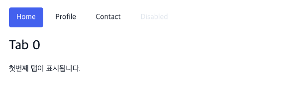

= Admin Template > Components
:toc: left
:toc-title: Admin Template Components
:toclevels: 3
:stylesheet: asciidoctor.css
:hardbreaks:
:doctype: book
:icons: font
:idseparator: -
:sectanchors:
:sectids:
:sectnums:
:sectlinks:
:source-highlighter: rouge
:sectnumlevels: 6
:author: kunner@rchemist.io
:authorname: Kunner, Kil.
:version-label: v0.1

[#getting-started]
== Getting Started

이 문서는 Admin Template 에서 제공하는 여러 Rendering 용 Component 를 안내합니다.

주로 예상 화면과 코드로 구성되어 있습니다.

== Tab

=== 기본 탭

다음과 같은 Tab 을 표시합니다.

====

====

====
[source, typescriptjsx]
----
import {Tab} from '@headlessui/react';

<Tab.Group>
                        <Tab.List className="mt-3 flex flex-wrap border-b border-white-light dark:border-[#191e3a]">
                            <Tab as={Fragment}>
                                {({ selected }) => (
                                    <button
                                        className={`${
                                            selected ? '!border-white-light !border-b-white  text-primary !outline-none dark:!border-[#191e3a] dark:!border-b-black ' : ''
                                        } -mb-[1px] block border border-transparent p-3.5 py-2 hover:text-primary dark:hover:border-b-black`}
                                        onClick={() => {setTabIndex(0)}}
                                    >
                                        Home
                                    </button>
                                )}
                            </Tab>
                            <Tab as={Fragment}>
                                {({ selected }) => (
                                    <button
                                        className={`${
                                            selected ? '!border-white-light !border-b-white  text-primary !outline-none dark:!border-[#191e3a] dark:!border-b-black ' : ''
                                        } -mb-[1px] block border border-transparent p-3.5 py-2 hover:text-primary dark:hover:border-b-black`}
                                        onClick={() => {setTabIndex(1)}}
                                    >
                                        Profile
                                    </button>
                                )}
                            </Tab>
                            <Tab as={Fragment}>
                                {({ selected }) => (
                                    <button
                                        className={`${
                                            selected ? '!border-white-light !border-b-white  text-primary !outline-none dark:!border-[#191e3a] dark:!border-b-black ' : ''
                                        } -mb-[1px] block border border-transparent p-3.5 py-2 hover:text-primary dark:hover:border-b-black`}
                                        onClick={() => {setTabIndex(2)}}
                                    >
                                        Contact
                                    </button>
                                )}
                            </Tab>
                            <Tab className="pointer-events-none -mb-[1px] block p-3.5 py-2 text-white-light outline-none dark:text-dark">Disabled</Tab>
                        </Tab.List>
                        <Tab.Panels>
                            <Tab.Panel>
                                {tabIndex === 0 ? (

                                    <h4 className="mb-4 text-2xl font-semibold">Tab number: {tabIndex}</h4>
                                    

                                        첫번째 탭이 표시됩니다.
                                    

                                
) : <></>}
                            </Tab.Panel>
                            <Tab.Panel>
                                {tabIndex === 1 ? (

                                    <h4 className="mb-4 text-2xl font-semibold">Tab number: {tabIndex}</h4>
                                    

                                        두번째 탭이 표시됩니다.
                                    

                                
) : <></>}
                            </Tab.Panel>
                            <Tab.Panel>
                                {tabIndex === 2 ? (

                                    <h4 className="mb-4 text-2xl font-semibold">Tab number: {tabIndex}</h4>
                                    

                                        세번째 탭이 표시됩니다.
                                    

                                
) : <></>}
                            </Tab.Panel>
                            <Tab.Panel>Disabled</Tab.Panel>
                        </Tab.Panels>
                    </Tab.Group>
----
====

=== Pills

탭을 다음과 같이 Pills 로 표시합니다.

====

====

====
[source, typescriptjsx]
----
import {Tab} from '@headlessui/react';

<Tab.Group>
  <Tab.List className="mt-3 flex flex-wrap">
    <Tab as={Fragment}>
        {({ selected }) => (
            <button
                className={`${selected ? 'bg-primary text-white !outline-none' : ''}
                            ' -mb-[1px] block rounded p-3.5 py-2 hover:bg-primary hover:text-white ltr:mr-2 rtl:ml-2`}
            >
                Home
            </button>
        )}
    </Tab>
    <Tab as={Fragment}>
        {({ selected }) => (
            <button
                className={`${selected ? 'bg-primary text-white !outline-none' : ''} -mb-[1px] block rounded p-3.5 py-2 hover:bg-primary hover:text-white ltr:mr-2 rtl:ml-2`}
            >
                Profile
            </button>
        )}
    </Tab>
    <Tab as={Fragment}>
        {({ selected }) => (
            <button
                className={`${selected ? 'bg-primary text-white !outline-none' : ''} -mb-[1px] block rounded p-3.5 py-2 hover:bg-primary hover:text-white ltr:mr-2 rtl:ml-2`}
            >
                Contact
            </button>
        )}
    </Tab>
    <Tab className="pointer-events-none -mb-[1px] block rounded p-3.5 py-2 text-white-light dark:text-dark">Disabled</Tab>
  </Tab.List>
  <Tab.Panels>
    <Tab.Panel>
        

            <h4 className="mb-4 text-2xl font-semibold">Tab 0</h4>
            

                첫번째 탭이 표시됩니다.
            

        

    </Tab.Panel>
    <Tab.Panel>
        

            <h4 className="mb-4 text-2xl font-semibold">Tab 1</h4>
            

                두번째 탭이 표시됩니다.
            

        

    </Tab.Panel>
    <Tab.Panel>
        

            <h4 className="mb-4 text-2xl font-semibold">Tab 2</h4>
            

                세번째 탭이 표시됩니다.
            

        

    </Tab.Panel>
    <Tab.Panel>Disabled</Tab.Panel>
  </Tab.Panels>
</Tab.Group>
----
====

== Accordions

접혔다 펼쳐지는 Accordion UI 를 구현합니다.

=== 기본 Accordion

====

====

====
[source, typescriptjsx]
----
import {Accordion, AccordionBody, AccordionItem, AccordionTitle} from "@/components/accordions/Accordion";

<Accordion>
  <AccordionItem>
    <AccordionTitle>제목</AccordionTitle>
    <AccordionBody>내용</AccordionBody>
  </AccordionItem>
  <AccordionItem>
    <AccordionTitle>제목2</AccordionTitle>
    <AccordionBody>내용2</AccordionBody>
  </AccordionItem>
  <AccordionItem>
    <AccordionTitle>제목3</AccordionTitle>
    <AccordionBody>내용3</AccordionBody>
  </AccordionItem>
</Accordion>
----
====

=== No Spacing
아코디언 아이템이 펼쳐질 때 구분선을 제거하고, 각 아코디언 아이템 간의 공백을 제거합니다.

====
image::images/components/acc-spacing.png[]
====

====
[source, typescriptjsx]
----
import {Accordion, AccordionBody, AccordionItem, AccordionTitle} from "@/components/accordions/Accordion";

<Accordion spacing={0}>
  <AccordionItem>
    <AccordionTitle>제목</AccordionTitle>
    <AccordionBody>내용</AccordionBody>
  </AccordionItem>
  <AccordionItem>
    <AccordionTitle>제목2</AccordionTitle>
    <AccordionBody>내용2</AccordionBody>
  </AccordionItem>
  <AccordionItem>
    <AccordionTitle>제목3</AccordionTitle>
    <AccordionBody>
      

        
중첩된 HTML 구조의 데이터도 삽입될 수 있습니다.

        <button type="button" className={'btn btn-outline-primary'}>버튼</button>
      

    </AccordionBody>
  </AccordionItem>
</Accordion>
----
====

=== with Icon

====
image::images/components/acc-icon.png[]
====

====
[source, typescriptjsx]
----
import {Accordion, AccordionBody, AccordionItem, AccordionTitle} from "@/components/accordions/Accordion";
import IconBell from '@/components/icon/icon-bell';

<Accordion>
  <AccordionItem>
    <AccordionTitle icon={<IconBell/>}>제목</AccordionTitle>
    <AccordionBody>내용</AccordionBody>
  </AccordionItem>
  <AccordionItem>
    <AccordionTitle>제목2</AccordionTitle>
    <AccordionBody>내용2</AccordionBody>
  </AccordionItem>
  <AccordionItem>
    <AccordionTitle>제목3</AccordionTitle>
    <AccordionBody>내용3</AccordionBody>
  </AccordionItem>
</Accordion>
----
====

== Modal

`@/components/components/modals/Modal` 을 사용해 쉽게 모달 창을 띄울 수 있습니다.

`<Modal/>` 에서 사용할 수 있는 옵션은 다음과 같습니다.

====
[source, typescriptjsx]
----
interface ModalProps {
  opened?: boolean;   // 모달의 open 상태를 외부에서 제어하기 위한 값
  position?: WindowPositionType;    // 지정된 position 으로 모달을 띄울 때 사용한다. classNames['position'] 이 지정된 경우 무시한다.
  zIndex?: number;    // 모달의 zIndex, 기본값은 999
  title?: string | ReactNode;   // 모달 제목, entity-form.title = false 인 경우에는 이 값을 지정해도 제목이 표시되지 않는다.
  width?: SizeType;    // 모달의 크기를 지정된 사이즈로 띄울 때 사용한다. classNames['maxWidth'] 가 지정된 경우 무시한다.
  className?: string;   // 오버라이드 클래스네임
  classNames?: Record<string, string>;  // 특정 타입의 클래스만 변경하고자 할 때, ModalClassType 에 지정된 key 에만 대응한다.
  onClose?: () => void;   // 모달이 닫힐 때 상위 모듈로 전파하는 function
  view?: {
    title?: boolean,    // 제목 표시 여부  이 값이 false 이면 제목이 '' 로 표시된다.
    close?: boolean,    // 닫기 버튼 표시 여부 - 이 값이 false 이면 닫기 버튼이 표시되지 않는다.
    closeButton?: ReactNode     // 사용자 정의 닫기 버튼 - close 가 false 면 이 값을 설정해도 표시되지 않는다.
  }
  closeOnClickOutside?: boolean;    // 모달 창의 바깥 backdrop 을 클릭하면 모달이 닫히게 할 것인지 여부, 기본값은 true
  closeOnEscape?: boolean;    // 모달의 띄워진 상태에서 Escape 를 누르면 모달이 닫히게 할 것인지 여부, 기본값은 false
  children: ReactNode | ReactNode[];    // 모달창 body 에 들어갈 실제 모달 내용
  animation?: AnimationType | 'none';    // 모달 애니메이션 타입
  padding?: boolean | number | string;   // 모달 body의 padding 값. boolean 으로 설정하면 기본 패딩 p-5 의 적용 여부, 숫자로 들어오면 p-[number], 문자열로 오면 className 을 대체함
}

----
====

====
.파라미터 타입
[source, typescript]
----
export type WindowPositionType = 'center' | 'top' | 'top-left' | 'top-right' | 'top-center' | 'bottom' | 'bottom-left'| 'bottom-right' | 'center-left' | 'center-right'

export type SizeType = 'xs' | 'sm' | 'md' | 'lg' | 'xl' | '2xl' | '5xl' | 'full';

export type AnimationType = 'fade-in' | 'slide-down' | 'fade-up' | 'slide-up' | 'fade-left' | 'rotate' | 'fade-right' | 'zoom';
----
====

=== 기본 모달
====
[source, typescriptjsx]
----
import {Modal} from '@/components/components/modals/Modal';

<Modal title={'Modal Title'} opened={open1} onClose={() => {
          setOpen1(false)
        }}>
    {/*{// omitted //}*/}
</Modal>
----
====

=== 모달 위치 조정

position 속성을 지정해 모달의 위치를 조정합니다.

화면을 9분할한 PositionType 을 지정할 수 있습니다.

====
[source, typescriptjsx]
----
import {Modal} from '@/components/components/modals/Modal';

<Modal title={'Modal Title'} opened={open1} onClose={() => {
          setOpen1(false)
        }} position={`center`}>
    {/*{// omitted //}*/}
</Modal>
----
====

=== closeOnClickOutside

모달 창의 바깥 영역을 누르면 창이 닫히게 하는 옵션을 설정합니다. 기본 값은 `true` 입니다.

====
[source, typescriptjsx]
----
import {Modal} from '@/components/components/modals/Modal';

<Modal title={'Modal Title'} opened={open1} onClose={() => {
          setOpen1(false)
        }} closeOnClickOutside={false}>
    {/*{// omitted //}*/}
</Modal>
----
====

=== animation

모달 창이 뜰 때 애니메이션 효과를 지정합니다. 기본값은 `fade-in` 입니다.

애니메이션의 종류는 AnimationType 을 참고하세요.

이 값에 `none` 을 설정해 애니메이션 없이 모달을 띄울 수 있습니다.

====
[source, typescriptjsx]
----
import {Modal} from '@/components/components/modals/Modal';

<Modal title={'Modal Title'} opened={open1} onClose={() => {
          setOpen1(false)
        }} animation={'none'}>
    {/*{// omitted //}*/}
</Modal>
----
====

=== size

size 옵션을 지정해 모달창의 가로 크기를 설정할 수 있습니다.

====
[source, typescriptjsx]
----
import {Modal} from '@/components/components/modals/Modal';

<Modal title={'Modal Title'} opened={open1} onClose={() => {
          setOpen1(false)
        }} size={'xl'}>
    {/*{// omitted //}*/}
</Modal>
----
====

=== view 설정

모달 창 내부의 기본 layout 을 변경할 수 있습니다.

모달 창은 기본적으로 Header bar 와 Body 영역을 나누어 표시합니다.

====

====

만약 Header 영역 표시를 제거하려면 다음과 같이 코드를 작성합니다.

====
[source, typescriptjsx]
----
import {Modal} from '@/components/components/modals/Modal';

<Modal title={'Modal Title'} opened={open1} onClose={() => {
          setOpen1(false)
        }} view={{title: false}}>
    {/*{// omitted //}*/}
</Modal>
----
====

== Card

====
image::images/components/card-basic.png[]
[source, typescriptjsx]
----

    

        

            

                <IconStar />
            

            <h5 className="mb-4 text-xl font-semibold text-[#3b3f5c] dark:text-white-light">타이틀</h5>
            
내용

        

    

----
====

== Carousel

`Swiper` 모듈을 사용해 Carousel 을 구현합니다.

====
[source, typescriptjsx]
----
import { Navigation, Pagination, Autoplay } from 'swiper';
import {Swiper, SwiperSlide} from 'swiper/react';

const items = ['carousel1.jpeg', 'carousel2.jpeg', 'carousel3.jpeg'];

return <Swiper
    modules={[Navigation, Autoplay, Pagination]}
    navigation={{
        nextEl: '.swiper-button-next-ex2',
        prevEl: '.swiper-button-prev-ex2',
    }}
    pagination={{ clickable: true }}
    autoplay={{ delay: 2000 }}
    className="swiper mx-auto mb-5 max-w-3xl"
    id="slider2"
    dir={themeConfig.rtlClass}
    key={themeConfig.rtlClass === 'rtl' ? 'true' : 'false'}
>
    

        {items.map((item, i) => {
            return (
                <SwiperSlide key={i}>
                    
                    

                        
This is blog Image

                        

                            {`Lorem Ipsum is simply dummy text of the printing and
              typesetting industry. Lorem Ipsum has been the
              industry's standard.`}
                        

                        <button type="button" className="btn btn-primary mt-4">
                            Learn more
                        </button>
                    

                </SwiperSlide>
            );
        })}
    

    <button className="swiper-button-prev-ex2 absolute top-1/2 z-[999] grid -translate-y-1/2 place-content-center rounded-full border border-primary p-1  text-primary transition hover:border-primary hover:bg-primary hover:text-white ltr:left-2 rtl:right-2">
        <IconCaretDown className="h-5 w-5 rotate-90 rtl:-rotate-90" />
    </button>
    <button className="swiper-button-next-ex2 absolute top-1/2 z-[999] grid -translate-y-1/2 place-content-center rounded-full border border-primary p-1  text-primary transition hover:border-primary hover:bg-primary hover:text-white ltr:right-2 rtl:left-2">
        <IconCaretDown className="h-5 w-5 -rotate-90 rtl:rotate-90" />
    </button>
</Swiper>
----
====

=== 여러 Carousel 을 한번에 표시하기

====
[source, typescriptjsx]
----
import { Navigation, Pagination, Autoplay } from 'swiper';
import {Swiper, SwiperSlide} from 'swiper/react';

const items = ['carousel1.jpeg', 'carousel2.jpeg', 'carousel3.jpeg'];

return <Swiper
    id="slider4"
    modules={[Navigation, Pagination]}
    navigation={{
        nextEl: '.swiper-button-next-ex5',
        prevEl: '.swiper-button-prev-ex5',
    }}
    pagination={{
        clickable: true,
    }}
    breakpoints={{
        1024: {
            slidesPerView: 3,
            spaceBetween: 30,
        },
        768: {
            slidesPerView: 2,
            spaceBetween: 40,
        },
        320: {
            slidesPerView: 1,
            spaceBetween: 20,
        },
    }}
    dir={themeConfig.rtlClass}
    key={themeConfig.rtlClass === 'rtl' ? 'true' : 'false'}
>
    

        {items.map((item, i) => {
            return (
                <SwiperSlide key={i}>
                    
                </SwiperSlide>
            );
        })}
        {items.map((item, i) => {
            return (
                <SwiperSlide key={i}>
                    
                </SwiperSlide>
            );
        })}
    

    <button className="swiper-button-prev-ex5 absolute top-[44%] z-[999] grid -translate-y-1/2 place-content-center rounded-full border border-primary p-1  text-primary transition hover:border-primary hover:bg-primary hover:text-white ltr:left-2 rtl:right-2">
        <IconCaretDown className="h-5 w-5 rotate-90 rtl:-rotate-90" />
    </button>
    <button className="swiper-button-next-ex5 absolute top-[44%] z-[999] grid -translate-y-1/2 place-content-center rounded-full border border-primary p-1  text-primary transition hover:border-primary hover:bg-primary hover:text-white ltr:right-2 rtl:left-2">
        <IconCaretDown className="h-5 w-5 -rotate-90 rtl:rotate-90" />
    </button>
</Swiper>
----
====

== Countdown

====
image::images/components/countdown.png[]
[source, typescriptjsx]
----
import React, {useEffect, useState} from 'react';

const [demo1, setDemo1] = useState<any>({ days: null, hours: null, minutes: null, seconds: null });
const [timer1, setTimer1] = useState<any>(null);

const setTimerDemo1 = () => {
    const date = new Date();
    date.setDate(date.getDate() + 3);
    const countDownDate = date.getTime();

    let updatedValue: any = {};
    setTimer1(
        setInterval(() => {
            const now = new Date().getTime();

            const distance = countDownDate - now;

            updatedValue.days = Math.floor(distance / (1000 * 60 * 60 * 24));
            updatedValue.hours = Math.floor((distance % (1000 * 60 * 60 * 24)) / (1000 * 60 * 60));
            updatedValue.minutes = Math.floor((distance % (1000 * 60 * 60)) / (1000 * 60));
            updatedValue.seconds = Math.floor((distance % (1000 * 60)) / 1000);
            setDemo1((demo1: any) => ({
                ...demo1,
                ...updatedValue,
            }));

            if (distance < 0) {
                clearInterval(timer1);
            }
        })
    );
};

useEffect(() => {
    setTimerDemo1();
}, []);

return (

    

        

            <h1 className="text-center text-xl text-primary sm:text-3xl">{demo1.days}</h1>
        

        <h4 className="mt-4 text-center text-[15px] font-semibold text-[#3b3f5c] dark:text-white-dark">Days</h4>
    

    

        

            <h1 className="text-center text-xl text-primary sm:text-3xl">{demo1.hours}</h1>
        

        <h4 className="mt-4 text-center text-[15px] font-semibold text-[#3b3f5c] dark:text-white-dark">Hours</h4>
    

    

        

            <h1 className="text-center text-xl text-primary sm:text-3xl">{demo1.minutes}</h1>
        

        <h4 className="mt-4 text-center text-[15px] font-semibold text-[#3b3f5c] dark:text-white-dark">Mins</h4>
    

    

        

            <h1 className="text-center text-xl text-primary sm:text-3xl">{demo1.seconds}</h1>
        

        <h4 className="mt-4 text-center text-[15px] font-semibold text-[#3b3f5c] dark:text-white-dark">Sec</h4>
    

);
----
====

== Counter

컴포넌트가 마운트 되면 숫자값이 증가하는 효과를 주면서 숫자를 표시할 수 있습니다.

====
image::images/components/counter.png[]
[source, typescriptjsx]
----

import CountUp from 'react-countup';

    

        

            <CountUp start={0} end={710} duration={7} className="text-center text-xl text-primary sm:text-3xl" />
        

        <h4 className="mt-4 text-center text-xs font-semibold text-[#3b3f5c] dark:text-white-dark sm:text-[15px]">HOURS</h4>
    

    

        

            <CountUp start={0} end={915} duration={7} className="text-center text-xl text-primary sm:text-3xl" />
        

        <h4 className="mt-4 text-center text-xs font-semibold text-[#3b3f5c] dark:text-white-dark sm:text-[15px]">TICKETS</h4>
    

    

        

            <CountUp start={0} end={580} duration={7} className="text-center text-xl text-primary sm:text-3xl" />
        

        <h4 className="mt-4 text-center text-xs font-semibold text-[#3b3f5c] dark:text-white-dark sm:text-[15px]">CUSTOMERS</h4>
    

----
====

== SweetAlert

`SweetAlert` 모듈을 이용해 모달로 Alert 메시지를 표시하고 모달이 닫힐 때 추가 처리를 하게 할 수 있습니다.

====
.showSuccessBySweetAlert
[source, typescriptjsx]
----
import {showSuccessBySweetAlert} from "@/components/sweet-alerts/SweetAlert";

await showSuccessBySweetAlert({
                               message: '삭제가 완료 되었습니다',
                               onThen: onThen
                             });
----
====

