= Admin Template 개발자 매뉴얼
:toc: left
:toc-title: Admin Template 개발자 매뉴얼
:toclevels: 3
:stylesheet: asciidoctor.css
:hardbreaks:
:doctype: book
:icons: font
:idseparator: -
:sectanchors:
:sectids:
:sectnums:
:sectlinks:
:source-highlighter: rouge
:sectnumlevels: 6
:author: kunner@rchemist.io
:authorname: Kunner, Kil.
:version-label: v0.1

[#getting-started]
== Getting Started

=== Repository

https://github.com/rchemist/template-admin-site.git

github 에서 이 프로젝트를 fork 해 새로운 관리자도구 프로젝트를 생성합니다.

또는 git clone 으로 local 경로에 프로젝트를 생성합니다.

코드를 다 내려 받은 후 template-admin-site 폴더로 이동해 계속 진행합니다.

====
[source,bash]
----
git clone https://github.com/rchemist/template-admin-site.git
cd template-admin-site
----
====

=== 의존성 설치

먼저 node 와 npm 을 설치합니다. 이미 설치되어 있다면 skip 합니다.

====
[source,bash]
----
brew install npm
----
====

프로젝트의 root 디렉토리에서 npm install 명령어를 이용해 필요한 의존성을 다운로드 합니다.

====
[source,bash]
----
npm install
----
====

=== 실행

==== 로컬 개발모드 실행

로컬에서 다음 명령어를 통해 서버를 실행합니다.

====
[source,bash]
----
npm run dev
# or
yarn dev
# or
pnpm dev
----
====

브라우저에서 http://localhost:3300 로 접속하면 서비스를 확인할 수 있습니다.

==== 빌드/배포

===== 빌드

프로젝트를 배포하려면 먼저 코드를 빌드해야 합니다.

====
[source,bash]
----
npm run build
----
====

빌드 시점에 환경 별로 재정의된 변수를 참조할 수 있습니다.
이에 대한 자세한 설명은 <<installation-variables, 환경 변수>> 를 참고하세요.

====
.환경 별 빌드 명령
[cols="<.^3,<.^7"]
|===
|실행 환경 | 실행 명령

|로컬|npm run dev
|Development|npm run build:dev
|Staging|npm run build:staging
|Production|npm run build:staging
|===
====

===== 배포

빌드가 끝난 후 아래 명령어로 서비스를 실행합니다.

====
[source,bash]
----
npm run start
----
====

====
.환경 별 실행 명령
[cols="<.^3,<.^7"]
|===
|실행 환경 | 실행 명령

|로컬|npm run dev
|Development|npm run start:dev
|Staging|npm run start:staging
|Production|npm run start:staging
|===

개발서버, 스테이징 서버에서 서로 다른 환경변수를 설정해 서비스를 실행할 수 있습니다.
이에 대한 자세한 설명은 <<installation-variables, 환경 변수>> 를 참고 하시기 바랍니다.
====

==== Docker

루트 디렉토리에서 `deploy.sh` 를 실행하면 Docker 이미지가 생성되어 자동 실행됩니다.

====
[source,bash]
----
./deploy.sh
----
====

기본 포트는 3000 번이며, 포트를 변경하려면 아래 코드를 참고 하세요.

====
.docker-compose.yml
[source,yaml]
----
version: '3.8'

services:
  rchemist-admin:   # 적절한 서비스 이름으로 변경 가능
    build:
      context: .
      dockerfile: Dockerfile
    image: nextjs-app
    ports:
      - 3000:3300     # 서비스를 실행할 PORT 번호를 입력하세요.
    volumes:
      - ~/docker/www/rcm/admin/volume/data    # 먼저 해당 디렉토리가 실제로 존재해야 합니다. 필요에 따라 변경하면 됩니다.
    environment:
      - TZ=Asia/Seoul
    networks:
      - nginx-proxy-manager   # nginx-proxy-manager 를 사용하는 경우

networks:
  nginx-proxy-manager:
    external:
      name: nginx-proxy-manager   # nginx-proxy-manager 를 사용하는 경우

----
====

====
.Dockerfile
[source,dockerfile]
----
# Base Image
FROM node:18-alpine

# Set working directory
WORKDIR /app

RUN apk --no-cache add tzdata && \
    cp /usr/share/zoneinfo/Asia/Seoul /etc/localtime

# Copy package.json and package-lock.json
COPY package*.json ./

# Install dependencies
RUN npm ci

# Copy source code
COPY . .

# Build the Next.js application
RUN npm run build

# Expose the port Next.js is listening on (default: 3000)
# 필요한 포트로 변경
EXPOSE 3000

# Start the Next.js application
CMD ["npm", "start"]
----
====

[#installation-variables]
=== 환경 변수

NextJS 프로젝트는 `.env` 파일에 환경 변수를 설정해 사용합니다.
그리고 가장 높은 우선순위를 갖는 `.env.local` 파일로 환경 변수를 재정의할 수 있습니다.

====
link:https://nextjs.org/docs/pages/building-your-application/configuring/environment-variables[Environment Variables(NextJS)]
====

여기에 실행 명령에 따라 `.env` 파일을 실행 환경에 맞게 오버라이드 할 수 있습니다.

환경변수가 적용되는 우선순위는 다음과 같습니다.

====
.실행 명령 별 환경변수 설정
[cols="<.^3,<.^4,<.^3"]
|===
|실행 환경 | 실행 명령 | 환경 변수 적용

|로컬|npm run dev|`.env.local`
`.env`
|Development(빌드)|npm run build:dev|`.env.local`
`.env.development`
`.env`
|Development(실행)|npm run start:dev|`.env.local`
`.env.development`
`.env`
|Staging(빌드)|npm run build:staging|`.env.local`
`.env.staging`
`.env`
|Staging(실행)|npm run start:staging|`.env.local`
`.env.staging`
`.env`
|Production(빌드)|npm run build:staging|`.env.local`
`.env`
|Production(실행)|npm run start:staging|`.env.local`
`.env`
|===

`.env` 파일은 모든 환경에서 참조하며, 우선순위가 가장 낮습니다.
====

_실행 관련 설정은 /package.json 의 "scripts" 노드를 확인하시기 바랍니다._

[#auth]
== Authentication

[#auth-jwt]
=== AccessToken(JWT)

RCM Backend Framework 은 기본 인증 방식으로 JWT 를 사용합니다.

인증된 사용자가 RCM Backend API 를 요청하는 경우 Request Header 에 다음 값을 입력해야 합니다.
<<utils-api-method, CallExternalAPI>>를 이용하면 세션 정보를 자동으로 Header 에 넣어 주게 됩니다.
단, ServerSide Script 에서는 동작하지 않으므로 헤더에 직접 accessToken 을 추가해야 합니다.

====
.인증된 Header 값
[cols="<.^2,<.^8"]
|===
|필드 | 값

|authorization|Bearer `accessToken값`
|===
====

[#auth-process]
=== 인증 프로세스

RCM Admin Template 의 기본 인증 방식은 다음과 같습니다.

[#auth-process-loginName]
==== 아이디/비밀번호 로그인 프로세스

====
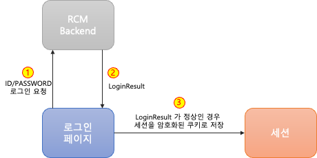
====

{blank}
{blank}

로그인이 정상적으로 완료되면 Backend 서버에서 아래와 같은 LoginResult 를 반환합니다.

[#auth-process-loginResult]
====
.LoginResult
[source,java]
----
public class LoginResult implements Serializable {

  // 토큰 정보
  protected Token token;

  // 인증된 사용자의 세부 정보
  protected PlatformAuthenticationData authentication;

  // Token Refresh 등의 영향으로 토큰이 변경됐는지 여부
  protected Boolean tokenChanged = false;

  // 생략

}
----

{blank}
{blank}

.Token
[source,java]
----
public class Token implements Serializable {

  // 'Bearer'
  private String grantType;

  // accessToken(JWT)
  private String accessToken;

  // refreshToken
  private String refreshToken;

  // accessToken 유효기간 - seconds
  private long accessTokenExpirationTime;

  // refreshToken 유효기간 - seconds
  private long refreshTokenExpirationTime;

  // 생략

}
----

{blank}
{blank}

.PlatformAuthenticationData
[source,java]
----
public class PlatformAuthenticationData implements PlatformAuthenticationTemplate<PlatformAuthenticationData> {

  /**
   * Object principal : 아이디
   * String loginName : 아이디
   * String name : 사용자 이름
   * String siteType : 사이트 유형 - 'ADMIN' | 'FRONT'
   * String userId : DB에서 관리하는 USER ID
   * String tenantAlias : 테넌트 아이디(멀티테넌트 사용 시)
   * String siteAlias : 사이트 아이디(멀티사이트 사용 시)
   * Boolean rememberMe : 자동로그인 사용 여부
   * List<String> roles : 인증된 사용자가 보유한 ROLE
   * String accessToken : ACCESS_TOKEN
   * String refreshToken : REFRESH_TOKEN
   */
  public PlatformAuthenticationData(PlatformAuthentication authentication) {
    this.withPrincipal(authentication.getPrincipal())
        .withLoginName(authentication.getLoginName())
        .withName(authentication.getName())
        .withSiteType(authentication.getSiteType())
        .withUserId(authentication.getUserId())
        .withTenantAlias(authentication.getTenantAlias())
        .withSiteAlias(authentication.getSiteAlias())
        .withRememberMe(authentication.isRememberMe())
        .withRoles(authentication.getRoles())
        .withAccessToken(authentication.getAccessToken())
        .withRefreshToken(authentication.getRefreshToken());
  }
  // 생략
}
----
====

[#auth-process-socialLogin]
==== 소셜 로그인 프로세스

====
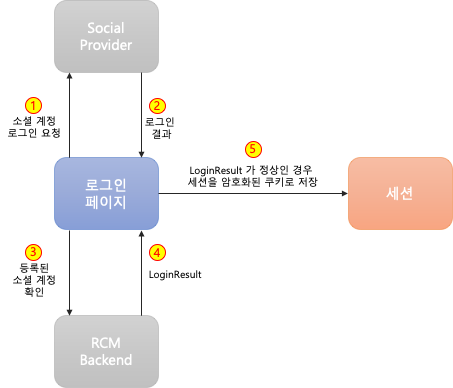
====

RCM Backend 를 호출하기 전, 소셜 프로바이더에서 accountId 를 획득하는 과정이 필요합니다.

이후 획득한 accountId 를 RCM Backend 로 전달해 등록된 계정인지 여부를 확인합니다.

최종적으로 RCM Backend 에서 전달 받는 LoginResult 는 <<auth-process-loginName, 아이디/비밀번호 로그인>>에서 설명한 <<auth-process-loginResult, LoginResult>> 와 동일합니다.

{blank}
{blank}

*Backend*

`https://{authServer}/api/v1/auth/login/social` 의 end point 가 필요합니다.

Front 에서는 해당 API로 다음 값을 전송합니다.

====
[source,json]
----
{
  "provider": "google | required",
  "providerUserId": "google-account id | required",
  "emailAddress": "email@rchemist.io"
}
----
====

[#auth-login]
=== 로그인

로그인은 사용자가 <<auth-process, 로그인 프로세스>> 에 따라 아이디 비밀번호, 또는 소셜 계정을 이용해 accessToken 을 획득하는 행위입니다.

아직 로그인하지 않은 경우 `http://localhost:3300/login` 으로 접속하면 로그인 화면을 확인할 수 있습니다.

====
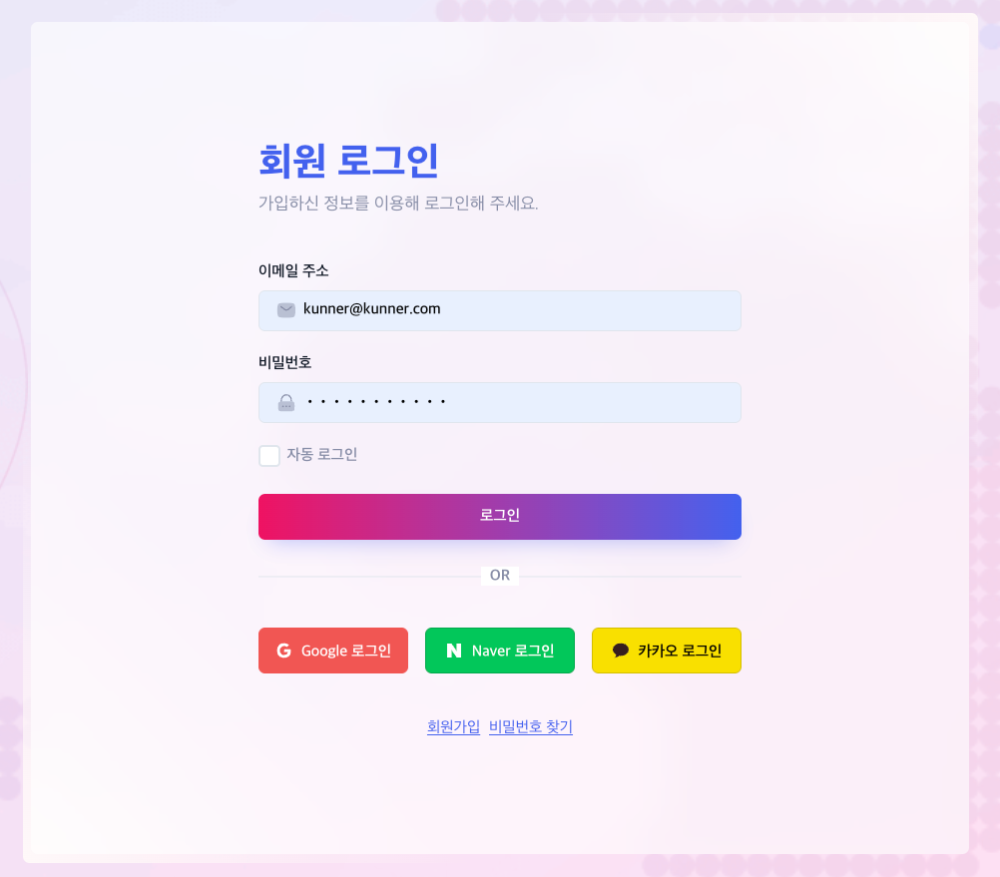
====

==== 아이디/비밀번호 로그인

아이디와 비밀번호를 입력해 로그인할 수 있습니다.

기본 템플릿에서는 아이디를 이메일 주소 형식으로 사용합니다.

로그인 화면에서 로그인 버튼을 누르면 `https://{authServer}/api/v1/auth/login` 으로 데이터를 전송합니다.

====
.로그인 전송 정보
[source,json]
----
{
  "loginName": "아이디 | required",
  "password": "비밀번호 | required",
  "tenantAlias": "TENANT_ALIAS",
  "rememberMe": false
}
----

_관련 코드는 `/src/auth/AuthFunctions#signIn` 을 확인하세요._
====

==== 소셜 로그인

기본적으로 구글, 네이버, 카카오 로그인이 연동되어 있습니다.

소셜 로그인을 설정하려면 `.env` 파일에 각각 아래와 같은 변수를 설정해야 합니다.

- AUTH_GOOGLE_ID
- AUTH_GOOGLE_SECRET
- AUTH_NAVER_ID
- AUTH_NAVER_SECRET
- AUTH_KAKAO_ID
- AUTH_KAKAO_SECRET

===== Backend 연동

소셜 프로바이더가 정상 로그인된 결과를 리턴한 경우 Backend 에 해당 계정이 가입한 기록이 있는지 확인해야 합니다.

`https://{authServer}/api/v1/auth/login/social` 으로 아래 정보를 전송합니다.

====
.소셜로그인 전송 정보
[source,json]
----
{
  "provider": "google | required",
  "providerUserId": "google-account id | required",
  "emailAddress": "email@rchemist.io // 소셜 계정이 등록되어 있지 않은 경우 이미 가입한 회원 정보가 있는지 확인하기 위함"
}
----

_관련 코드는 `/src/auth/type/SocialLogin#socialLogin` 를 확인하세요._
====

===== 프로바이더 추가

프로바이더를 추가하고자 하는 경우 `/src/auth/AuthConfig.tsx` 파일에 프로바이더를 추가합니다.

====
[source,typescript]
----
export const {handlers: {GET, POST}, auth, signIn, signOut} = NextAuth({
    ...authConfig,
    providers: [
      GoogleProvider({
        clientId: process.env.AUTH_GOOGLE_ID,
        clientSecret: process.env.AUTH_GOOGLE_SECRET
      }),
      KakaoProvider({
        clientId: String(process.env.AUTH_KAKAO_ID),
        clientSecret: String(process.env.AUTH_KAKAO_SECRET)
      }),
      NaverProvider({
        clientId: String(process.env.AUTH_NAVER_ID),
        clientSecret: String(process.env.AUTH_NAVER_SECRET)
      }),
      /**
      * NextAuth Social Provider 추가
      */

      ]
  }
)
----
====

[#auth-session]
=== 세션

<<auth-login, 로그인>> 의 결과로 세션(Session)이 생성됩니다.
{blank}
{blank}

====
./src/auth/type/Session#saveSession
LoginResult 를 Session 객체로 만든 후, Session 객체를 암호화해 쿠키에 저장합니다.
====

====
.암호화 할 때 Key 는 `.env` 의 AUTH_SECRET 으로 지정합니다.
Key 를 지정하지 않으면 `rcm-token-secret` 으로 임시 지정되며, 이 경우 보안에 문제가 발생할 수 있으므로 반드시 Key 를 설정하세요.
====

==== 세션 조회(Client Side)

===== SessionProvider

`/src/components/layouts/SessionProvider` 를 사용해 SessionContext 를 통해 ReactHook 으로 컴포넌트 간 Session 을 공유할 수 있습니다.

SessionProvider 로 감싸진 컴포넌트의 내부에서는 아래와 같이 세션을 확인할 수 있습니다.

====
[source,typescript]
----

import {getSession} from "@/components/layouts/SessionProvider";

// omitted
const session = getSession();   // Session or null
// omitted

----
====

===== useSession

ReactHook 을 사용할 수 없는 경우, `/src/auth/AuthFunctions#useSession` 을 사용해 세션을 확인할 수 있습니다.

단, async 로만 접근 가능합니다.

====
[source,typescript]
----

import {useSession} from "@/auth/AuthFunctions";

// omitted
useEffect(() => {

    (async () => {
      const session = await useSession();
      // do what you want using session
      })();
    }, []);
// omitted

----
====

==== 세션 조회(Server Side)

Server Side Script 에서는 ReactHook 을 사용할 수 없고, 쿠키에도 직접 접근할 수 없기 때문에 SessionProvider 나 useSession 은 사용할 수 없습니다.

이 경우 `/src/auth/AuthServerFunctions#getSession` 을 사용합니다.

====
[source,typescript]
----

import {getSession} from "@/auth/AuthServerFunctions";

// omitted
async function getSessionTest() {
  const session = await getSession();
  // do what you want using session
}
// omitted

----
====

=== 회원가입

세션이 없는 사용자가 http://localhost:3300/auth/register 로 접속하면 회원가입을 할 수 있습니다.

====
image::images/register.png[width=600]
====

회원가입이 완료되면, 자동으로 로그인 처리 되고 첫 화면으로 이동합니다.

관련 코드는 `/src/auth/Register` 에서 확인할 수 있습니다.

==== 가입과 동시에 소셜 계정 연동

소셜 로그인을 시도했을 때, 해당 소셜 계정의 이메일 주소가 서버에 등록되어 있지 않은 경우 해당 정보를 이용해 회원가입을 유도하고 회원가입 시 해당 소셜 계정을 바로 연결할 수 있습니다.

이때 회원가입 화면에서 Email 주소는 해당 소셜계정의 이메일 주소로 강제 고정 됩니다.

=== 비밀번호 찾기

회원정보를 기억하지 못하는 경우 가입한 이메일 주소를 입력해 로그인 정보를 확인할 수 있습니다.

====
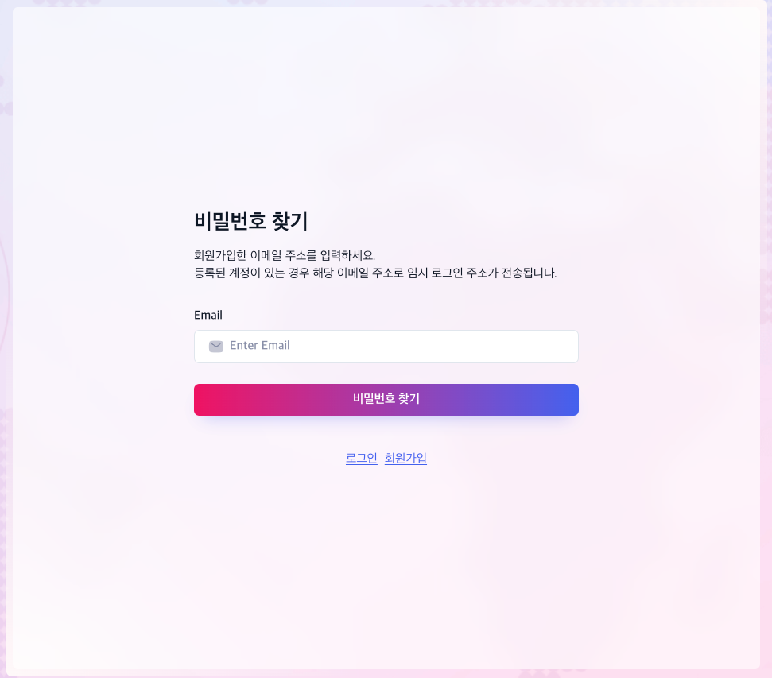
====

이메일 주소를 입력하고 비밀번호 찾기 버튼을 누르면 Backend 에서 입력받은 이메일 주소로 가입한 회원 정보가 있는지 확인합니다.
가입한 정보가 있는 경우 해당 이메일로 임시 로그인 주소를 전송합니다.

Backend `https://{authServer}/api/v1/auth/request-password` 로 아래 데이터를 전송합니다.

====
.Backend 전송 정보
[source,json]
----
{
  "emailAddress": "이메일주소 | required",
  "siteUrl": "이메일 인증을 위한 Front SITE 주소, 입력하지 않은 경우 backendServer 에서 자체 설정된 값 사용"
}
----
====

관련 코드는 `/src/auth/RequestAccount` 에서 확인할 수 있습니다.

==== 임시 로그인(매직링크)

비밀번호 찾기를 통해 제공된 임시 로그인을 처리하기 위해 매직 링크를 사용합니다.

링크를 통해 넘겨 받은 code 를 Backend 서버에서 검증하고 검증을 통과하면 세션을 생성합니다.

이때 Backend 서버의 `https://{authServer}/api/v1/auth/validate-otp` 로 아래 데이터를 전송합니다.

====
.Backend 전송 데이터
[source,json]
----
{
  "code": "code"
}
----
====

관련 코드는 `/src/app/(auth)/login/otp/code/page.tsx` 에서 확인할 수 있습니다.

=== Lock Screen

로그인한 사용자는 사용자의 세션을 잠금 처리할 수 있습니다.

세션이 잠김 처리되면, anonymous 로 개방된 페이지를 제외한 나머지 페이지에 접근할 수 없습니다.

=== middleware

세션 확인 및 페이지 접근 제어를 위한 미들웨어는 `/src/middleware.ts` 로 구현되어 있습니다.

==== 페이지 별 접근 권한 설정

`.env` 파일에 다음 정보를 작성해 페이지 별 접근권한을 설정합니다.
각 필드는 ,로 구분된 문자열입니다.

====
[cols="<.^2,<.^4,<.^4"]
|===
|필드 | 설명 | 예시

|AUTH_URL_PERMIT|누구에게나 허용되는 페이지 주소|/qna/*
|AUTH_URL_PROTECTED|세션을 가지고 있는 경우에만 접근 가능한 페이지 주소|*
|AUTH_URL_EXCEPTED|접근 제어를 확인하지 않는 페이지 주소|/lock/*
|AUTH_URL_ANONYMOUS_ONLY|세션이 없을 때만 접근 가능한 페이지 주소|/login/*
|AUTH_URL_SECURED_ROOT|로그인 후 이동할 페이지, 설정하지 않으면 /로 인식|/
|===
====

==== * (asterisk)

/login/* 와 같이 url 에 * 를 사용하면, /login 을 포함해 /login 하위 경로 전체에 대한 접근 제어를 설정할 수 있습니다.

== Menu

관리자도구의 좌측 메뉴를 json 파일로 설정할 수 있습니다.

`/public/menu/data.json` 에 아래와 같은 규칙으로 기술하면 됩니다.

====
[source,json]
----
{
  "menuData": [
    {
      "label": "1depth 라벨",
      "hidden": false,
      "items": [
        {
          "id": "메뉴ID, 영문/숫자로 띄어쓰기없이 중복되지 않게 임의의 문자열 설정",
          "label": "표시될 이름",
          "icon": "IconMenuDashboard | https://tabler.io/icons 의 아이콘 이름",
          "url": "/url",
          "subMenus": [
            {
              "id": "서브메뉴ID",
              "label": "표시될 서브메뉴 이름",
              "url": "/submenu-url"
            },
            {
              "id": "서브메뉴ID",
              "label": "표시될 서브메뉴 이름",
              "url": "/submenu-url"
            }
          ]
        }
      ]
    }
  ]
}
----
====

menuData 노드 하위에 복수의 MenuItem 데이터를 생성합니다.

각 MenuData 는 items 노드에 복수의 2depth MenuItem 을 가질 수 있으며, 각 2depth MenuItem 은 subMenus 에 복수의 2depth MenuItem 을 가질 수 있습니다.

1depth 의 hidden 을 true 로 설정하면 1depth 표시 없이 바로 2depth 메뉴가 표시됩니다.

== ListGrid

RCM 의 ListGrid 는 엔티티에 대한 메타데이터만 설정하면, 이에 대한 적절한 관리자도구 화면을 생성해 줍니다.

ListGrid란 데이터 목록을 표시하고, 목록에서 새 데이터를 작성하거나 기존 데이터의 내용을 확인하고 수정, 삭제할 수 있는 기능을 제공하는 모듈을 말합니다.
관리자도구를 개발한다는 것은 결국 관리하고자 하는 데이터를 대상으로 하는 수많은 ListGrid 를 만들어 나가는 것입니다.

[#listgrid-overview]
=== Overview

RCM ListGrid 의 흐름을 간략하게 도식화 하면 다음과 같습니다.

====
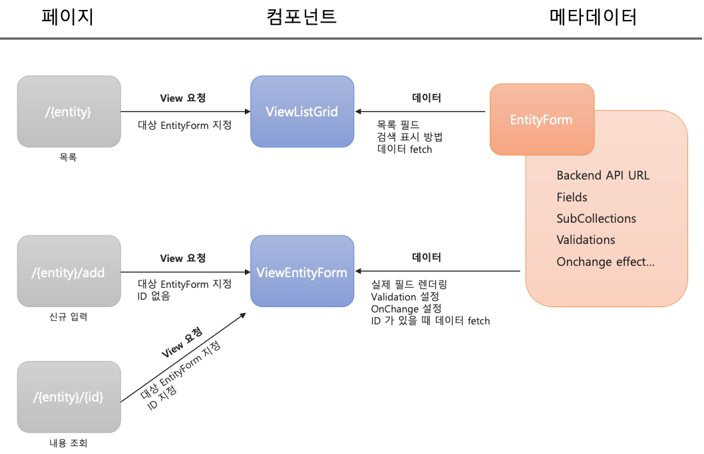
====

. 페이지는 목록, 신규 입력, 내용 조회(수정)의 세 개로 구성되어 있습니다.
목록은 <<listgrid-view-viewlistgrid, ViewListGrid>> 를 사용하며, 신규 입력과 내용 조회는 모두 <<listgrid-view-viewentityform, ViewEntityForm>> 을 사용합니다. ID 값의 유무에 따라 신규 입력인지, 내용 조회인지를 구분합니다.

. 모든 페이지에는 반드시 각 페이지에서 사용할 <<listgrid-entityForm, EntityForm>> 에 대한 정의가 필요합니다.
EntityForm 에는 이 엔티티에 대한 Backend API, 필드 구조, OneToMany SubCollection 정보, Validation 처리에 대한 설정 등 엔티티의 CRUD 를 처리하기 위한 다양한 정보가 있습니다.

. 각 페이지에는 이에 대응하는 Backend API 가 필요합니다. Backend API 의 URL 은 EntityForm 을 생성할 때 반드시 입력해야 합니다.
자세한 정보는 <<listgrid-overview-backendapi, Backend API>> 항목을 참고하세요.

. <<listgrid-view-viewlistgrid, ViewListGrid>> 와 <<listgrid-view-viewentityform, ViewEntityForm>> 에서 Backend API 로부터 수신하는 엔티티 데이터는 View 데이터 형태 입니다.
Backend 서버에서 전송되는 View 데이터는 반드시 <<listgrid-overview-viewdata, View 데이터 >> 에 맞게 생성되어야 합니다.

[#listgrid-overview-backendapi]
==== Backend API

Backend API Endpoint 은 반드시 다음과 같은 규칙으로 제공되어야 합니다.

====
[cols="<.^2,<.^4,<.^2,<.^2"]
|===
|종류 |URL |METHOD |Request Param(Body)

|목록 조회 |\{apiUrl\}/|POST |SearchForm
|신규 생성 |\{apiUrl\}/add/ |POST | \{createForm\}
|내용 조회 |\{apiUrl\}/\{ID\}/|GET | ID
|내용 수정 |\{apiUrl\}/\{ID\}/ |PUT | \{updateForm\}
|===

_RCM Backend Framework와 CodeGenerator 를 사용하면 해당 API Endpoint 가 자동으로 규칙에 맞게 작성됩니다._
====

[#listgrid-overview-viewdata]
==== View 데이터

====
image::images/process_createview.png[]

====

위는 Backend 서버에서 User 엔티티를 UserView 로 만들 때의 과정을 간략히 도식화 한 것입니다.

`0`. User 엔티티에 Tenant 엔티티가 ManyToOne 으로 매핑되어 있는 경우 - 즉, User 가 어떤 Tenant 에 속해 있는 경우 - User 엔티티에는 Tenant의 ID 값이 저장되어 있습니다.
`1`. DB 에서 ID 로 엔티티 데이터를 조회해 View의 각 필드에 값을 대입합니다.
`2`. 만약 이 엔티티가 ManyToOne 매핑된 다른 엔티티가 있다면 해당 엔티티 데이터를 조회합니다.
`3`. ManyToOne 매핑된 데이터의 View 를 생성해 원래 엔티티의 View 에 넣어 줍니다.
`4`. View 를 Front 에 리턴합니다.

2~3 단계를 생략하고, TenantView tenant 대신 tenantId 를 정의해도 <<listgrid-entityform-manytoonefield, ManyToOneField>> 에서 자동으로 TenantView 를 조회해 값을 참조합니다.

Front ViewEntityForm 에서 ManyToOne 엔티티를 관리하지 않을 경우, 2~3 단계의 작업은 필요하지 않습니다.

*다음은 Backend 데이터와 EntityForm 데이터를 작성할 때 중요한 규칙입니다.*
====
1. 엔티티의 View 데이터의 각 필드들은 EntityForm.fields 의 각 필드들의 name 과 일치해야 합니다.
2. OneToMany 로 매핑된 엔티티가 있는 경우 Many 에 해당하는 엔티티에는 반드시 One 에 해당하는 `엔티티의 이름 + ID` 을 lowerCamelCase 방식으로 하는 필드가 존재해야 합니다. (또는 Backend API 목록 검색 Endpoint 에서 해당 필드로 검색하는 로직이 정의되어 있어야 합니다)
====

_RCM Backend Framework 와 CodeGenerator 를 사용하면 위 규칙에 따라 View 가 자동 생성됩니다._

{blank}
{blank}

=== App(Page) Router

ListGrid 를 화면에 표시하기 위해 URL 과 매칭되는 router 가 필요합니다.

App Router 를 사용하는 경우에는 `/src/app/` 하위에, Page Router 를 사용하는 경우에는 `/src/pages` 하위에 URL 경로에 맞는 적절한 디렉토리와 파일을 생성합니다.

CRUD + 목록표시를 위해 router 파일은 총 3개가 필요합니다.

{blank}
{blank}

[#listgrid-router-list]
.목록
_예시: /src/app/(defaults)/energy/model/page.tsx_

====
[source,typescriptjsx]
----
'use client'
import {Breadcrumb} from "@/components/elements/breadcrumbs/Breadcrumb";
import {ViewListGrid} from "@/components/listgrid/view/listgrid/ViewListGrid";
import {ListGrid} from "@/components/listgrid/config/ListGrid";
import {ModelEntityForm} from "@/entity/energy/ModelEntityForm";

const Form = () => {

  // 사용하려는 EntityForm 을 지정합니다.
  const entityForm = ModelEntityForm();

  return 

    <Breadcrumb type={'basic'}
                items={[
                  {label: '에너지'},
                  {label: '모델', href:'/energy/model'},
                ]}
    />
    

      <ViewListGrid listGrid={new ListGrid(entityForm)}/>
    

  

}

export default Form;
----
====

{blank}
{blank}

[#listgrid-router-add]
.신규 입력
_예시: /src/app/(defaults)/energy/model/add/page.tsx_

====
[source,typescriptjsx]
----
'use client'
import {ViewEntityForm} from "@/components/listgrid/view/entityform/ViewEntityForm";
import {Breadcrumb} from "@/components/elements/breadcrumbs/Breadcrumb";
import React from "react";
import {ModelEntityForm} from "@/entity/energy/ModelEntityForm";

const Form = () => {

  // 사용하려는 EntityForm 을 지정합니다.
  const entityForm = ModelEntityForm();

  return 

    <Breadcrumb type={'basic'}
                items={[
                  {label: '에너지'},
                  {label: '모델', href:'/energy/model'},
                ]}
    />
    

      <ViewEntityForm entityForm={entityForm}
                    title={'모델'}
    ></ViewEntityForm>
    

  

}

export default Form;
----
====

{blank}
{blank}

[#listgrid-router-modify]
.내용 조회(수정)
_예시: /src/app/(defaults)/energy/model/[id]/page.tsx_

====
[source,typescriptjsx]
----
'use client'
import {ViewEntityForm} from "@/components/listgrid/view/entityform/ViewEntityForm";
import {Breadcrumb} from "@/components/elements/breadcrumbs/Breadcrumb";
import React from "react";
import {ModelEntityForm} from "@/entity/energy/ModelEntityForm";

// AppRouter 방식일 때 ID 확인 방법.
const Form = ({params}: {params: {id: string}}) => {

  // 사용하려는 EntityForm 을 지정합니다.
  // id 를 지정하면 신규 입력이 아니라 해당 데이터에 대한 조회/수정 을 할 수 있습니다.
  const entityForm = ModelEntityForm().withId(params.id);

  return 

    <Breadcrumb type={'basic'}
                items={[
                  {label: '에너지'},
                  {label: '모델', href:'/energy/model'},
                ]}
    />
    

      <ViewEntityForm entityForm={entityForm}
                    title={'모델'}
    ></ViewEntityForm>
    

  

}

export default Form;
----
====

=== View

<<listgrid-overview, Overview>> 에서 언급한 바와 같이, ListGrid 는 목록, 신규 입력, 내용 조회 의 세 페이지로 이루어져 있고, 목록 페이지는 <ViewListGrid/> 를, 나머지 두 페이지는 <ViewEntityForm/> 을 사용합니다.

그리고 각 페이지

[#listgrid-view-viewlistgrid]
==== ViewListGrid

<<listgrid-router-list, App Router / 목록>>에서 확인할 수 있는 것처럼, 엔티티의 목록을 표시할 때는 `ViewListGrid` 컴포넌트를 사용합니다.

ViewListGrid 의 프로세스를 간단히 도식화 하면 다음과 같습니다.

====
image::images/process_viewlist.png[]

1. ViewListGrid 에서 Backend API 로 SearchForm 을 전송합니다.
2. Backend API 에서는 SearchForm 의 정보를 이용해 DB 를 검색합니다.
3. DB 검색 결과의 엔티티를 View 로 변환하고, 페이징 정보를 포함해 Page<View> 로 리턴합니다.
4. Page<View> 정보를 EntityForm 의 메타데이터와 조합해 목록 화면을 렌더링 합니다.
====

ViewListGrid 를 호출할 때는 다음과 같이 코드를 작성합니다.

====
[source,typescriptjsx]
----
import {ViewListGrid} from "@/components/listgrid/view/listgrid/ViewListGrid";
import {ListGrid} from "@/components/listgrid/config/ListGrid";
import {MeterAggregateDataEntityForm} from "@/entity/energy/MeterAggregateDataEntityForm";

<ViewListGrid listGrid={new ListGrid(MeterAggregateDataEntityForm())}/>
----
====

ViewListGrid 를 호출할 때, listGrid 파라미터에 `new ListGrid(엔티티폼설정)` 을 반드시 추가해야 합니다.

{blank}
{blank}

다음은 ViewListGrid 를 호출할 때의 파라미터 입니다.

====
.ViewListGrid 파라미터
[source,typescriptjsx]
----
interface ViewListGridProps {
  listGrid: ListGrid;
  options?: {
    readonly?: boolean;
    subCollection?: SubCollectionProps,
    manyToOne?: { onSelect: (item: any, setManagedId: (value: any) => void) => void }
    popup?: boolean,
    create?: CreateUpdateOptions,
    update?: CreateUpdateOptions,
    delete?: {
      onDelete?: (entityForm: EntityForm) => Promise<void>;
    },
    // if condition is undefined, then AND
    filters?: { condition?: 'AND' | 'OR', items: FilterItem[] }[],

  }
}
----
====

{blank}
{blank}

===== listGrid(Required)

- type: ListGrid

`new ListGrid({EntityForm})` 으로 초기화 합니다.

필드 목록, 필터 설정과 같은 정보는 모두 EntityForm 메타데이터를 통해 자동으로 처리 됩니다.

===== options(optional)

리스트그리드를 렌더링할 때 부가 옵션을 정의할 수 있습니다.

모든 값은 기본적으로 필수가 아니며, 필요에 따라 설정하면 됩니다.

====== options.readonly

- type: boolean

이 값을 `true` 로 설정하면 목록에 `신규 생성` 버튼이 표시되지 않습니다.
또 `View` 화면에서 데이터를 수정/삭제 할 수 없게 됩니다.

====
[source,typescriptjsx]
----
import {ViewListGrid} from "@/components/listgrid/view/listgrid/ViewListGrid";
import {ListGrid} from "@/components/listgrid/config/ListGrid";
import {MeterAggregateDataEntityForm} from "@/entity/energy/MeterAggregateDataEntityForm";

<ViewListGrid listGrid={new ListGrid(MeterAggregateDataEntityForm())}
              options={{readonly: true}}
/>
----
====

====== options.subCollection

- type: SubCollectionProps

ListGrid 가 다른 Entity 의 ``하위 리스트``일때 이 ListGrid 를 `SubCollection` 이라고 부릅니다.
ListGrid 가 SubCollection 으로 표현되기를 바란다면, 아래 정보를 반드시 입력해야 합니다.

_단, 이 설정은 EntityForm 에 collections 을 설정하면 자동으로 처리되므로 특별한 경우가 아니면 직접 설정하지 않아도 됩니다._

====
[source,typescriptjsx]
----
export interface SubCollectionProps {
  name: string;   // collection 의 이름
  /**
   * 이 콜렉션의 엔티티에 상위 엔티티가 어떤 필드명으로 매핑되어 있는지.
   * 예를 들어 one Plant : many Transceivers 관계에서
   * Transceiver 엔티티에 plantId = 1 이라는 값으로 매핑되어 있다고 하면 mappedBy 는 plantId 가 되고 mappedValue 는 1이 된다.
   */
  mappedBy: string;
  mappedValue: any;
}
----
====

====== options.manyToOne

- type: {onSelect: (item, setManageId) => void}

`가` ListGrid 가 `A` 엔티티의 SubCollection 으로 표시된다고 가정해 보겠습니다.

그러면 `A` 엔티티의 View 화면에 `가` 엔티티의 ListGrid 가 SubCollection 으로 표시됩니다.

이걸 데이터 관점에서 보면 `A` : `가` = one : many , 즉 `OneToMany` 의 관계가 됩니다.
반대로, `가` 엔티티 입장에서는 `ManyToOne` 이 됩니다.

이런 관계에서, `가` SubCollection 에 대해 `신규 입력` 을 하면, `가` 엔티티가 생성될 때 `가` 에 `A` 엔티티의 ID 를 FK 로 지정해야 합니다.

보통의 경우 각 엔티티의 id 가 다른 엔티티의 FK 가 되지만, 그렇지 않은 경우에는 options.manyToOne 으로 설정할 수 있습니다.

====
[source,typescriptjsx]
----
import {ViewListGrid} from "@/components/listgrid/view/listgrid/ViewListGrid";
import {ListGrid} from "@/components/listgrid/config/ListGrid";
import {MeterAggregateDataEntityForm} from "@/entity/energy/MeterAggregateDataEntityForm";

<ViewListGrid listGrid={new ListGrid(MeterAggregateDataEntityForm())}
              options={{manyToOne: {
                onSelect: (item, setManageId) => {
                  // id 가 아니라 key 필드를 FK 로 사용하는 경우
                  setManageId(item.key);
                }}
              }}
/>
----
====

====== options.popup

- type: boolean

ListGrid 가 팝업으로 표시되는 경우 이 옵션을 `true` 로 설정합니다.

목록, 내용보기 화면의 가로폭과 여백이 조정됩니다.

====== options.create, options.update

- type: CreateUpdateOptions

ListGrid 에서 데이터를 신규 생성할 때(`create`), 또는 데이터를 수정할 때(`update`)의 동작을 제어할 수 있습니다.

예를 들어 신규 데이터가 생성된 다음 사용자 정의 모달 알림창을 띄운다든가, 생성된 데이터를 이용해 고객에게 메일을 발송한다든가 하는 처리를 할 수 있습니다.

`CreateUpdateOptions` create 와 update 에서 모두 공통적으로 사용되며 `CreateUpdateOptions`의 세부 정보는 아래와 같습니다.

====
[source,typescript]
----
interface CreateUpdateOptions {
  // 입력창을 모달로 띄울 것인지 여부, 기본값은 false
  modal?: boolean;
  // 데이터가 생성(수정)된 후 어떤 처리를 할 것인지 - Post Save 에 대한 사용자 정의 함수
  onSave?: (entityForm: EntityForm) => Promise<void>;
  // 데이터 입력 중 취소하면 어떤 처리를 할 것인지
  onClose?: () => void;
}
----
====

====
[source,typescriptjsx]
----
import {ViewListGrid} from "@/components/listgrid/view/listgrid/ViewListGrid";
import {ListGrid} from "@/components/listgrid/config/ListGrid";
import {MeterAggregateDataEntityForm} from "@/entity/energy/MeterAggregateDataEntityForm";

<ViewListGrid listGrid={new ListGrid(MeterAggregateDataEntityForm())}
              options={{
                create: {
                  onSave: (entityForm: EntityForm) => {
                    const emailAddress = entityForm.getValue('emailAddress');
                    // send email
                  }
                }
              }}
/>
----
====

====== options.delete

- type: {onDelete: (entityForm:EntityForm) => Promise<void>}

ListGrid 의 아이템이 삭제될 때 후속 처리를 추가로 지정할 수 있습니다.

`onDelete` 메소드의 `entityForm` 파라미터는 삭제될 당시의 entityForm 데이터를 가지고 있습니다.

====
[source,typescriptjsx]
----
import {ViewListGrid} from "@/components/listgrid/view/listgrid/ViewListGrid";
import {ListGrid} from "@/components/listgrid/config/ListGrid";
import {MeterAggregateDataEntityForm} from "@/entity/energy/MeterAggregateDataEntityForm";

<ViewListGrid listGrid={new ListGrid(MeterAggregateDataEntityForm())}
              options={{
                delete: {
                        onDelete: (entityForm: EntityForm) => {
                          const title = entityForm.getValue('title');
                          const emailAddress = entityForm.getValue('emailAddress');

                          // send email
                          sendMail(emailAddress, `${title} 게시물이 삭제 되었습니다.`);
                          return Promise.resolve();
                        }
                      }
              }}
/>
----
====

[#listgrid-view-viewlistgrid-options-filters]
====== options.filters

- type: { condition?: 'AND' | 'OR', items: FilterItem[] }[]

ListGrid 의 데이터를 조회할 때 반드시 포함해야 하는 필터값이 있다면 options.filters 로 지정하면 됩니다.

items 의 FilterItem 은 다음과 같습니다.

====
[source,typescript]
----
// import {FilterItem} from "@/components/listgrid/config/SearchForm";
export interface FilterItem {
  name: string;
  value?: string;
  values?: string[];
  queryConditionType?: QueryConditionType;
  not?: boolean;
  subFilters?: Map<'AND' | 'OR', FilterItem[]>;
}
----
====

다음은 목록을 검색할 때 `tenantAlias` 가 `'kunner'` 인 데이터만 조회하는 예제 입니다.

====
[source,typescriptjsx]
----
import {ViewListGrid} from "@/components/listgrid/view/listgrid/ViewListGrid";
import {ListGrid} from "@/components/listgrid/config/ListGrid";
import {MeterAggregateDataEntityForm} from "@/entity/energy/MeterAggregateDataEntityForm";

<ViewListGrid listGrid={new ListGrid(MeterAggregateDataEntityForm())} options={{
          // tenant 가 kunner 인 데이터만 조회하도록 설정
        filters: [
          {items: [{name: 'tenantAlias', value: 'kunner'},]}
        ]
      }}/>
----
====

[#listgrid-view-viewentityform]
==== ViewEntityForm

<<listgrid-router-add, App Router / 신규 입력>> 또는 <<listgrid-router-modify, App Router / 수정>> 에서처럼, 내용보기나 신규 입력창을 표시할 때는 `<ViewEntityForm/>` 을 사용합니다.

[#listgrid-view-viewentityform-overview]
===== Overview

====== 내용 조회

먼저, 내용 조회를 할 때 ViewEntityForm 이 처리되는 과정을 간략히 도식화 하면 다음과 같습니다.

====
.내용 조회(수정) 화면의 ViewEntityForm 의 처리 과정
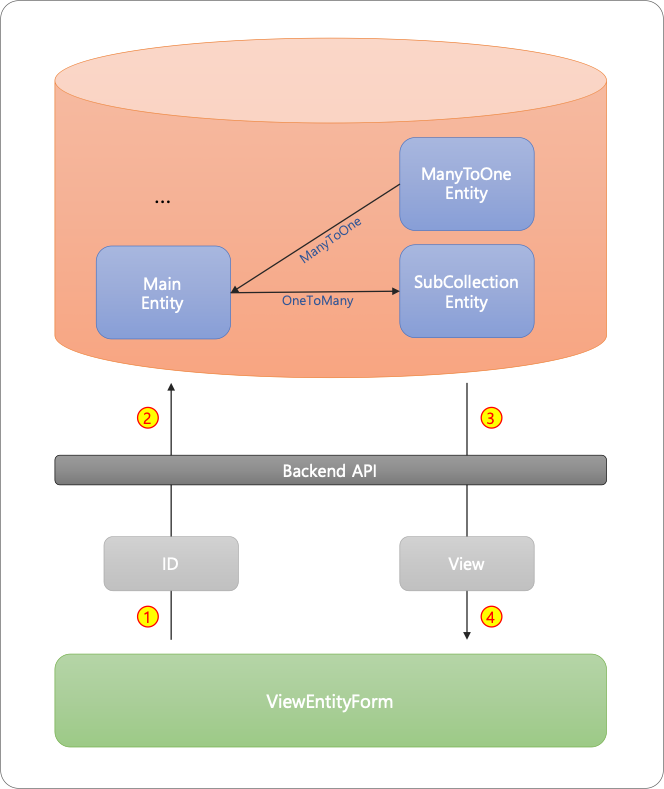

1. Front 에서 Backend API 로 조회할 엔티티의 ID 를 전달합니다.
2. Backend 에서 ID 로 해당 엔티티를 조회합니다.
3. 엔티티를 View 데이터 구조에 맞게 처리해 View 데이터를 생성합니다. (<<listgrid-overview-viewdata, View 데이터>> 참고)
4. Backend 에서 전달받은 View 데이터를 이용해 ViewEntityForm 의 entityForm.fields 의 필드값을 갱신합니다.
====

ViewEntityForm에서 화면을 렌더링 하면서 데이터를 조회하고 반영하는 프로세스에 대해 좀더 집중해 보면 아래와 같이 설명할 수 있습니다.

====
.View 데이터를 ViewEntityForm 에서 사용하는 방법
image::images/process_viewentityform.png[]

1. ViewEntityForm 을 최초 렌더링할 때, ID 를 이용해 대상 엔티티를 조회합니다.
2. Backend API에서 View 데이터를 받아 ViewEntityForm.entityForm.fields 의 value 로 View 데이터의 각 필드값을 대입합니다.
이때, View 데이터의 각 필드명은 반드시 EntityForm.fields 에 규정한 <<listgrid-entityform-entityfield, EntityField>> 의 name 과 대응해야 합니다.
3. 만약 entityForm 에 subCollection 이 지정되어 있다면 각 SubCollection 을 렌더링 해야 합니다. 이때 subCollection 으로 지정된 EntityForm의 url 속성을 이용해 Backend API 에 목록 검색을 합니다. 목록 검색 API의 Endpoint 는 SubCollection 에 정의된 EntityForm 의 url 이며, 이때 필터로 메인 엔티티의 id 가 자동으로 삽입됩니다. User 엔티티의 SubCollection 에 대한 조회인 경우 userId = 'ID' 라는 필터가 자동으로 적용됩니다.
4. 3단계의 결과를 바탕으로 Page<UserView> 데이터를 리턴 받아, SubCollection 을 렌더링 합니다.
====

====== 데이터 저장

다음으로 ViewEntityForm 에서 저장 버튼을 눌러 새 데이터가 생성되거나, 기존 데이터를 수정하는 프로세스는 다음과 같습니다.

====
.신규 데이터 생성 또는 기존 데이터 수정 시 처리 과정
image::images/process_create_update.png[]

1. Front 에서 입력폼 값들을 모아 CreateForm 또는 UpdateForm 형태의 FormData 를 만들어 Backend API 로 전달합니다.
2. CreateForm 또는 UpdateForm 을 반영해 신규 엔티티를 만들거나 기존 엔티티를 수정합니다.
3. 2단계가 적용된 새 엔티티 데이터를 이용해 View 데이터를 생성합니다.
4. Backend 에서 전달받은 View 데이터를 이용해 ViewEntityForm 의 entityForm.fields 의 필드값을 갱신합니다.
====

{blank}
{blank}

===== ViewEntityForm 정의하기

ViewEntityForm 은 다음과 같이 사용할 수 있습니다.

====
.신규 입력폼
[source,typescriptjsx]
----
import {ViewEntityForm} from "@/components/listgrid/view/entityform/ViewEntityForm";
import {MeterAggregateDataEntityForm} from "@/entity/energy/MeterAggregateDataEntityForm";

// 신규 입력폼을 표시하려면 id 를 지정하지 않습니다.
const WriteForm = () => {
  return <ViewEntityForm entityForm={MeterAggregateDataEntityForm()}
                    title={'menu.energy.meteraggregatedata.list.title'}></ViewEntityForm>
}
----

.정보 수정 / 내용 보기
[source,typescriptjsx]
----
import {ViewEntityForm} from "@/components/listgrid/view/entityform/ViewEntityForm";
import {MeterAggregateDataEntityForm} from "@/entity/energy/MeterAggregateDataEntityForm";

// 내용 보기를 할 때는 path 의 params 으로 대상 entity 의 ID 를 지정해야 합니다.
const EditForm = ({params}: {params: {id: string}}) => {
  return <ViewEntityForm entityForm={MeterAggregateDataEntityForm().withId(params.id)}
                    title={'menu.energy.meteraggregatedata.list.title'}></ViewEntityForm>
}
----
====

_ViewEntityForm에 id 를 지정했는지 여부에 따라 신규 입력과 내용 보기 화면을 구분합니다._

다음은 ViewEntityForm 을 호출할 때의 파라미터 입니다.

====
.ViewEntityForm 파라미터
[source,typescriptjsx]
----
interface ViewEntityFormProps {
  entityForm: EntityForm;
  // ViewEntityForm 에서 버튼을 커스텀으로 추가하고 싶으면 여기에 값을 추가한다.
  buttons?: EntityFormButton[];
  title?: string;
  postSave?: (entityForm: EntityForm) => Promise<EntityForm>;
  buttonLinks?: EntityButtonLinkProps,
  subCollection?: boolean
}
----
====

{blank}
{blank}

다음은 ViewEntityForm 을 생성할 때 각 파라미터들에 대한 자세한 설명입니다.

====== entityForm(Required)

ViewEntityForm 을 호출하기 위해, 반드시 EntityForm 설정 정보가 필요합니다.

이 EntityForm 메타데이터에는 EntityForm 이 저장될 API 의 URL, 필드 구조, Validations 과 같은 다양한 정보가 있습니다.

보다 자세한 설명은 <<listgrid-entityForm, EntityForm>> 항목을 참조 하세요.

[#listgrid-view-entityform-buttons]
====== buttons

- type: EntityFormButton[]

EntityForm 을 화면에 표시할 때 버튼을 재정의할 수 있습니다.

EntityFormButton 은 Class 로 다음과 같이 정의되어 있습니다.

====
[source,typescriptjsx]
----
/**
* id: 버튼 ID. id 가 list 또는 save 이거나 delete 인 경우에는 기존의 entityForm 버튼을 대체한다.
* icon: 버튼에 표시할 아이콘
* label: 버튼에 표시할 라벨, 문자열로 입력해도 되고 ReactNode 로도 입력 가능
* className: 버튼이 표시될 때 오버라이드 할 className
* onClick: 버튼을 클릭했을 때 처리
*/
export class EntityFormButton {
  //
  private readonly id: string;
  icon?: ReactNode;
  label?: LabelType;
  className?: string;
  onClick?: (props: EntityFormButtonProps) => Promise<EntityForm>;

  constructor(id: string) {
    this.id = id;
  }
  // omitted
}

// EntityFormButtonProps
/**
* entityForm: 버튼이 동작하는 EntityForm
* router: 버튼이 표시되는 시점의 NextRouter
* pathname: 버튼이 표시되는 시점의 path
* setErrors: 버튼을 클릭했을 때 에러를 표시하고 싶다면 이 메소드를 구현
* setNotifications: 버튼을 클릭했을 때 SweetAlert 메시지를 띄우고 싶다면 이 메소드를 구현
*/
interface EntityFormButtonProps {
  entityForm: EntityForm,
  router: any,
  pathname: any,
  setErrors: (errors: string[]) => void,
  setNotifications: (notifications: string[]) => void
}

// LabelType
/**
 * LabelType 에 따라 라벨 표시 방법이 달라진다.
 * string 은 i18n 으로 라벨 처리
 * ReactNode 면 단순 표시
 * false 면 표시하지 않는다.
 */
export type LabelType = string | ReactNode | false;

----
====

ViewEntityForm 에서 버튼을 재정의 하는 방법은 다음과 같습니다.

====
[source,typescriptjsx]
----
import {EntityFormButton} from "@/components/listgrid/config/EntityFormButton";
import {ViewEntityForm} from "@/components/listgrid/view/entityform/ViewEntityForm";
import {MeterAggregateDataEntityForm} from "@/entity/energy/MeterAggregateDataEntityForm";

// 내용 보기를 할 때는 path 의 params 으로 대상 entity 의 ID 를 지정해야 합니다.
const EditForm = ({params}: {params: {id: string}}) => {
  return <ViewEntityForm entityForm={MeterAggregateDataEntityForm().withId(params.id)}
                    buttons={[
                      new EntityFormButton('delete').withLabel('삭제 불가')
                        .withOnClick((props) => {
                          props.setNotifications(['이 엔티티는 삭제할 수 없습니다.'])
                          return Promise.resolve(props.entityForm);
                        })
                    ]}
                    title={'menu.energy.meteraggregatedata.list.title'}></ViewEntityForm>
}
----
====

====== title

- type: string

ViewEntityForm 렌더링할 때 화면 최상단에 제목을 표시합니다.

====== postSave

- type: (entityForm: EntityForm) => Promise<EntityForm>

엔티티를 저장한 후(신규 입력/수정) 사용자 정의 로직을 추가할 수 있습니다.

====
[source,typescriptjsx]
----
import {EntityForm} from "@/components/listgrid/config/EntityForm";
import {ViewEntityForm} from "@/components/listgrid/view/entityform/ViewEntityForm";
import {MeterAggregateDataEntityForm} from "@/entity/energy/MeterAggregateDataEntityForm";

// 내용 보기를 할 때는 path 의 params 으로 대상 entity 의 ID 를 지정해야 합니다.
const EditForm = ({params}: {params: {id: string}}) => {
  return <ViewEntityForm entityForm={MeterAggregateDataEntityForm().withId(params.id)}
                    postSave={(entityForm: EntityForm) => {
                      // do something with entityForm
                      return Promise.resolve(entityForm);
                    }}
                    title={'menu.energy.meteraggregatedata.list.title'}></ViewEntityForm>
}
----
====

_신규 입력하는 경우 entityForm 파라미터 에는 새로 저장된 id 값이 포함되어 있습니다._

====== buttonLinks

- type: EntityButtonLinkProps

EntityForm 의 버튼을 재정의하는 것은 <<listgrid-view-entityform-buttons, buttons>> 설정으로도 충분하지만, 기존 버튼을 유지한채 해당 버튼의 동작 방식만 바꾸고 싶다면 buttonLinks 를 이용하면 됩니다.

EntityButtonLinkProps 는 다음과 같이 정의 되어 있습니다.

====
[source,typescriptjsx]
----
export type EntityButtonLinkProps = {
  onClickList?: () => void,    // 리스트를 클릭했을 때
  onSave?: EntityButtonResultProps    // 저장 버튼을 클릭해 성공 / 실패 케이스 오버라이드
  onDelete?: EntityButtonResultProps   // 삭제 버튼을 클릭해 성공 / 실패 케이스 오버라이드
}

// onSave, onDelete Type
interface EntityButtonResultProps {
  success?: (result: EntityFormActionResult) => void,
  failed?: (result: EntityFormActionResult) => void
}

// success, failed 의 Type
export interface EntityFormActionResult {
  entityForm: EntityForm;
  errors?: string[];
  redirectUrl?: string;   // 특정 url 로 redirect 해야 하는 경우
  refreshOrList?: boolean;    // 화면을 리프레시 하거나, parent 창을 refresh 해야 하는 경우
  messages?: string[];   // 알림 메시지 목록
}

----
====

====== subCollection

- type: boolean

ViewEntityForm 이 subCollection 에서 표시되는 경우 이 값이 true 로 설정됩니다.

subCollection 이 `true` 로 설정되면 해당 ``ViewEntityForm``이 모달로 표시되는 것을 의미하며, 화면의 Padding 값을 모달에 맞게 설정합니다.
또 엔티티 데이터를 저장하거나 삭제할 때 버튼의 반응도 모달에 맞게 변경됩니다.

_보통 subCollection 관련한 설정은 ViewEntityForm 렌더링 과정에서 자동으로 처리되므로 특별한 경우가 아니면 설정할 필요가 없습니다._

[#listgrid-listgrid]
=== ListGrid

`ViewListGrid` 컴포넌트에 필수로 정의해야 하는 ListGrid 객체에 대한 설명입니다.

ListGrid 객체는 다음과 같이 생성할 수 있습니다.

====
[source,typescriptjsx]
----
import {ListGrid} from "@/components/listgrid/config/ListGrid";
import {MeterAggregateDataEntityForm} from "@/entity/energy/MeterAggregateDataEntityForm";

const listGrid = new ListGrid(MeterAggregateDataEntityForm());

// do what you want
----
====

ListGrid 객체를 생성하려면 <<listgrid-entityForm, EntityForm>> 이 반드시 있어야 합니다.
EntityForm 을 설정하는 방법은 관련 문서를 참고 하시기 바랍니다.

{blank}
{blank}

ListGrid 객체를 생성할 때 다음 메소드를 이용해 ViewListGrid 의 동작을 재정의할 수 있습니다.

- <<listgrid-listgrid-withSearchForm, withSearchForm>>(searchForm: SearchForm)
- <<listgrid-listgrid-withOverrideFetchData, withOverrideFetchData>>(overrideFetchData?: (url: string, searchForm: SearchForm) => Promise<PageResult>)

[#listgrid-listgrid-withSearchForm]
==== withSearchForm

ListGrid 를 설정할 때 SearchForm 을 지정해 검색 결과를 필터할 수 있습니다.

====
[source,typescriptjsx]
----
import {ListGrid} from "@/components/listgrid/config/ListGrid";
import {MeterAggregateDataEntityForm} from "@/entity/energy/MeterAggregateDataEntityForm";
import {SearchForm} from "@/components/listgrid/config/SearchForm";

// userId 필드의 값이 wjwc884143271b 인 데이터만 검색하도록 설정
const searchForm = new SearchForm().handleAndFilter('userId', 'wjwc884143271b');

const listGrid = new ListGrid(MeterAggregateDataEntityForm()).withSearchForm(searchForm);

// do what you want
----
====

[#listgrid-listgrid-searchform]
===== SearchForm

SearchForm 은 ListGrid 에서 검색을 처리할 때 사용하는 검색 필터 및 페이징 정보가 담겨 있는 객체 입니다.

SearchForm의 필드와 SearchForm 의 상태를 외부에서 설정할 수 있는 주요 메소드는 다음과 같습니다.

====
[source,typescriptjsx]
----
// /src/components/listgrid/config/SearchForm.ts
export class SearchForm {
  // constructor 를 통해 생성될 때 단 하나의 유니크한 값을 가진다.
  private cacheKey: string = '';
  // 페이지 당 보여 줄 게시물의 수
  private pageSize: number = 20;
  // 현재 페이지, 0 부터 시작
  private page: number = 0;
  // 정렬 필드
  private sorts: Map<string, Direction> = new Map<string, Direction>();
  // 필터
  private filters: Map<'AND' | 'OR', FilterItem[]> = new Map<"AND" | "OR", FilterItem[]>();
  // Backend API 에서 캐시를 사용할지 여부
  private ignoreCache: boolean = false;
  // 목록을 조회할 때 상세 view 를 리턴받을지 여부
  private viewDetail: boolean = false;
  // 이 값은 필터링된 결과가 없을 때, 빈 결과를 반환할지 여부를 결정한다.
  private shouldReturnEmpty: boolean = false;
  // ListGrid 의 필터를 일시적으로 변경했다가 fetch 후 다시 복구할 때 사용한다.
  private preservedFilters: SearchValueConfig[] = [];

  // omitted
  /**
  * 데이터를 조회할 페이지 지정, 0 부터 시작하는 number
  * @param page
  */
  withPage(page: number): this {
    this.page = page;
    return this;
  }

  // omitted
  /**
  * 한 페이지에 몇개의 데이터를 표시할 것인지, 기본값은 20
  * @param pageSize
  */
  withPageSize(pageSize: number): this {
    this.pageSize = pageSize;
    return this;
  }

  // omitted
  /**
  * 필드에 대한 정렬
  * @param fieldName
  * @param direction 'ASC' | 'DESC'
  */
  withSort(fieldName: string, direction?: Direction): this {
    // omitted
    return this;
  }

  // omitted
  /**
  * 필드 별 필터링: And 조건의 필터값을 추가할 때 사용
  * @param fieldName
  * @param value 필터값
  * @param op 필터할 때 ConditionType. /src/components/listgrid/config/SearchForm/QueryConditionType 기본은 EQUAL
  * @param not 필터를 부정적인 값으로 하는 경우. 이 값이 true 인 경우 EQUAL 은 NOT_EQUAL 이 되고 IS_NULL 은 IS_NOT_NULL 이 되는 식이다.
  */
  handleAndFilter(fieldName: string, value: any, op?: QueryConditionType, not?: boolean): this {
    // omitted
    return this;
  }

  // omitted
  /**
  * 필드 단위로 필터를 조작하지 않고, 전체 필터를 한번에 재정의할 수 있다.
  * AND, OR 조건을 세분화 해서 검색 가능
  * @param condition
  * @param filterItems
  */
  withFilter(condition: 'AND' | 'OR', ...filterItems: FilterItem[]): this {
    // omitted
    return this;
  }

  // omitted
  /**
  * Backend 서버에서 검색 결과를 리턴할 때 캐시된 데이터 대신 실제 DB 데이터만 사용하도록 고정
  * @param ignoreCache
  */
  withIgnoreCache(ignoreCache?: boolean): this {
    // omitted
    return this;
  }

  // omitted
  /**
  * viewDetail 값이 true 이면 Backend 서버에서 검색 결과를 리턴할 때
  * 각 Row Item 의 Data 를 ViewEntityForm 을 할 때와 동일하게
  * 모든 필드의 데이터를 결과값으로 리턴한다.
  * @param viewDetail
  */
  withViewDetail(viewDetail: boolean): this {
    // omitted
    return this;
  }

  // omitted

}
----
====

withFilter 메소드의 FilterItem 에 대한 설명은 <<listgrid-view-viewlistgrid-options-filters, options.filters>> 를 참고하세요.

===== SeachForm 사용 방법

====
.특정값을 가진 검색 결과만 조회
[source,typescript]
----
import {SearchForm} from "@/components/listgrid/config/SearchForm";

// userId 가 wjwc884143271b 이고 seceded 가 false 인 데이터만 검색
const searchForm = new SearchForm()
      .handleAndFilter('userId', 'wjwc884143271b')
      .handleAndFilter('seceded', false);

----

.특정 필드로 정렬
[source,typescript]
----
import {SearchForm} from "@/components/listgrid/config/SearchForm";

// userId 에 대해 ASC 정렬
const searchForm = new SearchForm()
      .withSort('userId', 'ASC');

----

.AND/OR 조건을 조합해 검색
[source,typescript]
----
import {SearchForm} from "@/components/listgrid/config/SearchForm";

// (userId 가 wjwc884143271b 이고 seceded 가 false) 이면서 : AND 조건
// (emailAddress 가 rchemist.io 로 끝나거나 phoneNumber 가 8241 로 끝나는 경우) : AND 조건을 충족하는 상태에서 OR 조건
const searchForm = new SearchForm()
      .withFilter('AND',
        {
          name: 'userId',
          value: 'wjwc884143271b'
        },
        {
          name: 'seceded',
          value: false
        },
      ).withFilter('OR',
        {
          name: 'emailAddress',
          value: 'rchemist.io',
          op: 'END_WITH'
        },
        {
          name: 'phoneNumber',
          value: '8241',
          op: 'END_WITH'
        },
      )

----
====

[#listgrid-listgrid-withOverrideFetchData]
==== withOverrideFetchData

withOverrideFetchData 를 사용해 ListGrid 에서 목록 데이터를 fetch 하는 메소드를 재정의할 수 있습니다.

====
[source,typescriptjsx]
----

import {ListGrid} from "@/components/listgrid/config/ListGrid";
import {MeterAggregateDataEntityForm} from "@/entity/energy/MeterAggregateDataEntityForm";
import {SearchForm} from "@/components/listgrid/config/SearchForm";
import {PageResult} from "@/components/listgrid/config/ListGrid";

const listGrid = new ListGrid(MeterAggregateDataEntityForm())
            .withOverrideFetchData((url: string, searchForm: SearchForm) => {

              const pageResult: PageResult = doCustomFetchData(url, searchForm);

              return Promise.resolve(pageResult);
            });

// 커스텀 fetch 로직 구현
function doCustomFetchData(url: string, searchForm: SearchForm): PageResult {
  const result = PageResult.createEmptyResult(searchForm);
  // custom login here
  return result;
}

----
====

[#listgrid-entityForm]
=== EntityForm

<<listgrid-overview, Overview>> 에서 언급한대로, `EntityForm(엔티티폼)` 은 ListGrid 전체에서 사용되는 `엔티티에 대한 메타데이터` 입니다.

다시 말해, ListGrid 를 화면에 표시할 때 즉, <<listgrid-view-viewlistgrid, ViewListGrid>> 와 <<listgrid-view-viewentityform, ViewEntityForm>> 은 EntityForm 에 설정된 정보를 바탕으로 동작합니다.

EntityForm 에서는 다음과 같은 정보를 설정할 수 있습니다.

- <<listgrid-entityform-create, EntityForm 생성>>
1. Entity 데이터의 CRUD 를 처리하는 API URL
2. View 화면에 표시될 Title
3. 이 EntityForm 이 표시될 메뉴 URL
4. ViewEntityForm 화면에서의 탭, 필드그룹
- <<listgrid-entityform-withid, Entity ID>> (기존 데이터 조회/수정)
- <<listgrid-entityform-overridefetch, Entity 데이터 Fetch 로직 재정의>>
- <<listgrid-entityform-entityfield, Entity 필드>>
1. 엔티티 필드 설정
2. ListGrid 의 목록 필드 및 검색 필드 설정
- <<listgrid-entityform-subcollections, Entity 서브콜렉션>>
- <<listgrid-entityform-datatransfer, Excel Upload / Download 설정>>

[#listgrid-entityform-create]
==== EntityForm 생성

EntityForm 객체는 new 생성자로 생성할 수 있습니다.
기본 생성자를 호출할 때 EntityForm 을 식별할 name 과 이 엔티티 데이터를 fetch 할 때 사용할 apiUrl 을 파라미터로 제공해야 합니다.

====
[source,typescriptjsx]
----
import {EntityForm} from "@/components/listgrid/config/EntityForm";

const entityForm: EntityForm = new EntityForm('모델', 'http://localhost:8010/api/v1/energy/model');

----
====

[#listgrid-entityform-withid]
==== 내용 조회 시 엔티티 ID 값 전달

====
[source,typescriptjsx]
----
import {EntityForm} from "@/components/listgrid/config/EntityForm";

const entityForm: EntityForm = new EntityForm('모델', 'http://localhost:8010/api/v1/energy/model')
                              .withId('100');

----
====

[#listgrid-entityform-overridefetch]
==== Entity 의 Fetch 로직 재정의

====
[source,typescriptjsx]
----
import {EntityForm} from "@/components/listgrid/config/EntityForm";
import {ResponseData} from "@/utils/RequestUtil";

const entityForm: EntityForm = new EntityForm('모델', 'http://localhost:8010/api/v1/energy/model')
                              .withOverrideFetchData(async (url, entityForm) => {
                                const responseData: ResponseData = await callCustomFetchData(url, entityForm);

                                return Promise.resolve(responseData);
                              });

/**
* custom fetch data logic here
* @param url
* @param entityForm
*/
async function callCustomFetchData(url: string, entityForm: EntityForm): Promise<ResponseData> {

  // do what you want

  return Promise.resolve(new ResponseData());

}

----
====

[#listgrid-entityform-addFields]
===== 화면에 필드 배치하기

ViewEntityForm 이 화면에 필드를 렌더링할 때, 필드를 탭과 필드 그룹으로 묶어 표시할 수 있습니다.

====
image::images/tab-fieldgroup.png[width=800]

1. 탭(Tab)
ViewEntityForm 을 여러 탭으로 나눠 각 탭에 필드그룹들을 배치합니다.
탭을 클릭하면 해당 탭의 필드들을 확인할 수 있습니다.
2. 필드그룹(FieldGroup)
여러 필드를 하나의 필드그룹으로 묶어 표시합니다.
====

탭과 필드그룹은 EntityForm#addFields 메소드를 이용해 EntityForm 에 필드를 추가할 때 정의할 수 있습니다.

EntityForm#addFields 의 Arguments는 AddFieldItemProps 인터페이스로, 다음과 같이 정의 되어 있습니다.

====
[source, typescriptjsx]
----
export interface AddFieldItemProps extends AbstractAddFieldProps {
  items: EntityItem[]
}

export interface AbstractAddFieldProps {
  tab?: TabInfo,
  fieldGroup?: FieldGroupInfo,
}

export type TabInfo = {
  id: string,
  label: string,
  order: number,
  hidden?: boolean    // Status 탭과 같이 일반적인 형태로 표시되지 않는 탭은 hidden 을 true 로 처리한다.
};

export type FieldGroupInfo = {
  id: string,
  label: string,
  order: number
}

export const DEFAULT_TAB_INFO: TabInfo = {
  id: 'default',
  label: '기본 정보',
  order: 100,
}

export const DEFAULT_FIELD_GROUP_INFO: FieldGroupInfo = {
  id: 'default',
  label: '기본 정보',
  order: 100,
}

----
====

addFields 메소드를 호출할 때, 탭과 필드그룹은 생략할 수 있으며 생략하는 경우 다음 기본 탭 `DEFAULT_TAB_INFO` 과 기본 필드그룹 `DEFAULT_FIELD_GROUP_INFO` 으로 지정됩니다.

한 EntityForm 에 여러 탭이 지정되어 있는 경우, 각 Tab 의 order 값이 낮은 순서대로 먼저 표시됩니다.

마찬가지로 FieldGroup 도 우선순위 값이 낮을 수록 먼저 표시됩니다.

`addFields({탭, 필드그룹, 필드들})` 과 같은 방식으로 필드들을 탭과 필드그룹에 배치하게 됩니다.

====
.Tab과 FieldGroup을 정의하는 예제
[source,typescriptjsx]
----
// omitted
import {ADD_ONLY} from "./Config"; entityForm
.addFields({
      // Tab 과 FieldGroup 을 입력하지 않으면 기본 Tab, 기본 FieldGroup 을 사용한다.
      items: [
        new StringField('name', 100)
              .withLabel('이름')
              .withRequired(true)
              .withViewPreset(ADD_ONLY),
        new EmailField('emailAddress', 200)
              .withLabel('이메일 주소')
              .withRequired(true)
              .withViewPreset(ADD_ONLY),
      ]
    })
.addFields({
      tab: {
        id: 'desc',
        label: '상세정보',
        order: 200,
      }, fieldGroup: {
        id: 'additional',
        label: '추가 정보',
        order: 100
      }, items: [
        new TextareaField('description', 200).withLabel('설명'),
      ]
    })
----
====

[#listgrid-entityform-entityfield]
==== Entity 필드

EntityForm 에서 가장 중요한 설정은 Entity 를 구성하는 필드의 정보를 정의하는 것입니다.

Entity 필드 정의를 통해, `ViewEntityForm` 에서 화면에 어떤 필드를 어떻게 렌더링할지, 또 `ViewListGrid` 의 목록 필드와 필터에 어떤 필드를 노출할지 등에 대해 설정할 수 있습니다.

EntityForm 에 필드를 정의할 때는 아래와 같이 <<listgrid-entityform-addFields, addFields>> 메소드를 이용하면 됩니다.

====
[source,typescriptjsx]
----
import {EntityForm} from "@/components/listgrid/config/EntityForm";
import {StringField} from "@/components/listgrid/fields/StringField";
import {TextareaField} from "./TextareaField";

const entityForm: EntityForm = new EntityForm('모델', 'http://localhost:8010/api/v1/energy/model')
        .addFields({
          items: [
            new StringField('name', 10).useListField(),
            new TextareaField('description', 20),
        ]});

----
====

===== EntityField

EntityForm#addFields 의 items 에 들어가는 필드 정보는 EntityField 의 하위 유형입니다.

EntityField 는 EntityForm 에서 사용되는 필드의 인터페이스로, 실제 구현체는 필드의 성격에 따라 매우 다양합니다.

다음은 EntityField 의 구현체에 대한 간단한 개요 입니다.

[#listgrid-entityform-entityfield-overview]
====
.EntityField의 구성
image::images/fields.png[]
====

EntityField 에는 기본적으로 다음과 같은 정보가 정의되어 있습니다.

====
[source,typescriptjsx]
----
export interface EntityField extends EntityItem {

  // 필드값
  value?: FieldValue;
  // 필드가 표시되는 방법. 모든 EntityField 는 render 메소드를 이용해 화면에 표시된다. 따라서 render 가 각 EntityField 의 구현체 별로 있어야 한다.
  type: FieldType;

  // placeHolder, string 으로 지정된 경우에는 그냥 신규/수정 모두 동일한 메시지가 표시되고, 그 외에는 상황에 맞게 분리돼 표시된다.
  placeHolder?: PlaceHolderType;
  // 필수값 여부, 이 값이 boolean 으로 지정된 경우에는 신규/수정 모두 동일하게 처리되고, 그 외에는 상황에 맞게 분리돼 표시된다.
  required?: RequiredType;
  // 필드에 지정된 validation 정보
  validations?: Validation[];

  /**
   * display value 를 변조할 수 있다.
   * @param field
   * @param renderType
   */
  displayFunc?: (field: any, renderType?: RenderType) => Promise<any>;

  /**
  * 이 필드를 화면에 렌더링하는 로직을 사용자정의로 처리할 수 있게 하는 메소드
  * @param params
  */
  overrideRender?: (params: FieldRenderParameters) => Promise<ReactNode | null | undefined>;

  // omitted

}

export interface EntityItem {
  // 필드 표시 순서, 필요하다면 list 의 필드 순서를 별도로 지정할 수 있다.
  order: number;
  // 필드 이름 - 시스템에서 사용하는 이름으로, 하나의 엔티티 폼에서 필드는 반드시 유니크 해야 한다. equlas 비교를 해야 하기 때문에 가급적 영문/숫자를 이용한다.
  name: string;
  // 화면에 표시되는 필드의 label. i18n 을 자동 지원한다.
  label?: LabelType;
  // helpText, string 으로 지정된 경우에는 그냥 신규/수정 모두 동일한 메시지가 표시되고, 그 외에는 상황에 맞게 분리돼 표시된다.
  helpText?: HelpTextType;
  // 필드 표시 여부, boolean 으로 지정된 경우에는 그냥 신규/수정 모두 동일하게 처리되고, 그 외에는 상황에 맞게 분리돼 표시된다.
  hidden?: HiddenType;
  // 수정 불가 여부, boolean 으로 지정된 경우에는 그냥 신규/수정 모두 동일하게 처리되고, 그 외에는 상황에 맞게 분리돼 표시된다.
  readonly?: ReadOnlyType;

  // // tab, fieldGroup 의 ID, 이 값은 EntityForm 이 initialize 될 때 자동으로 처리된다. 외부에서 입력할 필요가 없는 값이다.
  form?: { tabId: string, fieldGroupId: string };

  // omitted
}

----
====

대부분의 경우 EntityField 를 새로 정의할 필요 없이 이미 구현된 Field 를 지정해 사용하면 됩니다.
하지만 만약 아래 지정된 필드 외 사용자정의 필드를 사용하려는 경우 EntityField 를 직접 구현할 수 있습니다.
이때 목록에 표시되는지 여부나, 옵션 선택값 여부 등을 감안해 FormField 의 하위 abstract class 를 사용할 수 있습니다.

EntityField 에는 다음과 같은 세부 유형의 필드가 있습니다.

- <<listgrid-entityform-booleanfield, BooleanField>>
- <<listgrid-entityform-checkboxfield, CheckboxField>>
- <<listgrid-entityform-datefield, DateField>>
- <<listgrid-entityform-datetimefield, DatetimeField>>
- <<listgrid-entityform-emailfield, EmailField>>
- <<listgrid-entityform-filefield, FileField>>
- <<listgrid-entityform-htmlfield, HtmlField>>
- <<listgrid-entityform-inlinemapfield, InlineMapField>>
- <<listgrid-entityform-manytoonefield, ManyToOneField>>
- <<listgrid-entityform-markdownfield, MarkdownField>>
- <<listgrid-entityform-monthfield, MonthField>>
- <<listgrid-entityform-multiselectfield, MultiSelectField>>
- <<listgrid-entityform-numberfield, NumberField>>
- <<listgrid-entityform-passwordfield, PasswordField>>
- <<listgrid-entityform-phonenumberfield, PhoneNumberField>>
- <<listgrid-entityform-selectfield, SelectField>>
- <<listgrid-entityform-stringfield, StringField>>
- <<listgrid-entityform-tagfield, TagField>>
- <<listgrid-entityform-textareafield, TextareaField>>
- <<listgrid-entityform-timefield, TimeField>>
- <<listgrid-entityform-yearfield, YearField>>

{blank}
{blank}
<<listgrid-entityform-entityfield-overview, 그림 EntityField의 구성>> 에서 확인할 수 있는 것처럼, 각 필드들은 성격에 따라 FormField, ListableFormField, OptionalField, MultipleOptionalField, CheckDuplicateField, AbstractDateField 의 구현체 입니다.

필드가 어떤 abstract class 를 구현했는가에 따라 사용 방법이 달라집니다.
_하지만 모든 필드는 FormField 의 구현체이므로, 사용 방법은 거의 비슷합니다._

[#listgrid-entityform-formfield]
===== FormField

abstract class 인 `FormField` 에는 다음 메소드를 사용할 수 있습니다.

====
.FormField 의 주요 메소드
[source,typescriptjsx]
----
export abstract class FormField<T extends FormField<T>> implements EntityField {
  // omitted

  /**
    * displayValue 를 표시하는 방법을 재정의할 수 있습니다.
    * @param fn
  */
  withDisplayFunc(fn: (field: FormField<T>, renderType?: RenderType) => Promise<any>): this {
    // omitted
    return this;
  }

  /**
    * Entity 의 상태(신규/수정)에 따라 readonly, hidden 을 ViewPreset 으로 지정해 사용할 수 있습니다.
    * @param type
  */
  withViewPreset(type: ViewPreset): this {
    // omitted
    return this;
  }

  /**
* 이 필드를 View 화면에서 렌더링하는 로직을 override 할 수 있습니다.
* @param fn
*/
  withOverrideRender(fn: (params: FieldRenderParameters) => Promise<React.ReactNode | null | undefined>): this {
    // omitted
    return this;
  }

  /**
* 필드의 표시 순서를 설정합니다.
* @param order
*/
  withOrder(order: number): this {
    // omitted
    return this;
  }

  /**
* 필드 입력폼 하단에 출력될 helpText 를 지정할 수 있습니다.
* @param helpText
*/
  withHelpText(helpText?: HelpTextType): this {
    // omitted
    return this;
  }

  /**
* placeHolder 를 지원하는 타입의 필드인 경우 표시될 placeHolder 를 설정합니다.
* @param placeHolder
*/
  withPlaceHolder(placeHolder?: PlaceHolderType): this {
    // omitted
    return this;
  }

  /**
* 필드의 visible 옵션을 설정할 수 있습니다.
* boolean 타입으로 지정하거나, 필드값의 현재 상태에 따라 hidden 여부를 조정할 수도 있습니다.
* @param hidden
*/
  withHidden(hidden?: HiddenType): this {
    // omitted
    return this;
  }

  /**
* 필드 입력폼의 라벨에 표시될 내용을 설정할 수 있습니다.
* 단순 문자열로 지정도 가능하고, 필드값에 따라 다른 형태의 라벨이 표시되도록 설정도 가능합니다.
* @param label
*/
  withLabel(label?: LabelType): this {
    // omitted
    return this;
  }

  /**
* 필드가 reaonly 인지 여부를 설정합니다.
* boolean 타입으로 지정하거나, 필드값의 현재 상태에 따라 readonly 여부를 조정할 수도 있습니다.
* @param readOnly
*/
  withReadOnly(readOnly?: ReadOnlyType): this {
    // omitted
    return this;
  }

  /**
* 필드가 필수 입력값인지 여부를 설정합니다.
* boolean 타입으로 지정하거나, 필드값의 현재 상태에 따라 required 여부를 조정할 수도 있습니다.
* @param required
*/
  withRequired(required?: RequiredType): this {
    // omitted
    return this;
  }

  /**
* 필드의 현재 값(value.currentValue)을 설정합니다.
* @param value
*/
  withValue(value: any): this {
    // omitted
    return this;
  }

  /**
* 필드값에 대한 검증 로직을 설정할 수 있습니다.
* validations 를 설정하면 EntityForm.save 에서 각 Validation 들이 자동으로 실행됩니다.
* @param validation
*/
  withValidations(...validation: Validation[]): this {
    // omitted
    return this;
  }

  /**
* 필드의 기본값(value.defaultValue)을 설정합니다.
* @param value
*/
  withDefaultValue(value: any): this {
    // omitted
    return this;
  }

  // omitted
}
----
====

====== withDisplayFunc

필드의 displayValue 값을 재정의할 수 있습니다.

재정의된 로직은 field.getDisplayValue() 를 호출할 때 실행됩니다.

====
.예제: 값이 없을 때 기본값으로 NoValue 를 리턴
[source,typescriptjsx]
----
import {StringField} from "@/components/listgrid/fields/StringField";
const stringField = new StringField('string', 100)
                .withDisplayFunc(async (field, renderType) => {
                  const currentValue = field.getCurrentValue(renderType);
                  if (currentValue !== undefined) {
                    return currentValue;
                  }
                  return 'NoValue';
                });
----
====

====== withViewPreset

필드가 화면에 표시되는지 여부(visible), 또는 필드가 표시는 되지만 입력/수정은 할 수 없는 상태인지(readonly) 에 대해 미리 설정된 preset 을 이용해 정의할 수 있습니다.

다음은 Framework 에서 기본 제공하는 ViewPreset 입니다.

- `ALWAYS`: 항상 표시되고, 입력/수정이 가능한 상태(기본값)
- `HIDDEN`: 항상 숨김 처리되어 표시되지 않음
- `ADD_ONLY`: 신규 입력폼에서만 입력이 가능하고, 내용보기 화면에서는 readonly 상태
- `MODIFY_ONLY`: 신규 입력폼에서는 필드가 표시되지 않고, 내용보기 화면에서만 입력/수정 가능
- `VIEW_HIDDEN`: 신규 입력폼에서만 입력이 가능하고, 내용보기 화면에서는 필드가 표시되지 않음

_상기 ViewPreset은 /src/components/listgrid/config/Config 에 정의되어 있습니다._

====
[source,typescriptjsx]
----
import {StringField} from "@/components/listgrid/fields/StringField";
import {ADD_ONLY} from "./Config";

const stringField = new StringField('string', 100)
                .withViewPreset(ADD_ONLY);
----
====

====== withOverrideRender

필드가 렌더링 되는 로직을 변경하거나, 커스텀필드를 만들 때 필드가 렌더링 되는 방식을 정의할 수 있습니다.

기본적으로는 각 필드 별로 고유한 렌더링 방식을 가지고 있지만, 특별히 변경이 필요한 경우 이 메소드를 사용해 렌더링 결과를 바로 리턴하게 할 수 있습니다.

`withOverrideRender` 메소드는 `Promise<ReactNode | null | undefined>` 를 반환하는데, 만약 이 메소드의 결과가 `Promise<undefined>` 라면 오버라이드 하기 전의 ``기본 렌더링``을 사용하게 됩니다.
즉, 필드의 현재 상태에 따라 특정한 경우 별도의 렌더링을, 그 외에는 기본 렌더링을 사용할 수도 있습니다.

====
.필드값에 따라 선택적으로 렌더링 하는 예제
[source,typescriptjsx]
----
import {StringField} from "@/components/listgrid/fields/StringField";

const stringField = new StringField('string', 100)
                .withOverrideRender(async (param) => {
                    const entityForm = param.entityForm;
                    const fieldValue = entityForm.getValue('string');

                    if (fieldValue === 'ABC') {
                      return Promise.resolve(
알파벳
);
                    }

                    // 기본 view 렌더링 사용
                    return Promise.resolve(undefined);

                });
----
====

`withOverrideRender` 에서 사용되는 `FieldRenderParameters` 는 다음과 같습니다.

====
[source,typescriptjsx]
----
export interface FieldRenderParameters {
  // 현재 엔티티폼. 여기서 값을 꺼내 오거나, 다른 필드의 상태를 확인할 수 있다.
  entityForm: EntityForm,
  /**
   * 필드 값이 변경될 때마다 호출된다.
   * @param value
   * @param propagation 상위로 onChange 를 전파할 지 여부, 기본은 true, textarea 나 HTML 에디터 필드와 같은 경우 글자가 변경될 때 마다 상위 전파를 하면 안 되기 때문에 이 값을 선택적으로 설정하게 한다.
   */
  onChange: (value: any, propagation?: boolean) => void,
  // 에러가 발생했다면 에러 메시지를 표현할 때 이 메소드를 사용한다.
  onError?: (message: string) => void,
  // 필드가 현재 required 상태인지 여부 - required 가 필드값의 상태에 따라 다를 수 있기 때문에 파라미터로 전달한다.
  required?: boolean,
  // 필드가 현재 readonly 상태인지 여부  - 필드의 현재 상태에 따라 값이 달라질 수 있기 때문에 직접 전달
  readonly?: boolean,
  // 필드의 placeHolder 정보 - 필드의 현재 상태에 따라 값이 달라질 수 있기 때문에 직접 전달
  placeHolder?: string,
  // 필드의 helpText 정보 - 필드의 현재 상태에 따라 값이 달라질 수 있기 때문에 직접 전달
  helpText?: string
}
----
====

====== withOrder

필드의 표시 순서를 변경합니다.

모든 필드의 생성자에 order 파라미터가 필요하므로, 모든 필드는 기본적으로 order 를 가지고 있습니다.

하지만 때로, 필드가 생성된 이후 order를 재조정할 필요가 있습니다. 이때 필드의 withOrder 를 사용할 수 있습니다.

====
.필드의 order 재정의
[source,typescriptjsx]
----
import {StringField} from "@/components/listgrid/fields/StringField";

const bool: boolean = false;

// 다른 조건에 따라 선택적으로 order 를 바꿀 수도 있다.
const stringField = new StringField('string', 100)
                .withOrder(boole ? 200 : 300);
----
====

[#listgrid-entityform-formfield-withHelpText]
====== withHelpText

필드 입력폼 하단에 도움말 문구를 삽입할 수 있습니다.

고정된 문자열을 입력할 수도 있고, 신규 입력 상황과 정보 수정 상황에서의 메시지를 다르게 표시할 수도 있습니다.

====
.고정된 문자열로 도움말 정의
[source,typescriptjsx]
----
import {StringField} from "@/components/listgrid/fields/StringField";

const stringField = new StringField('string', 100)
                .withHelpText('고정된 도움말이 표시됩니다.')
----

.엔티티 상태에 따른 도움말
[source,typescriptjsx]
----
import {StringField} from "@/components/listgrid/fields/StringField";

// 엔티티 상태에 따라 도움말 표시
const stringField = new StringField('string', 100)
                .withHelpText({
                  onCreate: '신규 입력시의 도움말',
                  onUpdate: '정보 수정 시점의 도움말'
                })
----

.필드값에 따른 도움말
[source,typescriptjsx]
----
import {StringField} from "@/components/listgrid/fields/StringField";

// 필드값에 따라 도움말 표시
const stringField = new StringField('string', 100)
                .withHelpText((entityForm, renderType, value) => {
                  let helpText = '';

                  if (!isBlank(value?.current)) {
                    helpText = '문자열을 입력하셨습니다.';
                  } else {
                    helpText = '문자열을 입력해야 합니다.'
                  }

                  return Promise.resolve(helpText);
                })
----
====

====== withPlaceHolder

입력폼의 Placeholder 를 지정할 수 있습니다.

사용법은 <<listgrid-entityform-formfield-withHelpText, withHelpText>> 와 동일합니다.

====== withLabel

입력폼의 라벨을 지정할 수 있습니다.

label 을 지정하지 않으면 기본적으로 name 과 동일한 값을 label 로 사용합니다.

withLabel 에 문자열을 직접 지정하거나, ReactNode 로 정의할 수도 있습니다.

====
.고정 문자열로 Label 설정
[source,typescriptjsx]
----
import {StringField} from "@/components/listgrid/fields/StringField";

const stringField = new StringField('string', 100)
                .withLabel('문자열 이름');
----

.ReactNode로 Label 설정
[source,typescriptjsx]
----
import {StringField} from "@/components/listgrid/fields/StringField";

const stringField = new StringField('string', 100)
                .withLabel(
ReactNode 라벨
);
----
====

[#listgrid-entityform-formfield-withreadonly]
====== withReadOnly

필드를 읽기 전용으로 만들어 입력/수정할 수 없게 합니다.

고정으로 읽기 전용 처리할 수도 있고, 엔티티 상태에 따라 설정하거나, 엔티티의 값에 따라 설정할 수도 있습니다.

====
.항상 readonly 로 설정
[source,typescriptjsx]
----
import {StringField} from "@/components/listgrid/fields/StringField";

const stringField = new StringField('string', 100)
                .withReadOnly(true)
----

.엔티티 상태에 따라 읽기 전용 설정
[source,typescriptjsx]
----
import {StringField} from "@/components/listgrid/fields/StringField";

const stringField = new StringField('string', 100)
                .withReadOnly({
                  onCreate: false,
                  onUpdate: true
                })
----

.필드값에 따라 읽기 전용 설정
[source,typescriptjsx]
----
import {StringField} from "@/components/listgrid/fields/StringField";

const stringField = new StringField('string', 100)
                .withHelpText((entityForm, renderType, value) => {
                  let readonly = false;

                  if (value === 'static') {
                    readonly = true;
                  }

                  return Promise.resolve(readonly);
                })
----
====

====== withRequired

withRequired 로 필드를 필수값으로 설정해 필드값이 undefined 거나 null 또는 '' 인 경우 Validation Error 를 내게 할 수 있습니다.

사용법은 <<listgrid-entityform-formfield-withreadonly, withReadOnly>> 와 같습니다.

====== withValue

필드에 값을 지정할 수 있습니다.

value 가 FieldValue 타입인 경우 그대로 입력되고, FieldValue 타입이 아닌 경우에는 value.currentValue 에 지정된 값을 대입합니다.

====
.value 가 FieldValue 타입인 경우
[source,typescriptjsx]
----
import {StringField} from "@/components/listgrid/fields/StringField";

const stringField = new StringField('string', 100)
                .withValue({
                  defaultValue: 'initial',
                  currentValue: 'changed'
                })
// stringField.value 는 {defaultValue: 'initial', currentValue: 'changed'} 이 됩니다.
----

.value 가 단순값인 경우
[source,typescriptjsx]
----
import {StringField} from "@/components/listgrid/fields/StringField";

const stringField = new StringField('string', 100)
                .withValue('static');

// stringField.value 는 {currentValue: 'static'} 이 됩니다.

----
====

====== withValidations

필드를 입력할 때 필드값에 대한 검증 처리를 하려면 withValidations 에 Validation 을 추가하면 됩니다.

Validation 은 다음과 같은 인터페이스로 정의 되어 있습니다.

====
[source,typescriptjsx]
----
export interface Validation {
  // Validation 의 ID.
  // 하나의 필드에 중복된 ID 의 Validation 이 여러개 있으면 하나만 등록되기 때문에 반드시 유니크한 값으로 설정해야 함
  id: string;

  // 기본 에러 메시지. 별도로 설정하지 않으면 DEFAULT_ERROR_MESSAGE 가 출력된다.
  message?: string;

  /**
   * 실제 검증 로직
   * @param entityForm - 현재의 엔티티폼 상태
   * @param value - 현재 필드의 필드값. FieldValue 타입인 경우 value.currentValue 가 현재 값
   * @param message - 상위 폼에서 넘어 온 기본 오류 메시지
   */
  validate(entityForm: EntityForm, value: FieldValue | undefined, message?: string): Promise<ValidateResult>

  /**
   * 에러 메시지 반환
   */
  getErrorMessage(): string;
}
----
====

위 인터페이스를 구현해 `withValidations` 로 지정하면 해당 필드값이 변경될 때 마다 자동으로 값을 검증하고 오류가 발생하면 `ViewEntityForm` 에 에러 메시지를 표시합니다.

====== ValidationItem

`ValidationItem` 이라는 abstract class 를 사용하면 Validation 인터페이스를 쉽게 구현할 수 있습니다.

====
[source,typescriptjsx]
----
export abstract class ValidationItem implements Validation {

  protected constructor(id: string, message?: string) {
    this.id = `${id}`;
    this.message = message;
  }

  id: string;

  message?: string;

  /**
   * 검증 로직
   * @param entityForm
   * @param value
   * @param message
   */
  abstract validate(entityForm: EntityForm, value: FieldValue, message?: string): Promise<ValidateResult>

  getErrorMessage(): string {
    return this.message ?? DEFAULT_ERROR_MESSAGE;
  }

  /**
   * 현재 필드값을 string 으로 반환하는 편의성 메소드
   * @param entityForm
   * @param value
   */
  getValueAsString(entityForm: EntityForm, value: FieldValue) : string {

    const currentValue = value?.current;
    if (currentValue !== undefined) {
      if (currentValue === null) {
        return '';
      }
      return String(currentValue);
    }

    return (entityForm.getRenderType() === 'update') ? value?.fetched : value?.default;
  }

  /**
   * 현재 필드값을 number 로 반환하는 편의성 메소드
   * @param entityForm
   * @param value
   */
  getValueAsNumber(entityForm: EntityForm, value: FieldValue) : number {
    return Number(value?.current ??
    (entityForm.getRenderType() === 'update') ? value?.fetched : value?.default);
  }

  /**
   * 현재 필드값을 boolean 로 반환하는 편의성 메소드.
   * @param entityForm
   * @param value
   */
  getValueAsBoolean(entityForm: EntityForm, value: FieldValue) : boolean {
    return Boolean(value?.current ??
    (entityForm.getRenderType() === 'update') ? value?.fetched : value?.default);
  }

  /**
   * ValidateResult 를 반환하는 편의성 메소드.
   * @param error
   * @param message
   */
  returnValidateResult(error: boolean, message?: string) : ValidateResult {
    return error ? ValidateResult.fail(message ?? this.getErrorMessage()) : ValidateResult.success();
  }

}
----
====

아래는 ValidationItem 을 사용해 Validation 을 설정하는 간단한 예 입니다.

====
.EmailValidation
예를 들어 해당 필드에 입력된 값이 이메일인지 확인하는 Validation 을 정의한다면 다음과 같이 코드를 작성합니다.

[source,typescriptjsx]
----
import {StringField} from "@/components/listgrid/fields/StringField";
import {ValidationItem} from "@/components/listgrid/validations/Validation";
import {RegexEmailAddress} from "@/utils/validation";

/**
* ValidationItem 을 extends 해 validate 메소드만 따로 구현함.
*/
class EmailValidation extends ValidationItem {
  constructor(id: string, message?: string) {
    super(id, message);
  }

  validate(entityForm: EntityForm, value: FieldValue, message?: string): Promise<ValidateResult> {

    // 현재 필드값을 문자열로 가져와 확인
    const currentValue = this.getValueAsString(entityForm, value);

    // 이메일 정규식 검증
    const error = (!RegexEmailAddress.test(currentValue));

    // returnValidateResult 편의성 메소드를 이용해 결과값 리턴
    return Promise.resolve(this.returnValidateResult(error, message));
  }
}

// 필드의 validations에 EmailValidation 객체를 설정한다.
const emailField = new StringField('email', 100)
                        .withValidations(new EmailValidation());

----
====

====== Preset Validations

편리한 필드 Validation 을 위해 미리 만들어진 여러 Validation 이 있습니다.
validate 메소드를 직접 구현해 사용해도 되지만, 미리 만들어진 Validation 을 상황에 맞게 사용할 수도 있습니다.

- <<listgrid-entityform-validations-email, EmailValidation>>
- <<listgrid-entityform-validations-minmax, MinMaxNumberValidation>>
- <<listgrid-entityform-validations-password, PasswordValidation>>
- <<listgrid-entityform-validations-phonenumber, PhoneNumberValidation>>
- <<listgrid-entityform-validations-regex, RegexValidation>>
- <<listgrid-entityform-validations-string, StringValidation>>

{blank}

[#listgrid-entityform-validations-email]
====
.EmailValidation
입력받은 문자열이 이메일 형식인지 검증하는 Validation 으로, 다음과 같이 호출할 수 있습니다.

[source,typescriptjsx]
----
import {StringField} from "@/components/listgrid/fields/StringField";
import {EmailValidation} from "@/components/listgrid/validations/EmailValidation";

const emailField = new StringField('email', 100).withValidations(new EmailValidation())
----
====

[#listgrid-entityform-validations-minmax]
====
.MinMaxNumberValidation
NumberField 에서 숫자값의 상한, 하한을 설정할 수 있습니다.

[source,typescriptjsx]
----
import {NumberField} from "@/components/listgrid/fields/NumberField";
import {MinMaxNumberValidation} from "@/components/listgrid/validations/MinMaxNumberValidation";

// 최소 10보다 커야 하고(초과) 최대 90보다 작아야하는(미만) 경우
const numberField = new NumberField('num', 100).withValidations(new MinMaxNumberValidation('minMax', {min: 10, max: 90}));
----
====

[#listgrid-entityform-validations-password]
====
.PasswordValidation
입력받은 문자열이 비밀번호 형식에 맞는지 검증

[source,typescriptjsx]
----
import {StringField} from "@/components/listgrid/fields/StringField";
import {PasswordValidation} from "@/components/listgrid/validations/PasswordValidation";

const passwordField = new StringField('password', 100).withValidations(new PasswordValidation())
----
====

[#listgrid-entityform-validations-phonenumber]
====
.PhoneNumberValidation
입력받은 문자열이 전화번호 형식(숫자로 10 자 ~ 11자)에 맞는지 검증

[source,typescriptjsx]
----
import {StringField} from "@/components/listgrid/fields/StringField";
import {PhoneNumberValidation} from "@/components/listgrid/validations/PhoneNumberValidation";

const phoneField = new StringField('phone', 100).withValidations(new PhoneNumberValidation())
----
====

[#listgrid-entityform-validations-regex]
====
.RegexValidation
입력받은 문자열에 대해 정규식 검증

[source,typescriptjsx]
----
import {StringField} from "@/components/listgrid/fields/StringField";
import {RegexValidation} from "@/components/listgrid/validations/RegexValidation";
import {RegexEmailAddress} from "@/utils/validation";

// 입력받은 문자열이 이메일 형식에 맞는지 검증할 때
const stringField = new StringField('email', 100).withValidations(new RegexValidation('CUSTOM_REGEX', RegexEmailAddress))
----
====

[#listgrid-entityform-validations-string]
====
.StringValidation
StringField 에 대해 정규식 검증과 문자열 길이 검증을 한번에 할 수 있습니다.

[source,typescriptjsx]
----
import {StringField} from "@/components/listgrid/fields/StringField";
import {StringValidation} from "@/components/listgrid/validations/StringValidation";
import {RegexEmailAddress} from "@/utils/validation";

// 입력받은 문자열이 이메일 형식이면서 5 ~ 50 글자 이내여야 할 때
const stringField = new StringField('email', 100).withValidations(new StringValidation({
id: 'CUSTOM_REGEX',
regex: RegexEmailAddress,
limit: {min: 5, max: 50}
}))
----
====

====== ValidationResult

`Validation#validate` 의 결과로 반환되는 ValidationResult 는 다음과 같은 class 입니다.

====
[source,typescriptjsx]
----
export class ValidateResult {
  // 에러 여부, 이 값이 true 면 에러
  error: boolean;
  //
  message: string;

  constructor(error: boolean, message: string) {
    this.error = error;
    this.message = message;
  }

  static fail(message: string): ValidateResult {
    return new ValidateResult(true, message);
  }

  static success(): ValidateResult {
    return new ValidateResult(false, '');
  }

  hasError(): boolean {
    return this.error;
  }

  withMessage(message: string) {
    this.message = message;
    return this;
  }

}
----
====

`ValidateResult` 는 다음과 같이 생성할 수 있습니다.

====
[source,typescriptjsx]
----
import {ValidateResult} from "./Validation";

// 성공한 경우
const succeed = ValidateResult.success();

// 실패한 경우
const failed = ValidateResult.fail('오류 메시지를 입력합니다.');
----
====

====== withDefaultValue

필드에 기본값을 정의하려면 `withDefault` 메소드를 사용합니다.
기본값이 정의되면 사용자가 필드에 값을 입력하지 않았을 때 자동으로 해당 값이 입력됩니다.

====
[source,typescriptjsx]
----
import {StringField} from "@/components/listgrid/fields/StringField";

// 입력받은 문자열의 기본값에 'Rchemist' 셋팅
const corporation = new StringField('corporation', 100).withDefaultValue('Rchemist');
----
====

{blank}
{blank}

템플릿에서 기본으로 제공되는 Field 중 `FormField` 를 직접 구현한 필드는 다음과 같습니다.

- <<listgrid-entityform-htmlfield, HtmlField>>
- <<listgrid-entityform-inlinemapfield, InlineMapField>>
- <<listgrid-entityform-mappedjoinfield, MappedJoinField>>
- <<listgrid-entityform-markdownfield, MarkdownField>>
- <<listgrid-entityform-textareafield, TextareaField>>

{blank}
{blank}

[#listgrid-entityform-listableformfield]
===== ListableFormField

`ListableFormField` 는 <<listgrid-entityform-entityfield-overview, 그림 EntityField의 구성>> 에서 `FormField` 를 `extends` 해 목록 표시가 가능한 필드 타입으로 정의한 필드 들입니다.

`BooleanField`, `StringField`, `EmailField` 등 `ListableFormField` 의 하위 필드인 경우에만 ListGrid 의 목록에 표시될 수 있습니다.
====
_``OptionalField`` 나 `MultipleOptionalField`, `CheckDuplicatedField`, `AbstractDateField` 등도 모두 `ListableFormField` 의 하위 필드 입니다._
====

ListableFormField 의 하위 필드들은 <<listgrid-entityform-formfield, FormField>> 에서 제공하는 메소드는 물론 ListableFormField 에서 제공하는 메소드를 모두 사용할 수 있습니다.

ListableFormField 가 제공하는 대표적인 메소드들은 다음과 같습니다.

====
[source, typescriptjsx]
----
export abstract class ListableFormField<T extends ListableFormField<T>> extends FormField<T> {

  // omitted
  /**
* 이 필드를 ListGrid 에서 목록 필드로 사용하며, 검색/정렬이 가능하게 한다.
*/
  useListField(order?: number): this {
    // omitted
    return this;
  }

  /**
* 필드를 목록필드로 사용할 때 검색 지원 여부, 정렬 지원 여부를 세부적으로 설정할 수 있다.
* #useListField() 메소드를 사용하면 각 필드의 성격에 따라 자동으로 IlistConfig 이 셋팅되므로
* 대부분의 경우 이 메소드를 직접 호출할 필요는 없다.
* @param list
*/
  withListConfig(list?: IListConfig): this {
    // omitted
    return this;
  }

  /**
* 필드값이 목록에 표시될 때 렌더링 하는 처리를 override 할 때 사용
* @param overrideRenderList
*/
  withOverrideRenderListItem(overrideRenderList?: (props: ViewListProps) => Promise<ViewListResult>): this {
    // omitted
    return this;
  }

  /**
* 필드에 대한 검색 필터를 렌더링 하는 처리를 override 할 때 사용
* 오버라이드 하지 않는 경우 각 필드의 기본 필터 사용
* @param overrideRenderFilter
*/
  withOverrideRenderListFilter(overrideRenderFilter?: (params: FilterRenderParameters) => Promise<React.ReactNode | null>): this {
    // omitted
    return this;
  }

  /**
* 목록에서 필터 대상 필드인지 여부를 설정
* 따로 설정 없이 #useListField() 를 사용하면 기본적으로 filterable이 true 가 된다.
* @param filterable
*/
  withFilterable(filterable?: boolean) : this{
    // omitted
    return this;
  }

  /**
   * 목록 정렬 사용 여부 설정
   * 설정이 없는 한 정렬 사용은 true 이다.
   * 하지만 정렬을 하지 말아야 하는 경우에는 이 값을 false 로 명시적으로 선언해야 한다.
   * @param sortable
   */
  withSortable(sortable?: boolean) : this {
    // omitted
    return this;
  }

  // omitted

}
----
====

{blank}
{blank}

템플릿에서 기본으로 제공되는 Field 중 `ListableFormField` 를 직접 구현한 필드는 다음과 같습니다.

- <<listgrid-entityform-filefield, FileField>>
- <<listgrid-entityform-manytoonefield, ManyToOneField>>
- <<listgrid-entityform-monthfield, MonthField>>
- <<listgrid-entityform-numberfield, NumberField>>
- <<listgrid-entityform-phonenumberfield, PhoneNumberField>>
- <<listgrid-entityform-yearfield, YearField>>

{blank}
{blank}

[#listgrid-entityform-optionalfield]
===== OptionalField

<<listgrid-entityform-entityfield-overview, 그림 EntityField의 구성>>

FormField => ListableFormField => OptionalField

선택값(옵션)이 주어지고 필드값을 정의할 때 주어진 옵션에서 선택해야 하는 필드의 경우 OptionalField 의 하위 필드가 됩니다.

====
`HTML input form` 중 `<Select/>` 나 `<Input type='radio' />` 와 같은 입력폼으로 표시되는 필드가 `OptionalField` 의 전형적인 예 입니다.
====

`OptionalField` 에서 제공하는 대표적인 메소드들은 다음과 같습니다.

====
[source, typescriptjsx]
----
export abstract class OptionalField<T extends OptionalField<T>> extends ListableFormField<T> {

  // omitted

  /**
   * 이 필드를 라디오 버튼이나 Checkbox 타입으로 표시하는 경우 이 메소드를 호출한다.
   * @param props direction 설정
   */
  withComboType(props?: ComboProps): this {
    // omitted
    return this;
  }

  /**
* 선택 옵션을 설정한다.
* @param options
*/
  withOptions(options?: SelectOption[]): this {
    // omitted
    return this;
  }

  // omitted
}
----
====

`withOptions` 에 지정할 수 있는 `SelectOption` 인터페이스는 다음과 같습니다.

====
[source, typescriptjsx]
----
export interface SelectOption {
  // 옵션 라벨 - 지정하지 않으면 value 로 대신 사용
  label?: string;

  // 옵션값
  value: any;

  // 이 옵션값이 목록에 표시될 때 Badge 색상
  color?: ColorType;
}
----
====

{blank}
{blank}

템플릿에서 기본으로 제공되는 Field 중 `OptionalField` 를 직접 구현한 필드는 다음과 같습니다.

- <<listgrid-entityform-booleanfield, BooleanField>>
- <<listgrid-entityform-selectfield, SelectField>>

{blank}
{blank}

[#listgrid-entityform-multipleoptionalfield]
===== MultipleOptionalField

<<listgrid-entityform-entityfield-overview, 그림 EntityField의 구성>>

FormField => ListableFormField => OptionalField => MultipleOptionalField

필드값을 정의할 때 제공된 옵션들 중 하나 이상의 값을 선택해야 하는 경우 MultipleOptionalField 중 하나의 필드를 사용할 수 있습니다.

====
Checkbox 로 표시되거나, 복수 선택이 가능한 SelectBox 로 표시되거나, 복수의 Tag 를 입력할 수 있는 경우 MultipleOptionalField 의 하위 유형이 됩니다.
====

MultipleOptionalField 가 제공하는 대표적인 메소드들은 다음과 같습니다.

====
[source, typescriptjsx]
----
export abstract class MultipleOptionalField<T extends MultipleOptionalField<T>> extends OptionalField<T> {
  // omitted

  /**
* 복수 선택할 수 있는 최소, 최대 개수 설정
* 설정된 최소값이 있다면 해당 개수 미만을 선택하면 에러
* 설정된 최대값이 있다면 해당 개수를 초과하면 에러
* @param limit
*/
  withLimit(limit?: MinMaxLimit): this {
    // omitted
    return this;
  }

  /**
* 복수 선택할 수 있는 최소 개수만 설정
* @param min
*/
  withMin(min?: number): this {
    // omitted
    return this;
  }

  /**
* 복수 선택할 수 있는 최대 개수 설정
* @param max
*/
  withMax(max?: number): this {
    // omitted
    return this;
  }

  // omitted

}
----
====
_MultipleOptionalField 는 OptionalField 를 extends 하고 있으므로, FormField, ListableFormField, OptionalField 의 메소드를 모두 사용할 수 있습니다._

{blank}
{blank}

템플릿에서 기본으로 제공되는 Field 중 `MultipleOptionalField` 를 직접 구현한 필드는 다음과 같습니다.

- <<listgrid-entityform-checkboxfield, CheckboxField>>
- <<listgrid-entityform-multiselectfield, MultiSelectField>>
- <<listgrid-entityform-tagfield, TagField>>

{blank}
{blank}

[#listgrid-entityform-checkduplicatefield]
===== CheckDuplicateField

문자열 입력 필드에 대해 중복확인 버튼을 제공하고, 중복이 되지 않는 문자열만 허용하는 필드를 만들 수 있습니다.

<<listgrid-entityform-stringfield, StringField>>, <<listgrid-entityform-emailfield, EmailField>> 에서 사용할 수 있습니다.

====
[source, typescriptjsx]
----
export abstract class CheckDuplicateField<T extends CheckDuplicateField<T>> extends ListableFormField<T> {

  // omitted
  /**
* 중복확인 버튼을 클릭했을 때 value 를 중복 확인 하는 함수
* @param checkDuplicate
*/
  withCheckDuplicate(checkDuplicate?: (entityForm: EntityForm, value: string) => Promise<ValidateResult>): this {
    // omitted
    return this;
  }

  // omitted

}
----
====

{blank}
{blank}

템플릿에서 기본으로 제공되는 Field 중 `CheckDuplicateField` 를 직접 구현한 필드는 다음과 같습니다.

- <<listgrid-entityform-stringfield, StringField>>
- <<listgrid-entityform-emailfield, EmailField>>

{blank}
{blank}

[#listgrid-entityform-abstractdatefield]
===== AbstractDateField

캘린더를 표시해 날짜 또는 년월일시 또는 시각을 선택하는 입력폼을 만들 때 사용합니다.

====
[source, typescriptjsx]
----
export abstract class AbstractDateField<T extends AbstractDateField<T>> extends ListableFormField<T> {

  // omitted
  /**
* range 가 true 면, 시작 시각 ~ 종료 시각 두 가지를 입력받게 됩니다.
* @param range
*/
  withRange(range?: boolean): this {
    // omitted
    return this;
  }

  /**
* 최소, 최대값을 지정합니다
* @param limit
*/
  withLimit(limit?: MinMaxStringLimit): this {
    // omitted
    return this;
  }

  /**
* 최소값 지정 (초과)
* @param min
*/
  withMin(min?: string): this {
    // omitted
    return this;
  }

  /**
* 최대값 지정 (미만)
* @param max
*/
  withMax(max?: string): this {
    // omitted
    return this;
  }

  // omitted
}
----
====

{blank}
{blank}

템플릿에서 기본으로 제공되는 Field 중 `AbstractDateField` 를 직접 구현한 필드는 다음과 같습니다.

- <<listgrid-entityform-datefield, DateField>>
- <<listgrid-entityform-datetimefield, DatetimeField>>
- <<listgrid-entityform-timefield, TimeField>>

{blank}
{blank}

==== Fields

다음은 템플릿에서 기본으로 제공하는 필드들입니다.

Backend 엔티티의 설계 내역에 따라 알맞은 필드를 사용하면 됩니다.

[#listgrid-entityform-booleanfield]
===== BooleanField

View 화면에서 라디오 버튼으로 표시되는 입력폼을 제공하려면, BooleanField 를 사용하면 됩니다.

====
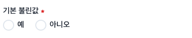
_리턴 타입: true | false | undefined_
====

BooleanField 의 필드값은 true | false | undefined 중 하나입니다.
_만약, SelectOption 을 설정했다면 해당 옵션의 값으로도 리턴될 수 있습니다._

BooleanField 를 선언하는 방법은 다음과 같습니다.

====
[source,typescriptjsx]
----
import {BooleanField} from "@/components/listgrid/fields/BooleanField";

const booleanField = new BooleanField('bool', 100)
        .withLabel('기본 불린값')
        .withRequired(true)
        .withComboType({direction: 'row'});
----
====

BooleanField 에 required 설정을 하지 않으면 자동으로 `선택안함 옵션(빈값)` 이 추가 됩니다.

====
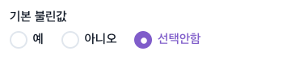
====

다른 모든 필드들과 마찬가지로 create builder 메소드를 이용해 생성할 수도 있습니다.
BooleanField.create 메소드에서는 <<listgrid-entityform-optionalfield, OptionalField>> 의 props 를 사용할 수 있습니다.

====
[source,typescriptjsx]
----
import {BooleanField} from "@/components/listgrid/fields/BooleanField";

const booleanField = BooleanField.create({
    name: 'boolean',
    order: 100,
    required: true,
    listConfig: {support: true, filterable: true, sortable: true},
});
----
====

BooleanField 는 OptionalField 의 세부 구현체로, true / false 의 단순 boolean 값뿐 아니라 SelectOption[] 을 이용해 라디오 버튼의 라벨과 옵션값을 설정할 수 있습니다.

====
[source,typescriptjsx]
----
import {BooleanField} from "@/components/listgrid/fields/BooleanField";

const booleanField = new BooleanField('boolean', 100)
                        .withRequired(true)
                        .withOptions([
                          {label: '좋아요', value: 'like'},
                          {label: '싫어요', value: 'dislike'}
                        ])
                        .useListField();    // 목록 표시, filter, sort 지원
----
====

====== direction

direction 설정을 이용해 라디오 버튼이 표시되는 방식을 바꿀 수 있습니다.
일반적으로 라디오 버튼은 한 줄로 표시되지만, 라벨값이 길어져 한 줄로 표시하기 어려운 경우나 기타 다른 이유로 라디오 버튼을 항목 별로 한 줄씩 표시할 수도 있습니다.

====
image::images/booleanfield_vertical.png[]
====

====
[source,typescriptjsx]
----
import {BooleanField} from "@/components/listgrid/fields/BooleanField";

const booleanField = BooleanField.create({
    name: 'boolean',
    label: '세로 정렬',
    order: 100,
    combo: {direction: `row`}
});
----
_BooleanField#withComboType 메소드를 사용해도 됩니다_
====

[#listgrid-entityform-checkboxfield]
===== CheckboxField

View 화면에서 Checkbox 로 표시되는 입력폼을 제공하려면, CheckboxField 를 사용하면 됩니다.

====
image::images/checkboxfield.png[]
_리턴 타입: string[]_
====

CheckboxField 를 선언하는 방법은 다음과 같습니다.

====
[source,typescriptjsx]
----
import {CheckboxField} from "@/components/listgrid/fields/CheckboxField";

const checkbox = new CheckboxField('checkbox', 100,
                          [
                            {label: 'Korean', value: 'ko'},
                            {label: 'English', value: 'en'},
                            {label: 'Chinese', value: 'cn'},
                          ]
                        )
                        .withComboType({direction: 'column'}) // 옵션을 가로로 표시
                        .withRequired(true)
                        .useListField();    // 목록 표시, filter, sort 지원
----
====

위와 동일한 설정을 create builder 메소드를 이용해 작성할 수도 있습니다.
CheckboxField.create 메소드에서는 <<listgrid-entityform-multipleoptionalfield, MultipleOptionalField>> 의 props 를 사용할 수 있습니다.

====
[source,typescriptjsx]
----
import {CheckboxField} from "@/components/listgrid/fields/CheckboxField";

const checkbox = CheckboxField.create({
    name: 'checkbox',
    order: 100,
    options: [
      {label: 'Korean', value: 'ko'},
      {label: 'English', value: 'en'},
      {label: 'Chinese', value: 'cn'},
    ],
    required: true,
    listConfig: {support: true, filterable: true, sortable: true},
});
----
====

[#listgrid-entityform-datefield]
===== DateField

View 화면에서 캘린더를 표시해 날짜를 입력받는 필드를 만들기 위해 DateField 를 사용할 수 있습니다.

====
image::images/datefield.png[]
_리턴 타입: string, `YYYY-MM-DD`_
_range 설정 시 string[]_
====

DateField 를 선언하는 방법은 다음과 같습니다.

====
[source,typescriptjsx]
----
import {DateField} from "@/components/listgrid/fields/DateField";

const dateField = new DateField('dateField', 100)
                        .withRequired(true)
                        .useListField();    // 목록 표시, filter, sort 지원
----
====

위와 동일한 설정을 create builder 메소드를 이용해 작성할 수도 있습니다.
DateField.create 메소드에서는 <<listgrid-entityform-abstractdatefield, AbstractDateField>> 의 props 를 사용할 수 있습니다.

====
[source,typescriptjsx]
----
import {DateField} from "@/components/listgrid/fields/DateField";

const dateField = DateField.create({
    name: 'dateField',
    order: 100,
    required: true,
    listConfig: {support: true, filterable: true, sortable: true},
});
----
====

[#listgrid-entityform-datefield-range]
====== range

range 옵션을 추가해 단일값 `YYYY-MM-DD` 가 아니라 string[] 으로 `시작일 ~ 종료일` 을 반환받을 수 있습니다.

====
[source,typescriptjsx]
----
import {DateField} from "@/components/listgrid/fields/DateField";

const dateRangeField = new DateField('dateRangeField', 100)
                        .withRange(true)
                        .withRequired(true)
                        .useListField();    // 목록 표시, filter, sort 지원

// create 메소드를 이용
const otherRangeField = DateField.create({
    name: 'otherRangeField',
    order: 200,
    range: true,
    required: true,
    listConfig: {support: true, filterable: true, sortable: true},
});
----
====

[#listgrid-entityform-datetimefield]
===== DatetimeField

View 화면에서 캘린더를 표시해 날짜와 시각을 함께 입력받는 필드를 만들기 위해 DatetimeField 를 사용할 수 있습니다.

====
image::images/datetimefield.png[]
_리턴 타입: string, YYYY-MM-DD HH:mm:ss_
_range 설정 시 string[]_
====

DateField 를 선언하는 방법은 다음과 같습니다.

====
[source,typescriptjsx]
----
import {DatetimeField} from "@/components/listgrid/fields/DatetimeField";

const dateTimeField = new DatetimeField('dateTimeField', 100)
                        .withRequired(true)
                        .useListField();    // 목록 표시, filter, sort 지원
----
====

위와 동일한 설정을 create builder 메소드를 이용해 작성할 수도 있습니다.
DatetimeField.create 메소드에서는 <<listgrid-entityform-abstractdatefield, AbstractDateField>> 의 props 를 사용할 수 있습니다.

====
[source,typescriptjsx]
----
import {DatetimeField} from "@/components/listgrid/fields/DatetimeField";

const dateTimeField = DatetimeField.create({
    name: 'dateTimeField',
    order: 100,
    required: true,
    listConfig: {support: true, filterable: true, sortable: true},
});
----
====

DateField 와 마찬가지로 DatetimeField 에서도 <<listgrid-entityform-datefield-range, range>> 옵션을 이용해 시작일시 ~ 종료일시 값을 받을 수 있습니다.

사용법은 DateField 의 range 옵션 사용법과 동일합니다.

[#listgrid-entityform-emailfield]
===== EmailField

EmailField 를 사용하면 이메일을 입력받는 필드를 만들 수 있습니다.

====
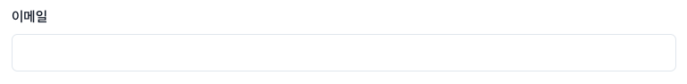
_리턴 타입: string_
====

EmailField 는 기본적으로 <<listgrid-entityform-stringfield, StringField>> 와 많은 부분에서 유사하지만, Email Validation 이 자동으로 추가된다는 점이 다릅니다.

따라서, EmailField 로 필드를 설정하면 해당 필드에 별다른 Validation 을 사용할 필요가 없습니다.

EmailField 를 선언하는 방법은 다음과 같습니다.

====
[source,typescriptjsx]
----
import {EmailField} from "@/components/listgrid/fields/EmailField";

const emailField = new EmailField('emailField', 100)
                        .withRequired(true)
                        .useListField();    // 목록 표시, filter, sort 지원
----
====

위와 동일한 설정을 create builder 메소드를 이용해 작성할 수도 있습니다.
EmailField.create 메소드에서는 <<listgrid-entityform-checkduplicatefield, CheckDuplicateField>> 의 props 를 사용할 수 있습니다.

====
[source,typescriptjsx]
----
import {EmailField} from "@/components/listgrid/fields/EmailField";

const emailField = EmailField.create({
    name: 'emailField',
    order: 100,
    required: true,
    listConfig: {support: true, filterable: true, sortable: true},
});
----
====

[#listgrid-entityform-emailfield-checkduplicate]
====== 필드값 중복 확인

====
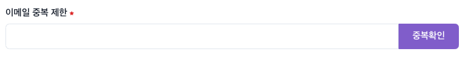
====

`withCheckDuplicate` 메소드를 이용하면, Backend API 를 연동해 필드값에 대한 중복 확인을 할 수 있습니다.

====
[source,typescriptjsx]
----
import {EmailField} from "@/components/listgrid/fields/EmailField";

const emailField = new EmailField('emailField', 100)
                        .withRequired(true)
                        .withCheckDuplicate((entityForm, value) => {
                            return (async () => {
                              const response = await getExternalApiListDataWithError({
                                url: plantFetchUrl,
                                method: 'POST',
                                formData: SearchForm.create().handleAndFilter('emailAddress', value)
                              })

                              if ((response?.data?.totalCount ?? 0) > 0) {
                                return ValidateResult.fail('중복된 이메일이 존재합니다.');
                              } else {
                                return ValidateResult.success();
                              }
                            })();
                          })
                        .useListField();    // 목록 표시, filter, sort 지원
----
====

값을 입력하고 중복확인을 누르면 API 연동 결과에 따라 다음 프로세스가 진행됩니다.

- 중복된 값이 없는 경우(success)
  : 중복확인 버튼이 확인완료 로 변경되고 entityForm 의 field.value 가 변경됩니다.
- 중복된 값이 있는 경우(fail)
  : 필드 도움말 하단에 에러 메시지가 표시됩니다.

[#listgrid-entityform-filefield]
===== FileField

입력폼에 파일 업로드 기능을 제공하려면 FileField 를 사용합니다.

====
image::images/filefield.png[]
_리턴 타입: FileFieldValue_
_파일 업로드는 `filepond` 라이브러리를 사용합니다._
====

실제 파일을 업로드/다운로드 하기 위해서는 Backend API 로 반드시 다음 endpoint 가 필요합니다.

====
.Backend API
[cols="<.^2,<.^4,<.^2,<.^2"]
|===
|종류 |주소 |METHOD |FormData

|업로드 |\{assetServer\}/asset/upload-file|POST |Multipart File
|다운로드 |\{assetServer\}/static-resource/\{fileName\} |GET |
|===
_RCM Backend Framework `module-asset` 모듈을 이용하면 Out of the box 로 사용할 수 있습니다_
====

====
[source,typescriptjsx]
----
import {FileField} from "@/components/listgrid/fields/FileField";

const fileField = new FileField('fileField', 100);
----
====

====== 업로드 제약 설정

다음 설정을 통해 업로드할 수 있는 파일의 수를 제한하거나, 파일 유형을 제한할 수 있습니다.

====
[source, typescriptjsx]
----
export interface IAssetConfig {
  // 개별 파일의 크기 제한이 있는지 mb 단위, 아무 것도 설정하지 않으면 기본값은 10mb
  maxSize?: number;
  // 한번에 몇개의 파일을 업로드할 수 있는지, 아무것도 설정하지 않으면 기본값은 1개
  maxCount?: number;
  // 허용되는 확장자, 지정하지 않으면 모두 허용
  extensions?: string[];
  // 허용되는 파일 타입 - ['image/*'], ...
  fileTypes?: string[];
}
----
====

다음과 같이 withConfig 메소드를 이용하거나, static create 메소드에 config: IAssetConfig 정보를 arguments 로 넘겨 업로드 제약을 설정할 수 있습니다.

====
[source,typescriptjsx]
----
import {FileField} from "@/components/listgrid/fields/FileField";

const fileField = new FileField('fileField', 100)
                      .withConfig({
                        maxCount: 1,    // 파일을 하나만 업로드
                        fileTypes: ['image/*']    // 이미지만 업로드 가능
                      });
----
====

[#listgrid-entityform-htmlfield]
===== HtmlField

입력폼에 HTML WYSIWYG 에디터를 제공하려면 HtmlField 를 사용합니다.

====
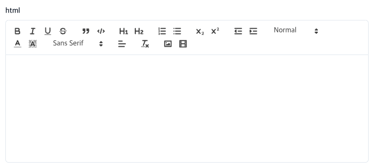
_리턴 타입: string_
_본 템플릿에서 WYSIWYG 에디터로 `QuillEditor` 를 사용합니다._
====

다음과 같이 코드를 작성해 htmlField 를 생성합니다.

====
[source, typescriptjsx]
----

const htmlField = new HtmlField('html', 100)
                      .withPlaceHolder('내용을 입력하세요')
                      .withRequired(true);

----
====

[#listgrid-entityform-inlinemapfield]
===== InlineMapField

Key, Value 로 이루어진 Map<string, string> 형태의 데이터를 다룰 때 InlineMapField 를 사용할 수 있습니다.

====
image::images/inlinemap.png[]
_리턴 타입: Map<string, string> | KeyValue[]_
====

다음 코드를 통해 InlineMapField 를 생성할 수 있습니다.

====
[source, typescriptjsx]
----

const mapField = new InlineMapField('inlineMap', 100);

----
====

====== withConfig

withConfig 메소드를 이용해 다음 설정을 지정할 수 있습니다.

====
[source, typescriptjsx]
----
export type InlineMapConfig = {
  // 허용되는 key 만 따로 입력한다.
  keys?: MapKey[];
  // 최소 X개, 최대 Y개 입력 제한
  limit?: MinMaxLimit;
  // Backend 와 연동하기 위해 Map 을 사용할지, KeyValue[] 를 사용할지
  resultType?: 'KeyValue' | 'Map'
}
----
====

====
.리턴 타입 설정
InlineMapField 의 리턴 타입은 기본적으로는 Map 이지만 설정을 통해 KeyValue[] 로 리턴할 수도 있습니다.
[source, typescriptjsx]
----
const mapField = new InlineMapField('inlineMap', 100)
                    .withConfig({resultType:'KeyValue'});
----
{blank}
{blank}

.입력할 수 있는 개수 제한
InlineMapField의 ROW 수를 제한할 수 있습니다.
다음과 같이 코드를 작성하면 최소 3줄에서 최대 5줄까지 항목을 입력할 수 있습니다.
[source, typescriptjsx]
----
const mapField = new InlineMapField('inlineMap', 100)
                    .withConfig({limit: {min:3, max:5}});
----
{blank}
{blank}

.입력할 수 있는 Key 제한
MapKey 를 지정하면 Map을 작성할 때 해당 Key 만 사용하도록 제한할 수 있습니다.
[source, typescriptjsx]
----
const mapField = new InlineMapField('inlineMap', 100)
                    .withConfig({keys:
                      [{key:'react', label: 'React'}, {key:'nextjs', label: 'NextJs'}]
                    });
----
====

[#listgrid-entityform-manytoonefield]
===== ManyToOneField

ManyToOneField 는 엔티티가 다른 엔티티와 OneToMany 의 관계를 가지고 있을 때 Many 측에 해당하는 다른 엔티티를 참조하는 방식의 필드 입니다.

ManyToOneField 를 이용하면 다른 필드를 검색하는 검색 창을 제공하고, 그 중 하나의 데이터를 선택해 참조값으로 설정할 수 있게 됩니다.

====
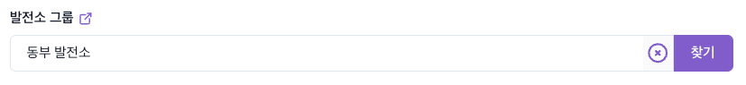
_리턴 타입: string | number_
_ManytoOneField의 반환값은 대상 엔티티의 `id` 이며, `field` 설정 시 'field.id' 필드의 값입니다._
====

====
.찾기 버튼을 눌렀을 때 뜨는 검색창
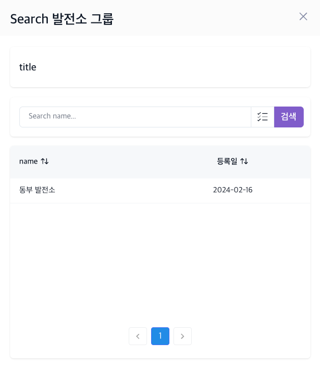
====

ManyToOneField 를 정의할 때는 Many 에 해당하는 다른 엔티티의 EntityForm 이 반드시 필요합니다.

====
[source, typescriptjsx]
----
new ManyToOneField('plantGroup', 1, {
          entityForm: PlantGroupEntityForm(),
          field: {id: 'id', name: 'name'}
        })
      .withLabel('발전소 그룹')
----
====

`field` 설정을 통해, 현재 EntityForm 을 Save 할 때 값으로 넘겨 줄 필드(id)와 선택된 항목의 이름을 표시하는 필드(view)를 지정할 수 있습니다.

_Main Entity 의 EntityForm 과 ManyToOneField 의 EntityForm 간의 관계는 <<listgrid-overview-viewdata, View 데이터>> 에서 설명한 내용을 고려해 작성되어야 합니다. 데이터 간의 관계가 알맞지 않으면 정상적으로 동작하지 않으므로 반드시 숙지해야 합니다._

[#listgrid-entityform-markdownfield]
===== MarkdownField

MarkdownField 는 TiptapEditor 를 이용해 마크다운 에디터를 제공합니다.

====
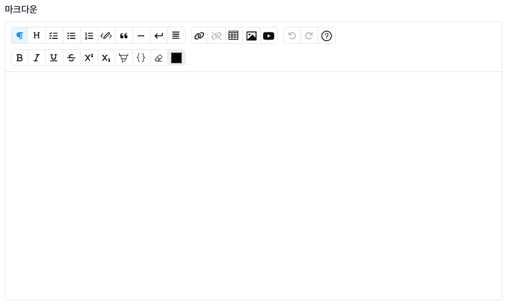
_리턴 타입: string_
====

다음 코드를 통해 MarkdownField 를 설정할 수 있습니다.

====
[source, typescriptjsx]
----
new ManyToOneField('markdown', 100)
      .withLabel('마크다운')
----
====

[#listgrid-entityform-monthfield]
===== MonthField

YYYY-MM 형태의 년월 정보를 입력받기 위해 MonthField 를 사용합니다.

====
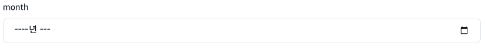
====

다음 코드를 작성해 MonthField를 정의할 수 있습니다.

====
[source,typescriptjsx]
----
new MonthField('month', 100);
----
====

limit 설정을 통해 최소값과 최대값을 지정할 수 있습니다.

====
[source,typescriptjsx]
----
new MonthField('month', 100)
    .withLimit({min: `2024-01`, max:`2025-02`});
----
위와 같이 설정하면 2024-01 ~ 2025-02 까지의 데이터만 입력 받을 수 있습니다.
====

[#listgrid-entityform-multiselectfield]
===== MultiSelectField

입력폼에 복수 선택이 가능한 SelectBox 를 제공하기 위해 MultiSelectField 를 사용합니다.

====
image::images/multiselectfield-selected.png[]
_리턴 타입: string[]_
====

====
[source, typescriptjsx]
----
new MultiSelectField('multiselect', 100,
          [{label: 'Java', value: 'java'}, {label: 'Javascript', value: 'javascript'}, {
            label: 'Golang',
            value: 'go'
          }])
        .withLabel('능숙한 언어')
        .withHelpText('가장 자신 있는 언어를 하나 이상, 두개까지 선택해 주세요.')
        .withMin(1).withMax(2)
----
====

[#listgrid-entityform-numberfield]
===== NumberField

숫자값만 입력 가능한 필드를 제공하려면 NumberField 를 사용합니다.

====
[source,typescriptjsx]
----
new NumberField('number', 100);
----
====

`withMin`, `withMax`, `withLimit` 설정을 통해 입력 가능한 최소, 최대값을 설정할 수 있습니다.

[#listgrid-entityform-passwordfield]
===== PasswordField

비밀번호를 입력받는 필드를 제공하려면 PasswordField 를 사용합니다.

비밀번호 입력 필드는 StringField 와 기본적으로 유사하지만, 비밀번호에 대한 Validation 을 자동으로 처리한다는 점이나, PasswordStrength 를 표현할 수 있다는 점에서 다릅니다.

다른 필드와 마찬가지로, PasswordField 도 new 생성자를 이용해 name 과 order 만 지정해 생성할 수 있습니다.

====
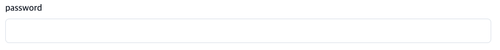
[source,typescriptjsx]
----
new PasswordField('password', 100);
----
====

이렇게 비밀번호 필드를 생성하는 경우 영문 소문자/영문 대문자/숫자/특수문자를 모두 포함해 8자 ~ 20 자 이내의 비밀번호를 규칙으로 하는 Validation 이 자동으로 추가됩니다.

====== Custom Validation

PasswordField 에 기본 Validation 이 아니라 새로운 비밀번호 규칙을 적용하려면 생성자의 세번째 파라미터로 Custom Validation 을 추가해야 합니다.

====
[source,typescriptjsx]
----
new PasswordField('password', 100, [new CustomPasswordValidation()]);
----
====

이렇게 하면 PasswordField 가 생성될 때 기본으로 적용되는 Validation 대신 Custom Validation 을 적용할 수 있습니다.

====== PasswordStrength

PasswordField 를 생성할 때 passwordStrength 속성을 정의하면 비밀번호 입력폼에 Password Strength Indicator 를 표시할 수 있습니다.

====
image::images/passwordfield-strength.png[]
[source,typescriptjsx]
----
new PasswordField('password', 100)
    .withStrength({
        show: {bar: true, error: true, helpText: true},
        length: 12})
----
====

passwordStrength 속성에 대한 정의는 다음과 같습니다.

====
[source, typescriptjsx]
----
export interface PasswordStrength {
  // PasswordStrengh Indicator 를 표시할 것인지 여부
  show?: {
    bar?: boolean,
    helpText?: boolean;
    error?: boolean;
  }
  // Password 의 max 길이
  length?: number;

  // Password 의 유효성 검사를 위한 RegexPattern 과 에러 메시지
  regex?: RegexPattern[];
}

export interface RegexPattern {
  pattern: RegExp;
  error: string;
}

----
====

[#listgrid-entityform-phonenumberfield]
===== PhoneNumberField

`-` 없이 10~11 자의 숫자로만 이루어진 전화번호를 입력받는 입력폼을 제공하려면 PhoneNumberField 를 사용합니다.

PhoneNumberField 를 사용하면 EmailField 에서와 마찬가지로, 전화번호에 대한 Validation 을 자동으로 적용합니다.

====
image::images/phonenumberfield.png[]
[source,typescriptjsx]
----
new PhoneNumberField('phone', 100).withLabel('전화번호');
----
====

[#listgrid-entityform-selectfield]
===== SelectField

입력폼에 Select Box 를 표시하고 선택한 옵션을 입력값으로 받고자 하는 경우 SelectField 를 사용합니다.

SelectField 는 OptionalField 의 하위 유형이며, 옵션이 없으면 필드를 렌더링 할 수 없으므로 생성할 때 반드시 SelectOption 을 지정해야 합니다.

====
image::images/selectfield.png[]
[source,typescriptjsx]
----
new SelectField('favorite', 300,
        [{label: 'Java', value: 'java'}, {label: 'Javascript', value: 'javascript'}, {
          label: 'Golang',
          value: 'go'
        }])
    .withLabel('선호하는 언어');
----
====

[#listgrid-entityform-stringfield]
===== StringField

StringField 는 문자열을 입력받는 필드이며, <<listgrid-entityform-booleanfield, BooleanField>>, <<listgrid-entityform-numberfield, NumberField>> 와 함께 가장 많이 사용되는 기본적인 필드입니다.

====

[source, typescriptjsx]
----
new StringField('name', 100)
          .withLabel('기본 문자열')
----
====

CheckDuplicateField 의 하위 필드로, EmailField 와 마찬가지로 withCheckDuplicate 옵션을 이용해 중복 확인 기능을 적용할 수 있습니다. 이에 관한 자세한 사용 방법은 <<listgrid-entityform-emailfield, EmailField>> 의 <<listgrid-entityform-emailfield-checkduplicate, 필드값 중복 확인>> 항목을 참고하세요.

_StringField 는 CodeGenerator 를 통해 코드를 생성할 때 기본 필드로 사용됩니다._

[#listgrid-entityform-tagfield]
===== TagField

TagField 로 태그를 입력해 string[] 으로 입력값을 반환받는 필드를 만들 수 있습니다.

====
image::images/tagfield.png[]
[source, typescriptjsx]
----
new TagField('tag', 100);
----
====

====== Options

TagField 에 withOptions 로 SelectOption[] 을 지정할 수 있습니다.
태그를 입력할 때 해당 옵션이 입력폼 하단에 표시됩니다.

====
image::images/tagfield-option.png[]
[source, typescriptjsx]
----
new TagField('tag', 100).withOptions([{value:'JAVA'}, {value:'NEXTJS'}]);
----
====

====
.주의
TagField 에 options 을 정의해도, 사용자가 지정된 SelectOption 이외의 값을 입력할 수 있습니다.
만약 지정된 옵션만 선택 가능하게 하려면 TagField 가 아니라 <<listgrid-entityform-multiselectfield, MultiSelectField>> 를 사용해야 합니다.
====

[#listgrid-entityform-textareafield]
===== TextareaField

Textarea 로 입력폼을 제공하고자 하는 경우 TextareaField 를 사용하면 됩니다.

====
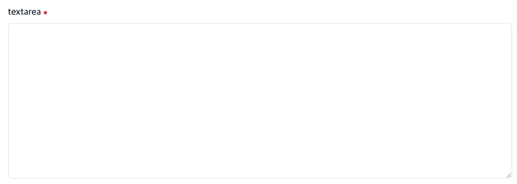
[source,typescriptjsx]
----
new TextareaField('textarea', 100);
----
====

====== Options

- `withRows`: 숫자값으로 Textarea 가 기본적으로 표시되는 Row의 수를 조절할 수 있습니다. 기본값은 10 입니다.
- `withLimit`: `{min?: number, max?:number}` 로 입력할 수 있는 최소 글자수, 최대 글자수를 지정할 수 있습니다.

====
[source, typescriptjsx]
----
new TextareaField('textarea', 100)
        .withRows(20)
        .withLimit({min: 10, max: 100});
----
====

[#listgrid-entityform-timefield]
===== TimeField

string 타입으로 `HH:mm` 의 시각 정보를 입력 받고 싶을 때, `TimeField` 를 사용합니다.

====
image::images/timefield.png[]

[source,typescriptjsx]
----
new TimeField('time', 100)
      .withDefaultValue('19:00')    // 입력값은 HH:mm 으로 반환됩니다.
----
====

`withLimit` 으로 최소값, 최대값을 지정할 수 있습니다.

====
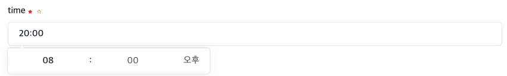

[source,typescriptjsx]
----
new TimeField('time', 100)
      .withLimit({min: '07:00', max:'20:00'})

----
위 코드를 실행하면, 선택 상자에서 오후 8시 이후는 선택되지 않습니다.
====

[#listgrid-entityform-yearfield]
===== YearField

YearField 는 `YYYY` 형식의 년도를 입력받기 위한 필드이며, 실제로는 SelectField 와 유사하게 렌더링 합니다.

====
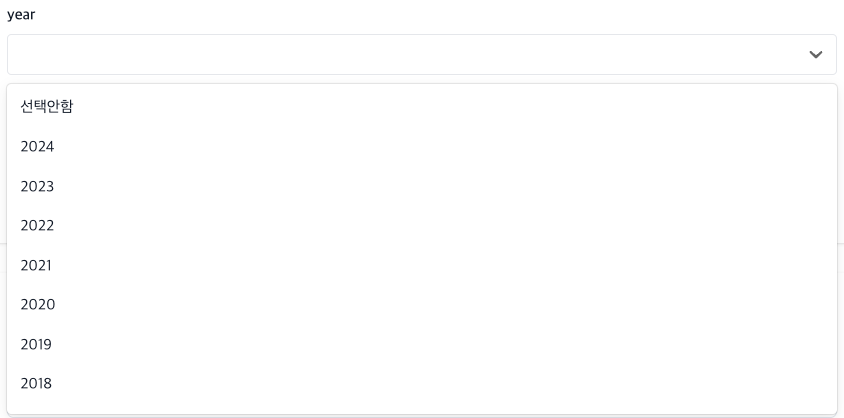
[source, typescriptjsx]
----
new YearField('year', 100);
----
====

YearField 를 생성할 때 선택할 수 있는 옵션의 min, max 값을 설정하면 해당 기간 동안의 년도만 표시됩니다.

====
image::images/yearfield-limit.png[]
[source, typescriptjsx]
----
new YearField('year', 100).withLimit({min: 2024, max: 2028});
----
====

[#listgrid-entityform-subcollections]
==== SubCollections

EntityForm 에 SubCollection 을 설정하면 OneToMany 관계를 표현할 수 있습니다.

EntityForm 에 SubCollection 이 있는 경우, ViewEntityForm 을 렌더링 할 때 SubCollection 에 대한 ViewListGrid 를 표시하게 됩니다.

Entity 와 SubCollection Entity 의 관계에 대한 설명은 <<listgrid-view-viewentityform-overview, ViewEntityForm > Overview>> 항목을 참고 하시기 바랍니다.

EntityForm 에 SubCollection 을 설정하면 아래와 같이 렌더링 됩니다.

====
image::images/subcollectionview.png[width=800]
여기서 `송수신 모듈` 이 `inner ViewListGrid` 로 표시된 SubCollection 입니다.
====

EntityForm 에 SubCollection 을 설정하는 방법은 다음과 같습니다.

====
[source, typescriptjsx]
----
// omitted
entityForm.addCollections({
      items: [
        new SubCollectionField({
          name: 'transceivers',
          label: '송수신 모듈',
          entityForm: TransceiverEntityForm(),
          order: 100,
          relation: {mappedBy: 'plantId'}
        })
      ]
    })

----
====

EntityForm#addCollections 메소드를 이용해 배열로 subCollection 을 추가합니다.

``addCollections`` 메소드는 `addFields` 와 완전히 동일합니다. `addFields` 메소드를 이용해 SubCollection 을 추가해도 무방합니다. 단지 명시적인 코드를 위해 추가 메소드를 제공합니다.

SubCollection 을 특정 Tab 과 FieldGroup 에 배치하려면 <<listgrid-entityform-addFields, addFields>> 을 참고하시기 바랍니다.

SubCollectionField 로 추가하는데, SubCollectionField 의 생성자는 아래와 같이 정의되어 있습니다.

====
[source, typescriptjsx]
----
export class SubCollectionField implements EntityItem {
  // omitted
  constructor(props: {
    // SubCollection 의 EntityForm
    entityForm: EntityForm,
    // OneToMany 에 대한 relation Key 매핑 구조
    relation: SubCollectionRelation,
    order: number,
    name: string,
    label?: LabelType,
    helpText?: HelpTextType,
    hidden?: HiddenType,
    readonly?: ReadOnlyType
  }) {
  // omitted
  }
  // omitted
}

interface SubCollectionRelation {
  // oneToMany 에서 Many 측 Entity에 parentId 필드명
  mappedBy: string,
  valueProperty?: string,   // mappedBy 에 해당하는 값이 어떤 것인지. 지정하지 않으면 entity.id 를 사용한다.
}

----
====

SubCollection 을 설정할 때 entityForm 과 relation 정보를 제외한 나머지는 Fields 의 정보와 동일하므로 설명을 생략합니다.
나머지 설정에 대한 자세한 설명은 <<listgrid-entityform-entityfield, Entity 필드>> 를 참고 하세요.

===== entityForm

`ViewEntityForm` 에서 SubCollection 은 필드그룹 내부의 `ViewListGrid` 로 표시됩니다.

따라서 ViewListGrid 를 표현하기 위해 entityForm 을 지정해야 합니다.

====
.순환 오류 방지
Main entity 의 EntityForm 에 SubCollection 을 지정할 때 순환 오류가 발생할 수 있습니다.

예를 들어, A EntityForm이 B EntityForm 을 SubCollection 으로 지정했다고 가정해 보겠습니다.
여기서 만약 B EntityForm 에 ManyToOneField 로 A EntityForm 을 지정하는 경우 A -> B -> A -> ... 와 같은 순환오류가 발생하게 됩니다.

따라서 EntityForm 을 생성하는 메소드에서 child 여부를 확인하고 child 로 호출되는 경우에는 sub collections 을 비활성화 하는 옵션 처리가 필요합니다.

[source, typescriptjsx]
----
export const PlantEntityForm = (child?: boolean): EntityForm => {
  const plantEntityForm = new EntityForm('PlantEntityForm', plantFetchUrl);
  // omitted

  // child 일 때는 subCollection 을 무시한다.
  if (!isTrue(child)) {
    plantEntityForm.addCollections({
      items: [
        new SubCollectionField({
          name: 'transceivers',
          label: '송수신 모듈',
          entityForm: TransceiverEntityForm(),
          order: 100,
          relation: {mappedBy: 'plantId'}
        })
      ]
    })
  }

}
----
====

===== relation

SubCollectionField 의 relation 속성은 Main Entity 와 Sub Entity 간의 매핑 관계를 기술하는 정보 입니다.

Plant 와 Transceiver 두 엔티티가 있고, 하나의 Plant 에 여러 Transceiver 가 매핑되어 있는 One to Many 관계를 갖고 있다고 가정해 보겠습니다.

이 경우 보통 RDB의 Relation 설정을 생각해 보면, Transceiver 엔티티에는 plantId 라는 필드가 있고, 이 필드는 Plant 엔티티의 ID 입니다.

SubCollection 의 relation 속성은 Relation Mapping 을 규정하는 필드를 정의하는 것입니다.

아래 예제에서 Transceiver 에는 plantId 라는 필드가 있고, 해당 필드가 Plant 에 대한 Transceiver 의 FK 입니다.

====
[source, typescriptjsx]
----
export const PlantEntityForm = (child?: boolean): EntityForm => {
  const plantEntityForm = new EntityForm('PlantEntityForm', plantFetchUrl);
  // omitted

  // child 일 때는 subCollection 을 무시한다.
  if (!isTrue(child)) {
    plantEntityForm.addCollections({
      items: [
        new SubCollectionField({
          name: 'transceivers',
          label: '송수신 모듈',
          entityForm: TransceiverEntityForm(),
          order: 100,
          relation: {mappedBy: 'plantId'}
        })
      ]
    })
  }

}
----
====

[#listgrid-entityform-datatransfer]
==== Data Transfer

DataTransfer 설정을 통해 ViewListGrid 의 목록 보기 화면에서 해당 데이터를 Excel 로 Upload / Download 하도록 설정할 수 있습니다.

====
image::images/datatransfer.png[width=800]

[source, typescriptjsx]
----
entityForm.withDataTransferConfig({type: DataTransferAll});

export const DataTransferAll: DataManageType = {
  exportable: true,
  importable: true
}

----
====

===== withDataTransferConfig

entityForm.withDataTransferConfig 메소드로 해당 EntityForm 의 업로드/다운로드 설정을 정의할 수 있습니다.

withDataTransferConfig 의 arguments 는 다음과 같습니다.

====
[source,typescriptjsx]
----
interface DataTransferConfigProps extends IDataTransferConfig{
  fieldNames?: string[];
}

export interface IDataTransferConfig {
  type: DataManageType;
  export?: TransferConfig;
  import?: TransferConfig;
  refreshView?: boolean;
  exportFileName?: string;
}

export interface DataManageType {
  exportable: boolean;
  importable: boolean;
}

/**
* 엑셀 업로드/다운로드 에 대한 세부 설정
*/
export interface TransferConfig {
  // 엑셀 업로드 / 다운로드 시 시트에 대한 세부 필드 설정
  fields: DataField[];
  // 엑셀 업로드 할 때 실제 시트에는 없지만 CreateForm 에 추가할 필드:값 정보
  addedFields?: Map<string, any>;
  // 엑셀 업로드 할 때 EntityForm 의 데이터를 CreateForm 으로 생성할 때 해당 formData 를 override
  overrideFormData?: (formData: any) => Promise<any>;
  // 엑셀 업로드할 때 Backend endpoint URL. 설정하지 않으면 대상 EntityForm.url + /excel-upload
  url?: string;
  // 엑셀 업로드할 때 샘플 시트를 제공할 때 사용하는 {key:value} 의 배열
  sampleData?: any[];
  // 업로드 / 다운로드 모달창에 표시할 설명
  description?: any;
  // 엑셀 업로드 결과를 화면에 표시할 때 해당 화면에 대한 사용자 정의
  overrideParseResult?: (formData: any, response: any) => {success: boolean, result: DataTransferResult, error?: string, errorView?: ReactNode};
}

export class DataField {
  // omitted
  constructor(props: DataFieldProps) {
    // omitted
  }
  // omitted
}

export interface DataFieldProps {
  // entityForm 에 규정된 field 의 name
  name: string;
  // 엑셀 시트의 헤더 컬럼의 이름
  label: string;
  // 필드의 타입
  type: FieldType;
  description?: string;
  required?: boolean;   // import 할 때 validation 용으로 사용한다.
  options?: SelectOption[];
  dataTransferRule?: DataTransferRule;
}
----
====

== Components

Admin Template 에서 제공하는 여러 View Components 는 <<components.adoc#getting-started, Admin Template Components>> 문서를 참고하시기 바랍니다.

== Translator

본 Admin Template은 다국어 설정을 내장하고 있습니다.

=== 다국어 설정 정보

`/i18n.ts` 에 지원 가능한 언어셋을 설정합니다.

[source,typescript]
----
// omitted
const langObj: any = { en, ae, da, de, el, es, fr, hu, it, ja, kr, pl, pt, ru, sv, tr, zh };
// omitted
----

`/i18n.ts` 의 다음 코드 부분을 수정해 기본 언어를 설정할 수 있습니다.

.i18n.ts
[source,typescript]
----
export const getTranslation = () => {
    const lang = getLang();
    // 'kr' 대신 사용하고 싶은 언어 코드를 langObj 의 코드 중 하나로 설정
    const data: any = langObj[lang || 'kr'];
    // omitted
}
----

=== 다국어 소스

`/public/locales/{언어코드}.json` 파일에 i18n 다국어 소스를 입력합니다.

이때 json 을 tree 형태로 작성하지 않고 아래와 같이 하나의 노드로 풀어서 작성합니다.

[source,json]
----
{
  "form.save.confirm": "데이터를 저장하시겠습니까?",
  "form.save.error.invalid": "입력값에 오류가 있습니다"
}
----

[#utils]
== Utilities

[#utils-api]
=== API 호출

RCM Backend Framework 의 API 를 호출하고 결과를 정형화된 객체로 전달 받을 수 있습니다.

==== RCM Backend Framework 의 리턴값

[#utils-api-success]
===== 성공

요청이 성공한 경우 응답값으로 아래와 같은 json 데이터를 수신합니다.
모든 성공 데이터는 "data" 노드 하위에 위치합니다.

[source,json]
----
{
  "data": {

  }
}

----

"data" 노드 하위에는 응닶값에 대한 세부 JSON 정보가 제공됩니다.

[#utils-api-fail]
===== 실패

요청이 실패한 경우 응답값으로 아래와 같은 json 데이터를 수신합니다.
모든 실패 데이터는 "error" 노드 하위에 위치합니다.

[source,json]
----
{
  "error": {
    "error": true,
    "status": 400,
    "errorType": "ALREADY_CONNECTED",
    "message": "이미 초기화되어 결과를 전송하지 않습니다. 초기화를 다시 하려면 관리자도구에서 기기 초기화를 진행하시기 바랍니다.",
    "fieldError": {
      "name": "이름은 반드시 입력해야 합니다."
    }
  }
}
----

.Variables
[cols="<.^2,<.^2,<.^2,<.^6"]
|===
|필드 |타입 |필수값 |설명

|error |boolean |O |에러 여부가 true / false 로 전송됩니다. 에러가 있는 경우에는 반드시 true 로 전달됩니다.
|status |int |O |HTTP STATUS 코드가 전달됩니다. 에러인 경우 4XX ~ 5XX 이내로 전달됩니다.
|errorType |string |O |서버에서 구분하는 에러코드입니다. 참고용으로 전달됩니다.
|message |string |O |에러코드를 Human readable message 로 풀어서 전달하는 정보 입니다.
|fieldError |array |X |에러가 요청 정보의 특정 필드로 기인하는 경우 해당 필드명과 필드에 대한 에러 메시지를 배열값으로 전달합니다.
|===

[#utils-api-method]
==== 기본 API 호출 메소드

@/utils/RequestUtil#callExternalHttpRequest 를 사용해 RCM Backend Framework 과 쉽게 통합할 수 있습니다.

[#utils-api-call-example]
===== 사용 예제

[source,typescript]
----
const responseData = await callExternalHttpRequest({url: authServerUrl, formData: {
    loginName, password, rememberMe,
  }
  , useSession: false
});

if (responseData.data) {
  const response = NextResponse.json(responseData.data);

  // 로그인 결과에 대한 세션 생성
  await Session.create(responseData.data.data, true, response);
  return response;

} else {
  const errorResponse: IEntityError = {error: {}};

  if (responseData.entityError?.error) {
    errorResponse.error = responseData.entityError.error;
  } else if (responseData.error) {
    try {
      errorResponse.error = parse(responseData.error);
    }catch (e) {
      errorResponse.error = {
        message: responseData.error,
      };
    }
  }

  return NextResponse.json(errorResponse);
}

----

[#utils-api-call-parameter]
===== 파라미터

[source,typescript]
----
export interface ApiRequest {
  // 접속할 대상 API URL
  url: string;

  // 'GET' | 'POST' | 'PUT' | 'DELETE', 기본값은 'POST'
  method?: MethodType;

  // Request Body 로 전송될 formData로 객체 타입이어야 하며,
  // JSON 으로 변환된 String 을 전달하는 경우 isStringFormData: true 로 설정해야 함
  formData?: Object;

  // Request Header에 추가값을 전송하고 싶은 경우 Map 에 담아 호출
  overrideHeaders?: Map<string, any>;

  // formData 가 Serialized 된 String 문자열일 경우 이 값을 true 로 설정한다.
  isStringFormData?: boolean;

  // SSR Backend 에서 호출하는 경우
  // Session 또는 Cookie 에 접근할 필요가 있다면 request 를 함께 담아 호출
  request?: NextRequest;

  // API 캐싱 사용 여부, 기본값은 false.
  // 메소드 호출 결과를 캐싱해 5초 이내 동일한 API 의 호출이 있다면 캐싱된 결과를 바로 리턴한다.
  useCache?: boolean;

  // Request Header 에 accessToken 정보를 자동으로 담아 보낼지 여부, 기본값은 true.
  // 만약 Backend SSR 에서 호출하는 경우 request 를 함께 보내든지,
  // 이 값을 false 로 하고 overrideHeaders 에 accessToken 을 수동으로 담아 호출하든지 해야 한다.
  useSession?: boolean;
}
----

[#utils-api-call-result]
===== 결과값

[source,typescript]
----
export class ResponseData {

  status: number = 400;

  error?: string;   // API 에서 에러가 넘어 온 경우, 에러 데이터를 분석해 이 필드에 대표 에러 메시지를 저장합니다.

  entityError?: IEntityError;   // API 에서 에러가 넘어 온 경우 에러 데이터를 분석해 EntityError 타입에 맞게 에러를 설정합니다.

  data?: any;   // API 에서 넘어 온 실제 데이터

  isError() {
    return this.status >= 400 || this.error !== undefined;
  }
}
----

[#utils-api-response-data-error]
==== 결과와 에러 메시지만 리턴 받기

메소드 callExternalHttpRequest 의 상세한 결과값까지는 필요하지 않으나, 에러 여부에 대한 정보가 필요하다면 메소드 getExternalApiDataWithError 를 사용합니다.

getExternalApiDataWithError 의 결과값은 다음과 같습니다.

[source,typescript]
----
export interface ApiResponseData {
  data?: any;
  error?: string;   // 에러가 발생한 경우 에러 메시지를 error 에 담아 리턴합니다.
}
----

getExternalApiDataWithError 의 결과값에 따라 로직을 분기하려면 다음과 같이 코드를 작성하면 됩니다.

[source,typescript]
----
const response = await getExternalApiDataWithError(
  {
    url: apiUrl,
    formData: formData
  });

if (response.data) {
  const value = response.data;
  // 성공한 경우 결과값을 가지고 처리
} else if (response.error) {
  const errorMessage = resopnse.error;
  // 실패한 경우 에러 메시지를 가지고 처리
}
----

[#utils-api-response-data-only]
==== 정상 결과만 리턴 받기

에러 여부가 중요하지 않고 단지 결과 데이터만 받고 싶은 경우, RequestUtil#getExternalApiData 를 사용하면 됩니다.

만약 API 에서 에러를 리턴한 경우 결과값은 `undefined` 가 됩니다.

[#utils-compare]
=== 값 비교, 검증

==== 문자열 빈값 여부 확인

파라미터로 넘겨 받은 문자열이 `undefined` 이거나, `null`, 또는 `''` 인 경우 true 를 리턴 합니다.

[source,typescript]
----
import {isBlank} from "@/utils/StringUtil";

function test(value?: string) {
  const result = isBlank(value);
  // when value is blank, result is true
}
----

==== 문자열 기본값 설정

value 가 isBlank 라면 defaultValue 를 리턴하고, defaultValue 가 isBlank 라면 `''` 를 리턴 합니다.
`undefined` 나 `null` 을 리턴하지 않습니다.

[source,typescript]
----
import {defaultString} from "@/utils/StringUtil";

function test(value?: string) {
  const result = defaultString(value, 'value');
  // when value is blank, result is 'value'
}
----

==== 두 값의 isBlank 확인

value 와 other 가 모두 `undefined` 이거나, 둘 중 하나는 `undefined` 이고, 다른 하나는 `null` 이거나 `''` 인 경우 true 를 리턴합니다.
두 값의 undefined, null 체크를 편리하게 하기 위해 사용합니다.

[source,typescript]
----
import {isNulls} from "@/utils/CompareUtil";

function test(value: any, other: any) {
  const result = isNulls(value, other);
  // when value is undefined, other is null, then result is true
}
----

==== 두 문자열의 Ignore case 비교

value 와 other 가 isNulls 이거나, lowerCase 값이 같을 때 true 를 리턴합니다.
value, other 에 대한 blank 체크를 피하고 편리하게 비교할 수 있습니다.

[source,typescript]
----
import {isEqualsIgnoreCase} from "@/utils/CompareUtil";

function test(value?: string, other?: string) {
  const result = isEqualsIgnoreCase(value, other);
  // when value is 'AbC', other is 'aBc', then result is true
}
----

==== 두 컬렉션의 요소 비교

value 와 other 컬렉션이 동일한 요소를 가지고 있는지 검사합니다.
ignoreOrder 를 설정하지 않으면 요소의 순서까지 확인하고, ignoreOrder 를 false 로 설정하면 요소의 포함 여부만 확인합니다.

[source,typescript]
----
import {isEqualCollection} from "@/utils/CompareUtil";

function test(value?: any[], other?: string[]) {
  const result = isEqualCollection(value, other, false);
}
----

==== 컬렉션 또는 Map 이 비어 있는지 확인

컬렉션이나 Map 의 빈 값 여부를 확인하려면 undefined, null 체크 후 length 로 비교해야 하는데 이를 간단히 isEmpty 로 처리할 수 있습니다.

[source,typescript]
----
import {isEmpty} from "@/utils/CompareUtil";

function test(value?: any[]) {
  const result = isEmpty(value);
}
----
